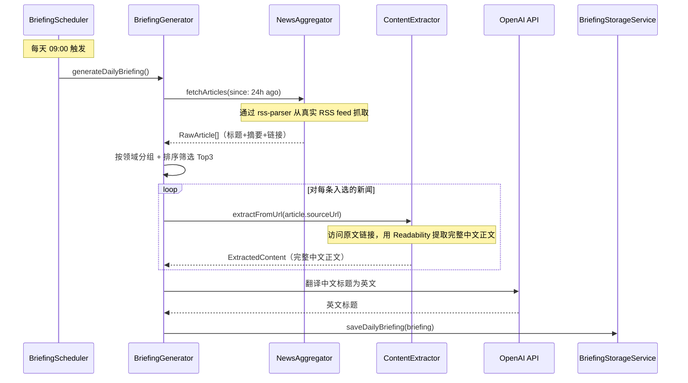

# 设计文档：双语学习平台

## 概述

双语学习平台在现有视译练习应用基础上扩展，新增三大功能模块：每日简报自动生成、双语对照研习会话、交互式术语收藏与术语库管理。

核心设计理念：
- **复用优先**：最大程度复用现有 `FileStorageService`、`DataService`、`SourceRegistryService`、`NewsAggregator`、`NewsRanker`、`NewsScheduler` 等服务
- **渐进式改造**：在现有 `NewsDomain` 类型中新增 `auto`（汽车）领域，调整 `SourceRegistry` 数据以覆盖四个目标领域
- **用户主导模式**：系统提供中文简报，用户主动提供英文链接进行对照学习，避免自动配对的复杂度
- **JSON 文件存储**：延续现有架构，使用 `FileStorageService` 进行数据持久化

### 关键设计决策

1. **领域枚举调整**：将现有 `NewsDomain = 'ai' | 'tech' | 'economy' | 'politics'` 改为 `BriefingDomain = 'ai-tech' | 'economy' | 'politics' | 'auto'`，合并 AI 和科技为一个领域，新增汽车领域
2. **简报与旧新闻系统并存**：新建 `BriefingService` 系列服务，不修改现有 `NewsItem` 等类型，避免破坏已有功能
3. **Content Extractor 使用 Readability 算法**：采用 Mozilla 的 `@mozilla/readability` + `jsdom` 提取正文内容（中英文均适用）。中文新闻在简报生成阶段即通过 RSS 链接提取完整正文；英文报道在用户提供链接后提取正文。确保所有展示的新闻内容均来自真实网页抓取，杜绝 AI 生成或虚构内容
4. **术语系统独立于现有 Expression 系统**：虽然功能类似，但 Term 有领域分类、语境原句等额外字段，且关联 StudySession 而非 Project，因此独立设计

## 架构

### 系统架构图

```mermaid
graph TB
    subgraph Frontend["前端 (React + Vite)"]
        BriefingPage["DailyBriefing 页面"]
        StudyPage["StudySession 页面"]
        TermLibPage["TermLibrary 页面"]
        BriefingApi["BriefingApiClient"]
    end

    subgraph Backend["后端 (Express)"]
        BriefingRouter["briefing 路由"]
        StudyRouter["study-sessions 路由"]
        TermRouter["terms 路由"]
        
        BriefingGen["BriefingGenerator"]
        ContentExt["ContentExtractor"]
        BriefingScheduler["BriefingScheduler"]
        BriefingStorage["BriefingStorageService"]
        StudyService["StudySessionService"]
        TermService["TermService"]
        
        SourceReg["SourceRegistryService (复用)"]
        NewsAgg["NewsAggregator (复用)"]
        FileStorage["FileStorageService (复用)"]
    end

    subgraph External["外部服务"]
        RSS["RSS 新闻源"]
        LLM["OpenAI API (翻译)"]
        CNWebPage["中文新闻原文网页"]
        ENWebPage["英文报道网页"]
    end

    BriefingPage --> BriefingApi --> BriefingRouter
    StudyPage --> BriefingApi --> StudyRouter
    TermLibPage --> BriefingApi --> TermRouter

    BriefingRouter --> BriefingStorage
    BriefingRouter --> BriefingGen
    StudyRouter --> StudyService
    StudyRouter --> ContentExt
    TermRouter --> TermService

    BriefingScheduler --> BriefingGen
    BriefingGen --> NewsAgg --> RSS
    BriefingGen --> ContentExt
    BriefingGen --> SourceReg
    BriefingGen --> LLM
    BriefingGen --> BriefingStorage

    ContentExt --> CNWebPage
    ContentExt --> ENWebPage
    StudyService --> FileStorage
    TermService --> FileStorage
end
```

### 数据流



## 组件与接口

### 后端服务组件

#### 1. BriefingGenerator

负责编排每日简报的完整生成流程。

```typescript
class BriefingGenerator {
  constructor(
    aggregator: NewsAggregator,
    sourceRegistry: SourceRegistryService,
    contentExtractor: ContentExtractor,
    translationService: TranslationService,
    storageService: BriefingStorageService
  )

  /** 生成指定日期的每日简报 */
  async generateDailyBriefing(date?: string): Promise<DailyBriefing>

  /** 从原始文章中按领域筛选 Top N */
  selectTopArticles(articles: RawArticle[], countPerDomain: number): Map<BriefingDomain, RawArticle[]>

  /** 对入选文章提取完整中文正文（通过 ContentExtractor 访问原文 URL） */
  async enrichWithFullContent(articles: RawArticle[]): Promise<RawArticle[]>
}
```

#### 2. TranslationService

封装 OpenAI API 调用，将中文标题翻译为英文。

```typescript
class TranslationService {
  constructor(apiKey: string, baseUrl: string, model: string)

  /** 批量翻译中文标题为英文 */
  async translateTitles(titles: string[]): Promise<string[]>
}
```

#### 3. ContentExtractor

访问 URL 并提取纯正文内容。同时用于中文新闻正文提取（简报生成阶段）和英文报道正文提取（用户提供链接后）。

```typescript
class ContentExtractor {
  /** 从 URL 提取正文内容（中英文均适用） */
  async extractFromUrl(url: string): Promise<ExtractedContent>
}

interface ExtractedContent {
  title: string;
  content: string;       // 纯文本正文
  htmlContent: string;   // 保留段落结构的 HTML
  siteName: string;
  excerpt: string;
}
```

#### 4. BriefingStorageService

管理每日简报的持久化存储，复用 `NewsStorageService` 的模式。

```typescript
class BriefingStorageService {
  /** 保存每日简报 */
  async saveDailyBriefing(briefing: DailyBriefing): Promise<void>

  /** 获取指定日期的简报 */
  async getDailyBriefing(date: string): Promise<DailyBriefing | null>

  /** 获取最新简报 */
  async getLatestBriefing(): Promise<DailyBriefing | null>

  /** 获取单条新闻条目 */
  async getNewsEntry(date: string, entryId: string): Promise<NewsEntry | null>
}
```

#### 5. StudySessionService

管理用户的研习会话 CRUD。

```typescript
class StudySessionService {
  constructor(fileStorage: FileStorageService)

  /** 创建研习会话 */
  async createSession(userId: string, input: CreateSessionInput): Promise<StudySession>

  /** 获取用户的所有研习会话 */
  async getSessions(userId: string): Promise<StudySession[]>

  /** 获取单个研习会话 */
  async getSession(userId: string, sessionId: string): Promise<StudySession | null>

  /** 更新研习会话（添加英文内容） */
  async updateSession(userId: string, sessionId: string, updates: Partial<StudySession>): Promise<void>
}
```

#### 6. TermService

管理用户术语的 CRUD。

```typescript
class TermService {
  constructor(fileStorage: FileStorageService)

  /** 创建术语 */
  async createTerm(userId: string, input: CreateTermInput): Promise<Term>

  /** 获取术语列表（支持领域筛选和关键词搜索） */
  async getTerms(userId: string, filters?: TermFilters): Promise<Term[]>

  /** 更新术语 */
  async updateTerm(userId: string, termId: string, updates: Partial<Term>): Promise<void>

  /** 删除术语 */
  async deleteTerm(userId: string, termId: string): Promise<void>
}
```

#### 7. BriefingScheduler

复用 `NewsScheduler` 的 cron + 重试模式。

```typescript
class BriefingScheduler {
  constructor(generator: BriefingGenerator)

  /** 启动定时任务（每天 09:00） */
  start(): void

  /** 停止定时任务 */
  stop(): void

  /** 手动触发生成 */
  async triggerGeneration(): Promise<BriefingUpdateResult>

  /** 带重试的执行（15分钟间隔，最多3次） */
  async executeWithRetry(): Promise<BriefingUpdateResult>
}
```

### 后端 API 路由

#### 简报路由 `/api/briefing`

| 方法 | 路径 | 说明 |
|------|------|------|
| GET | `/api/briefing/daily?date=YYYY-MM-DD` | 获取指定日期简报（默认今天） |
| GET | `/api/briefing/entry/:entryId?date=YYYY-MM-DD` | 获取单条新闻条目详情 |
| POST | `/api/briefing/trigger` | 手动触发简报生成 |

#### 研习会话路由 `/api/study-sessions`

| 方法 | 路径 | 说明 |
|------|------|------|
| POST | `/api/study-sessions` | 创建研习会话 |
| GET | `/api/study-sessions` | 获取用户所有研习会话 |
| GET | `/api/study-sessions/:id` | 获取单个研习会话 |
| PUT | `/api/study-sessions/:id` | 更新研习会话 |
| POST | `/api/study-sessions/:id/extract` | 提取英文正文 |

#### 术语路由 `/api/terms`

| 方法 | 路径 | 说明 |
|------|------|------|
| POST | `/api/terms` | 创建术语 |
| GET | `/api/terms?domain=ai-tech&keyword=xxx` | 获取术语列表 |
| GET | `/api/terms/:id` | 获取术语详情 |
| PUT | `/api/terms/:id` | 更新术语 |
| DELETE | `/api/terms/:id` | 删除术语 |

### 前端组件

#### DailyBriefing 页面
- `DailyBriefingPage`：简报首页容器，管理日期状态
- `DomainSection`：单个领域的新闻条目列表
- `NewsEntryCard`：单条新闻卡片（中英标题、摘要、精读按钮）
- `DatePicker`：日期选择器

#### StudySession 页面
- `StudySessionPage`：研习会话容器
- `ChinesePanel`：左栏中文原文面板
- `EnglishPanel`：右栏英文面板（含 URL 输入 + 正文展示）
- `UrlInputForm`：英文报道 URL 输入表单
- `ComparisonView`：双栏对照视图

#### TermLibrary 页面
- `TermLibraryPage`：术语库容器
- `TermList`：术语列表
- `TermCard`：术语卡片
- `TermDetail`：术语详情面板
- `TermFilters`：领域筛选 + 搜索栏

#### 交互式术语收藏组件
- `TextSelectionPopup`：划选弹出按钮
- `TermEditForm`：术语编辑表单（Modal）


## 数据模型

### 领域枚举

```typescript
// 新的简报领域类型（与旧 NewsDomain 并存）
type BriefingDomain = 'ai-tech' | 'economy' | 'politics' | 'auto';

const BRIEFING_DOMAIN_LABELS: Record<BriefingDomain, string> = {
  'ai-tech': 'AI科技',
  'economy': '国际经济/金融经济',
  'politics': '国际政治',
  'auto': '汽车',
};
```

### 新闻条目 (NewsEntry)

```typescript
interface NewsEntry {
  id: string;                    // UUID
  domain: BriefingDomain;        // 所属领域
  chineseTitle: string;          // 中文标题
  englishTitle: string;          // 英文翻译标题
  summary: string;               // 新闻摘要
  content: string;               // 完整中文正文
  sourceUrl: string;             // 原始来源 URL
  sourceName: string;            // 媒体名称
  publishedAt: string;           // 发布时间 ISO 8601
}
```

### 每日简报 (DailyBriefing)

```typescript
interface DailyBriefing {
  date: string;                  // YYYY-MM-DD
  entries: NewsEntry[];          // 新闻条目列表（最多12条）
  generatedAt: string;           // 生成时间 ISO 8601
  updateResult: BriefingUpdateResult;
}

interface BriefingUpdateResult {
  success: boolean;
  completedAt: string;
  articlesFetched: number;
  entriesGenerated: number;
  retryCount: number;
  errors: string[];
}
```

### 研习会话 (StudySession)

```typescript
interface StudySession {
  id: string;                    // UUID
  newsEntryId: string;           // 关联的 NewsEntry ID
  newsDate: string;              // 关联的简报日期
  chineseTitle: string;          // 中文标题（冗余存储，方便列表展示）
  chineseContent: string;        // 中文原文
  englishUrl: string | null;     // 用户提供的英文报道 URL
  englishContent: string | null; // 提取的英文正文
  englishHtmlContent: string | null; // 保留段落结构的英文 HTML
  englishSourceName: string | null;  // 英文来源网站名
  status: 'pending' | 'completed';   // pending=未提供英文, completed=已有英文
  createdAt: string;
  updatedAt: string;
}

interface CreateSessionInput {
  newsEntryId: string;
  newsDate: string;
  chineseTitle: string;
  chineseContent: string;
}

// 存储文件结构
interface StudySessionsFile {
  version: number;
  sessions: StudySession[];
}
```

### 术语 (Term)

```typescript
interface Term {
  id: string;                    // UUID
  english: string;               // 英文术语
  chinese: string;               // 中文释义
  domain: BriefingDomain;        // 所属领域
  context: string;               // 语境原句
  studySessionId: string;        // 出处研习会话 ID
  sourceArticleTitle: string;    // 出处文章标题（冗余存储）
  createdAt: string;
  updatedAt: string;
}

interface CreateTermInput {
  english: string;
  chinese: string;
  domain: BriefingDomain;
  context: string;
  studySessionId: string;
  sourceArticleTitle: string;
}

interface TermFilters {
  domain?: BriefingDomain;
  keyword?: string;
}

// 存储文件结构
interface TermsFile {
  version: number;
  terms: Term[];
}
```

### 来源注册表扩展 (SourceRegistry)

在现有 `sourceRegistry.json` 基础上，需要：
1. 将 `domain` 字段类型扩展支持 `BriefingDomain`
2. 移除英文源（简报只需中文源）
3. 新增汽车领域的中文新闻源

```typescript
// 扩展后的 NewsSource（兼容现有结构）
interface BriefingSource {
  id: string;
  name: string;
  url: string;                   // RSS feed URL
  domain: BriefingDomain;
  tier: 'T1' | 'T2';
  weight: number;
  enabled: boolean;
}

interface BriefingSourceRegistry {
  version: number;
  sources: BriefingSource[];
  lastUpdated: string;
}
```

### 存储结构

```
data/
├── briefings/                    # 每日简报（公共数据）
│   ├── 2025-01-15.json          # DailyBriefing
│   └── 2025-01-16.json
├── briefing-sources.json         # 简报专用来源注册表
└── {userId}/                     # 用户私有数据
    ├── user.json                 # 用户信息（已有）
    ├── projects.json             # 项目数据（已有）
    ├── expressions.json          # 表达数据（已有）
    ├── study-sessions.json       # 研习会话
    └── terms.json                # 术语库
```


## 正确性属性 (Correctness Properties)

*属性（Property）是指在系统所有合法执行中都应成立的特征或行为——本质上是对系统应做什么的形式化陈述。属性是人类可读规格说明与机器可验证正确性保证之间的桥梁。*

### Property 1: NewsEntry 字段完整性

*对于任意* DailyBriefing 中的任意 NewsEntry，其 chineseTitle、englishTitle、summary、content、sourceUrl、sourceName、publishedAt 字段均不得为空字符串。

**Validates: Requirements 1.5, 1.6, 6.5, 6.6**

### Property 2: 领域选择约束

*对于任意*候选文章集合，经过 `selectTopArticles` 筛选后，每个 BriefingDomain 最多包含 3 条 NewsEntry；若某领域候选文章不足 3 条，则保留该领域所有候选文章，且不从其他领域补充。输出中每条 NewsEntry 的 domain 必须与其来源文章的 domain 一致。

**Validates: Requirements 1.3, 1.4**

### Property 3: 时间窗口过滤

*对于任意*一组带有随机时间戳的文章，经过 24 小时时间窗口过滤后，所有保留的文章的 publishedAt 时间戳必须在 `[since, now]` 区间内，所有被过滤掉的文章的时间戳必须在此区间之外。

**Validates: Requirements 1.2**

### Property 4: 新闻源故障容错

*对于任意*一组新闻源，其中部分源不可访问时，系统仍应返回来自可访问源的文章，且错误列表中应包含所有不可访问源的错误记录。

**Validates: Requirements 1.8**

### Property 5: 领域分组正确性

*对于任意* DailyBriefing，按 domain 分组后，每个分组内的所有 NewsEntry 的 domain 字段必须与分组键一致，且所有 NewsEntry 恰好出现在一个分组中。

**Validates: Requirements 2.2**

### Property 6: 历史简报检索

*对于任意*已保存的 DailyBriefing，通过其 date 字段检索应返回与保存时完全相同的数据（round-trip）。

**Validates: Requirements 2.6**

### Property 7: 内容提取质量

*对于任意*包含 `<article>` 正文和 `<nav>`、`<aside>`、`<footer>` 等非正文元素的 HTML 文档，ContentExtractor 提取的结果应包含正文内容，且不应包含导航栏、侧边栏等非正文元素的文本。

**Validates: Requirements 3.4, 3.5**

### Property 8: StudySession 持久化 round-trip

*对于任意* StudySession，创建后读取应返回相同数据；更新英文内容后，status 应变为 'completed'，且读取应返回更新后的英文内容。

**Validates: Requirements 3.8, 3.10**

### Property 9: 语境原句提取

*对于任意*英文文本和其中的任意子串（术语），提取的语境原句必须包含该子串，且语境原句应是原文中包含该子串的完整句子。

**Validates: Requirements 4.6**

### Property 10: 术语领域默认值

*对于任意* NewsEntry 所属的 BriefingDomain，在该 NewsEntry 的 StudySession 中创建术语时，术语的默认 domain 应等于该 NewsEntry 的 domain。

**Validates: Requirements 4.5**

### Property 11: 术语中文释义必填验证

*对于任意*术语创建输入，若 chinese 字段为空字符串或纯空白字符串，系统应拒绝创建并返回验证错误。

**Validates: Requirements 4.8**

### Property 12: 术语 CRUD round-trip

*对于任意*合法的术语输入：(a) 创建后读取应返回相同数据；(b) 更新 chinese 或 context 后读取应反映更改；(c) 删除后读取应返回空。

**Validates: Requirements 4.7, 5.5, 5.6**

### Property 13: 术语领域筛选

*对于任意*术语集合和任意 BriefingDomain 筛选条件，返回的所有术语的 domain 字段必须等于筛选条件指定的 domain。

**Validates: Requirements 5.2**

### Property 14: 术语关键词搜索

*对于任意*术语集合和任意搜索关键词，返回的每条术语的 english 或 chinese 字段必须包含该关键词（不区分大小写）。

**Validates: Requirements 5.3**

### Property 15: 术语排序

*对于任意*术语列表，返回结果必须按 createdAt 降序排列，即对于列表中任意相邻的两条术语 terms[i] 和 terms[i+1]，terms[i].createdAt >= terms[i+1].createdAt。

**Validates: Requirements 5.7**

### Property 16: 来源注册表不变量

*对于任意*有效的 BriefingSourceRegistry：(a) 每个 BriefingDomain 至少有 2 个启用的新闻源；(b) 每个新闻源的 name、url、domain 字段均不为空。

**Validates: Requirements 6.2, 6.3**

### Property 17: 文章来源合法性

*对于任意* DailyBriefing 中的任意 NewsEntry，其 sourceName 必须对应 BriefingSourceRegistry 中某个已注册且启用的新闻源。

**Validates: Requirements 6.1**

### Property 18: 重要性排序

*对于任意* DailyBriefing 中同一领域的 NewsEntry 列表，它们应按重要性得分降序排列。更高 tier 权重和更近发布时间的文章应获得更高的重要性得分。

**Validates: Requirements 6.4**

## 错误处理

### 后端错误处理

| 场景 | 错误码 | 处理方式 |
|------|--------|----------|
| RSS 源不可访问 | `SOURCE_FETCH_ERROR` | 跳过该源，记录错误日志，继续抓取其他源 |
| 翻译 API 调用失败 | `TRANSLATION_ERROR` | 使用中文标题作为 fallback，记录错误 |
| 简报生成整体失败 | `BRIEFING_GENERATION_ERROR` | 15 分钟后重试，最多 3 次 |
| 英文 URL 不可访问 | `URL_UNREACHABLE` | 返回 400，提示用户检查 URL |
| 英文页面无法提取正文 | `EXTRACTION_FAILED` | 返回 422，提示用户手动粘贴正文 |
| 术语中文释义为空 | `VALIDATION_ERROR` | 返回 400，提示中文释义为必填项 |
| StudySession 不存在 | `NOT_FOUND` | 返回 404 |
| 术语不存在 | `NOT_FOUND` | 返回 404 |
| 文件读写失败 | `FILE_IO_ERROR` | 返回 500，记录错误日志 |

### 前端错误处理

- 网络请求失败：显示 Toast 提示，提供重试按钮
- 简报未生成：显示"今日简报正在生成中"占位提示
- URL 提取失败：在英文面板显示错误信息，提供手动粘贴入口
- 表单验证失败：在对应字段下方显示红色错误提示

## 测试策略

### 测试框架

- **单元测试**：Vitest
- **属性测试**：fast-check（`@fast-check/vitest`）
- **前端组件测试**：React Testing Library + Vitest

### 属性测试配置

- 每个属性测试至少运行 100 次迭代
- 每个属性测试必须以注释标注对应的设计文档属性
- 标注格式：`Feature: bilingual-learning-platform, Property {number}: {property_text}`
- 每个正确性属性由一个属性测试实现

### 测试分层

#### 属性测试（Property-Based Tests）

针对上述 18 个正确性属性编写属性测试，重点覆盖：

1. **BriefingGenerator**：领域选择约束（P2）、时间窗口过滤（P3）、字段完整性（P1）、来源合法性（P17）、重要性排序（P18）
2. **ContentExtractor**：内容提取质量（P7）
3. **StudySessionService**：持久化 round-trip（P8）
4. **TermService**：CRUD round-trip（P12）、领域筛选（P13）、关键词搜索（P14）、排序（P15）、验证（P11）
5. **SourceRegistry**：不变量检查（P16）
6. **上下文提取工具函数**：语境原句提取（P9）

#### 单元测试（Unit Tests）

针对具体示例和边界情况：

1. **BriefingScheduler**：重试机制（3 次重试后失败）、cron 调度
2. **ContentExtractor**：URL 不可访问、空页面、特定网站提取
3. **术语编辑表单**：默认领域值、自动填充划选文本
4. **DailyBriefing 页面**：简报未生成时的占位提示、日期切换
5. **NewsAggregator**：源故障容错（P4）

#### 集成测试

1. API 路由测试：验证各端点的请求/响应格式
2. 完整简报生成流程：从 RSS 抓取到存储的端到端验证

