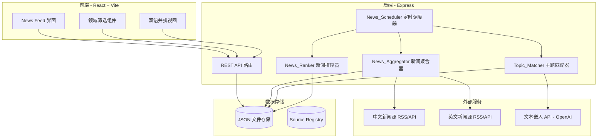

# 设计文档：双语新闻推送平台

## 概述

双语新闻推送平台是一个每日自动聚合中英文真实新闻的系统。系统通过定时任务从预注册的中英文新闻源抓取文章，利用语义相似度将报道同一事件的中英文文章配对，按重要性排序后筛选出 Top 10 新闻，最终通过 React 前端以双语并排视图展示给用户。

核心设计原则：
- 不使用机器翻译，所有文章均为原生语言撰写
- 基于语义相似度进行跨语言文章配对
- 确保 AI、科技、经济、国际政治四大领域的覆盖
- 完整保留新闻来源溯源信息

## 架构

系统采用前后端分离架构，与现有项目保持一致（React + Vite 前端，Express 后端）。



### 架构决策

1. **文件存储 vs 数据库**：沿用现有项目的 JSON 文件存储方案（FileStorageService 模式），每日新闻数据量小（10条），无需引入数据库。每日新闻以日期为文件名存储。

2. **RSS 抓取**：使用 `rss-parser` 库解析新闻源的 RSS feed，这是获取新闻标题、摘要、链接的标准方式，避免复杂的网页爬虫。

3. **语义匹配**：使用 OpenAI Embeddings API 将中英文文章标题+摘要转为向量，通过余弦相似度进行跨语言配对。OpenAI 的 embedding 模型原生支持多语言。

4. **重要性排序**：基于报道频次（同一事件被多少媒体报道）、媒体权重（Source Registry 中配置）和时效性（发布时间距当前的衰减）综合评分。T1 级媒体的报道在权重计算中获得更高基础分。

5. **定时任务**：使用 `node-cron` 在 Express 进程内运行定时任务，简单可靠，无需额外的任务队列基础设施。

6. **新闻源信誉要求**：Source Registry 仅收录官方、有声望和社会影响力的权威媒体机构。所有新闻源按信誉分为 T1（国家级/国际顶级媒体）和 T2（知名行业/专业媒体）两个等级，不收录自媒体、个人博客或缺乏编辑审核机制的来源。

## 组件与接口

### 1. News_Aggregator（新闻聚合器）

负责从 Source Registry 中注册的新闻源抓取文章。

```typescript
interface NewsAggregator {
  // 从所有注册源抓取过去24小时的文章
  fetchArticles(since: Date): Promise<AggregationResult>;
  // 从单个源抓取文章
  fetchFromSource(source: NewsSource): Promise<RawArticle[]>;
}

interface AggregationResult {
  articles: RawArticle[];
  errors: SourceError[];
  fetchedAt: string;
}

interface SourceError {
  sourceId: string;
  sourceName: string;
  error: string;
  timestamp: string;
}
```

### 2. Topic_Matcher（主题匹配器）

基于语义相似度将中英文文章配对。

```typescript
interface TopicMatcher {
  // 对文章列表进行跨语言配对
  matchArticles(articles: RawArticle[]): Promise<MatchedNewsItem[]>;
  // 计算两篇文章的语义相似度
  computeSimilarity(articleA: RawArticle, articleB: RawArticle): Promise<number>;
  // 生成新闻主题摘要
  generateTopicSummary(chArticle: RawArticle | null, enArticle: RawArticle | null): Promise<string>;
}
```

### 3. News_Ranker（新闻排序器）

对候选新闻按重要性排序并筛选 Top 10。

```typescript
interface NewsRanker {
  // 对候选新闻排序并筛选 Top 10
  rankAndSelect(items: MatchedNewsItem[], targetCount: number): RankedNewsItem[];
  // 计算单条新闻的重要性分数
  computeImportanceScore(item: MatchedNewsItem): number;
  // 确保领域覆盖（至少3个领域）
  ensureDomainCoverage(ranked: RankedNewsItem[], minDomains: number): RankedNewsItem[];
}
```

### 4. News_Scheduler（新闻调度器）

管理定时任务和执行流程。

```typescript
interface NewsScheduler {
  // 启动定时任务
  start(): void;
  // 停止定时任务
  stop(): void;
  // 手动触发一次更新
  triggerUpdate(): Promise<UpdateResult>;
}

interface UpdateResult {
  success: boolean;
  completedAt: string;
  articlesFetched: number;
  newsItemsGenerated: number;
  retryCount: number;
  errors: string[];
}
```

### 5. REST API 路由

```typescript
// GET /api/news/daily?date=YYYY-MM-DD
// 获取指定日期的每日新闻列表（默认今天）

// GET /api/news/:id
// 获取单条新闻详情（含中英文全文）

// GET /api/news/daily?date=YYYY-MM-DD&domain=ai
// 按领域筛选新闻

// GET /api/news/sources
// 获取所有注册新闻源列表

// POST /api/news/trigger
// 手动触发新闻更新（管理接口）
```

### 6. 前端组件

```typescript
// NewsFeed - 每日新闻列表页
// NewsItem - 单条新闻卡片（主题摘要、领域标签、来源信息）
// NewsDetail - 双语并排阅读视图
// DomainFilter - 领域筛选栏
// SourceBadge - 来源标识组件
```

## 数据模型

### NewsSource（新闻源）

```typescript
interface NewsSource {
  id: string;
  name: string;           // 媒体名称，如 "Reuters", "新华社"
  url: string;            // RSS feed URL
  language: 'zh' | 'en';  // 语言
  domain: NewsDomain;     // 主要领域
  tier: 'T1' | 'T2';     // 信誉等级：T1=国家级/国际顶级媒体，T2=知名行业/专业媒体
  weight: number;         // 媒体权重 (0-1)，用于重要性排序，T1 默认权重高于 T2
  enabled: boolean;       // 是否启用
}

type NewsDomain = 'ai' | 'tech' | 'economy' | 'politics';
```

### RawArticle（原始文章）

```typescript
interface RawArticle {
  id: string;
  sourceId: string;       // 关联的新闻源 ID
  sourceName: string;     // 媒体名称
  language: 'zh' | 'en';
  title: string;          // 文章标题
  summary: string;        // 文章摘要
  content: string;        // 文章正文
  url: string;            // 原始文章 URL
  publishedAt: string;    // 发布时间 ISO 8601
  fetchedAt: string;      // 抓取时间
  domain: NewsDomain;     // 所属领域
}
```

### NewsItem（新闻条目）

```typescript
interface NewsItem {
  id: string;
  topicSummary: string;       // 统一的新闻主题摘要
  domain: NewsDomain;         // 主要领域
  secondaryDomains: NewsDomain[]; // 次要领域标签
  chineseArticle: ArticleRef | null;  // 中文文章引用
  englishArticle: ArticleRef | null;  // 英文文章引用
  pairingStatus: 'paired' | 'zh-only' | 'en-only'; // 配对状态
  importanceScore: number;    // 重要性分数
  rank: number;               // 排名 (1-10)
  createdAt: string;          // 创建时间
}

interface ArticleRef {
  articleId: string;
  sourceId: string;
  sourceName: string;
  title: string;
  summary: string;
  content: string;
  url: string;
  publishedAt: string;
}
```

### DailyNews（每日新闻）

```typescript
interface DailyNews {
  date: string;               // YYYY-MM-DD
  items: NewsItem[];          // 当日 Top 10 新闻
  generatedAt: string;        // 生成时间
  updateResult: UpdateResult; // 更新执行结果
}
```

### SourceRegistry（来源注册表）

```typescript
interface SourceRegistry {
  version: number;
  sources: NewsSource[];
  lastUpdated: string;
}
```

#### 预注册权威媒体列表

Source_Registry 仅收录官方、有声望和社会影响力的权威媒体机构。以下为预注册的推荐媒体：

**中文新闻源（T1 - 国家级/顶级媒体）：**
- 新华社（xinhuanet.com）- 国家通讯社，综合领域
- 人民日报（people.com.cn）- 国家级综合媒体
- 央视新闻（cctv.com）- 国家级广播媒体

**中文新闻源（T2 - 知名行业/专业媒体）：**
- 财新网（caixin.com）- 财经深度报道
- 第一财经（yicai.com）- 财经与经济
- 36氪（36kr.com）- 科技与创业
- 澎湃新闻（thepaper.cn）- 时政与社会

**英文新闻源（T1 - 国际顶级媒体）：**
- Reuters（reuters.com）- 国际通讯社，综合领域
- BBC News（bbc.com/news）- 国际综合媒体
- The New York Times（nytimes.com）- 国际综合媒体
- Bloomberg（bloomberg.com）- 财经与经济

**英文新闻源（T2 - 知名行业/专业媒体）：**
- TechCrunch（techcrunch.com）- 科技与创业
- The Economist（economist.com）- 经济与国际政治
- Ars Technica（arstechnica.com）- 科技深度报道
- MIT Technology Review（technologyreview.com）- AI 与前沿科技


## 正确性属性（Correctness Properties）

*属性（Property）是指在系统所有有效执行中都应保持为真的特征或行为——本质上是对系统应做什么的形式化陈述。属性是人类可读规范与机器可验证正确性保证之间的桥梁。*

### 属性 1：文章来源合法性

*对于任意*由 News_Aggregator 返回的文章，其 sourceId 必须存在于 Source_Registry 的注册源列表中。

**验证需求：1.1**

### 属性 17：新闻源信誉等级合法性

*对于任意* Source_Registry 中注册的 NewsSource，其 tier 字段必须为 'T1' 或 'T2'，且 T1 级媒体的默认 weight 必须 ≥ T2 级媒体的默认 weight。

**验证需求：1.7**

### 属性 18：新闻源排除非权威来源

*对于任意* Source_Registry 中注册的 NewsSource，该来源必须为具有编辑审核机制的官方媒体机构，不得为自媒体、个人博客或未经认证的新闻聚合站点。

**验证需求：1.6, 1.8**

### 属性 2：文章元数据完整性

*对于任意*由 News_Aggregator 产出的 RawArticle，其 url、sourceName 和 publishedAt 字段必须为非空字符串，且 publishedAt 必须是有效的 ISO 8601 时间戳。

**验证需求：1.2**

### 属性 3：聚合器容错性

*对于任意*一组新闻源，其中部分源不可访问时，News_Aggregator 应仍然返回来自可访问源的文章，且为每个不可访问源生成对应的 SourceError 记录。不可访问的源不应导致整个抓取流程失败。

**验证需求：1.4**

### 属性 4：配对条目双语完整性

*对于任意* pairingStatus 为 "paired" 的 NewsItem，其 chineseArticle 和 englishArticle 必须均为非 null，且 chineseArticle.language 为 'zh'，englishArticle.language 为 'en'。

**验证需求：2.1**

### 属性 5：配对文章语义相似度阈值

*对于任意*被配对的中英文文章对，其语义相似度分数必须超过配置的最低阈值。

**验证需求：2.2**

### 属性 6：单语言条目正确标记

*对于任意* NewsItem，若 chineseArticle 为 null 且 englishArticle 非 null，则 pairingStatus 必须为 "en-only"；若 englishArticle 为 null 且 chineseArticle 非 null，则 pairingStatus 必须为 "zh-only"；若两者均非 null，则 pairingStatus 必须为 "paired"。

**验证需求：2.4**

### 属性 7：新闻主题摘要存在性

*对于任意*由 Topic_Matcher 产出的 NewsItem，其 topicSummary 必须为非空字符串。

**验证需求：2.5**

### 属性 8：24小时时间窗口过滤

*对于任意*由 News_Aggregator 在时间 T 触发抓取后返回的文章，其 publishedAt 必须在 [T - 24小时, T] 的时间范围内。

**验证需求：3.2**

### 属性 9：更新结果完整性

*对于任意*成功完成的 UpdateResult，其 completedAt 必须为有效时间戳，articlesFetched 和 newsItemsGenerated 必须为非负整数，且 newsItemsGenerated ≤ articlesFetched。

**验证需求：3.4**

### 属性 10：Top 10 数量保证

*对于任意*包含至少10条候选新闻的输入集合，News_Ranker 的输出必须恰好包含10条新闻。当候选新闻不足10条时，输出数量等于候选数量。

**验证需求：4.1, 4.4**

### 属性 11：重要性排序正确性

*对于任意* News_Ranker 的输出列表，列表中的新闻必须按 importanceScore 降序排列，即对于任意相邻的两条新闻 items[i] 和 items[i+1]，items[i].importanceScore ≥ items[i+1].importanceScore。

**验证需求：4.2**

### 属性 12：领域覆盖保证

*对于任意* News_Ranker 的输出列表（当候选新闻覆盖至少3个领域时），输出中不同 domain 值的数量必须 ≥ 3。

**验证需求：4.3**

### 属性 13：主次领域分配正确性

*对于任意* NewsItem，其 domain（主要领域）不得出现在 secondaryDomains 列表中，且 secondaryDomains 中不得有重复值。

**验证需求：5.2, 5.3**

### 属性 14：来源溯源信息完整性

*对于任意*在 News_Feed 中展示的 NewsItem，其每个非 null 的 ArticleRef 必须包含非空的 sourceName、url 和 publishedAt 字段。

**验证需求：6.1, 6.3**

### 属性 15：新闻卡片信息完整性

*对于任意*在 News_Feed 中渲染的 NewsItem 卡片，渲染输出必须包含 topicSummary、domain 标签和 createdAt 时间信息。

**验证需求：7.3**

### 属性 16：领域筛选正确性

*对于任意*领域筛选条件 D 和任意每日新闻列表，筛选后返回的所有 NewsItem 的 domain 或 secondaryDomains 必须包含 D。

**验证需求：7.4**

## 错误处理

### 新闻源抓取错误

| 错误场景 | 处理策略 | 用户影响 |
|---------|---------|---------|
| 单个新闻源不可访问 | 跳过该源，记录 SourceError，继续抓取其他源 | 无感知，可能少部分文章缺失 |
| 所有新闻源不可访问 | 记录严重错误，保留上一次成功的新闻数据 | 用户看到上一天的新闻，显示"更新失败"提示 |
| RSS 解析失败 | 跳过该源，记录解析错误详情 | 无感知 |
| 抓取超时 | 单源超时30秒后跳过，记录超时日志 | 无感知 |

### 语义匹配错误

| 错误场景 | 处理策略 | 用户影响 |
|---------|---------|---------|
| Embedding API 不可用 | 使用基于关键词的降级匹配策略 | 配对质量可能下降 |
| 相似度计算异常 | 将该文章标记为未配对（单语言） | 部分新闻显示为"仅中文"或"仅英文" |

### 定时任务错误

| 错误场景 | 处理策略 | 用户影响 |
|---------|---------|---------|
| 定时任务执行失败 | 15分钟后重试，最多3次 | 新闻更新延迟，最多延迟45分钟 |
| 3次重试均失败 | 记录严重错误，保留上一次数据，发送告警 | 用户看到上一天的新闻 |

### API 错误

| 错误场景 | HTTP 状态码 | 响应格式 |
|---------|-----------|---------|
| 请求的日期无数据 | 404 | `{ success: false, error: { code: 'NO_DATA', message: '该日期暂无新闻数据' } }` |
| 无效的日期格式 | 400 | `{ success: false, error: { code: 'INVALID_DATE', message: '日期格式无效' } }` |
| 无效的领域参数 | 400 | `{ success: false, error: { code: 'INVALID_DOMAIN', message: '无效的领域分类' } }` |
| 服务器内部错误 | 500 | `{ success: false, error: { code: 'INTERNAL_ERROR', message: '服务器内部错误' } }` |

## 测试策略

### 双重测试方法

本项目采用单元测试与属性测试相结合的策略，确保全面覆盖。

#### 属性测试（Property-Based Testing）

使用 `fast-check` 库（项目已有依赖）进行属性测试，每个属性测试至少运行 100 次迭代。

每个正确性属性对应一个属性测试，测试标注格式：
**Feature: bilingual-news-platform, Property {编号}: {属性描述}**

属性测试重点覆盖：
- **News_Ranker**：排序正确性（属性11）、数量保证（属性10）、领域覆盖（属性12）
- **Topic_Matcher**：配对状态一致性（属性4、6）、主题摘要存在性（属性7）
- **News_Aggregator**：来源合法性（属性1）、元数据完整性（属性2）、容错性（属性3）、时间窗口过滤（属性8）、新闻源信誉等级合法性（属性17）
- **领域分配**：主次领域不重叠（属性13）
- **前端渲染**：信息完整性（属性14、15）、筛选正确性（属性16）

每个属性测试需要自定义 `fast-check` 的 Arbitrary 生成器来生成随机的 NewsItem、RawArticle、NewsSource 等数据结构。

#### 单元测试

单元测试聚焦于具体示例、边界情况和集成点：

- **配置验证**：Source Registry 包含至少5个中文源和5个英文源（需求1.3），且所有源均为 T1 或 T2 级权威媒体（需求1.6、1.7）
- **定时任务配置**：cron 表达式对应每天9:00（需求3.1）
- **重试机制**：失败后15分钟重试，最多3次（需求3.3）
- **UI 行为**：原文链接在新窗口打开（需求6.2）、点击新闻展示并排视图（需求7.2）
- **边界情况**：候选新闻不足10条时的处理、所有源不可访问时的降级
- **错误条件**：无效日期格式、无效领域参数的 API 错误响应

#### 测试文件组织

```
server/src/services/__tests__/
  NewsAggregator.test.ts        # 聚合器单元测试 + 属性测试
  TopicMatcher.test.ts           # 匹配器单元测试 + 属性测试
  NewsRanker.test.ts             # 排序器单元测试 + 属性测试
  NewsScheduler.test.ts          # 调度器单元测试
server/src/routes/__tests__/
  news.test.ts                   # API 路由测试
src/components/__tests__/
  NewsFeed.test.tsx              # 前端组件测试 + 属性测试
  NewsDetail.test.tsx            # 并排视图测试
  DomainFilter.test.tsx          # 筛选组件测试
```
