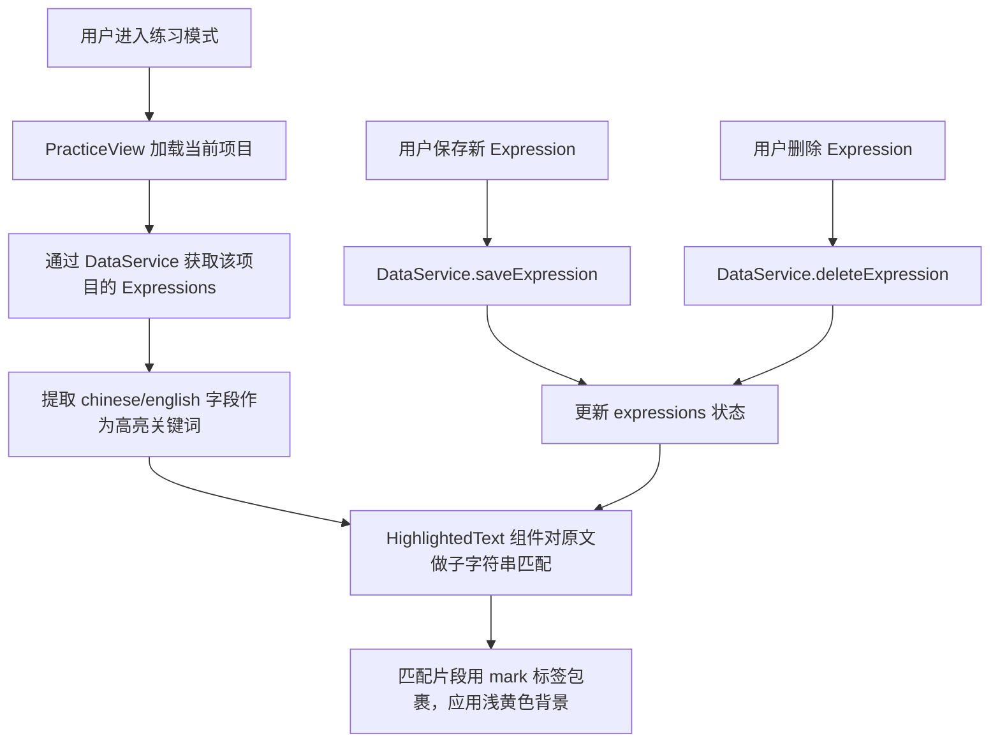
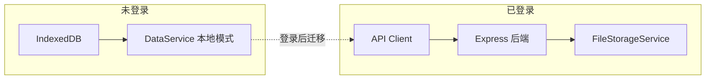

# 设计文档：Expression 高亮同步

## 概述

本功能在视译训练工具的练习视图（PracticeView）中，基于用户已收藏的 Expression 数据，在中英文原文中对匹配的文本片段进行浅黄色高亮渲染。核心设计思路是：**不引入独立的高亮数据结构**，直接复用 Expression 的 `chinese` / `english` 字段做子字符串匹配，天然复用现有的存储和同步链路（IndexedDB + FileStorageService）。

### 设计决策

1. **无独立高亮模型**：高亮完全派生自 Expression 数据，不需要额外的 Highlight 表或字段。这意味着新增/删除 Expression 自动影响高亮，无需维护两套数据的一致性。
2. **子字符串匹配**：使用 `String.indexOf` 在原文中查找所有匹配位置，简单可靠。不使用正则匹配，避免特殊字符转义问题。
3. **纯前端渲染**：高亮计算和渲染完全在前端完成，后端无需任何改动。
4. **React 组件化**：将文本高亮逻辑封装为独立的 `HighlightedText` 组件，保持 PracticeView 的简洁性。

## 架构

### 数据流



### 同步链路（已有，无需改动）



高亮功能完全依赖 Expression 数据，而 Expression 的存储和同步链路已经完整实现。因此：
- 未登录用户：Expression 存在 IndexedDB，刷新后从本地恢复高亮
- 已登录用户：Expression 通过 API 同步到后端 FileStorageService，其他设备加载同一项目时自动获取 Expression 并渲染高亮

## 组件与接口

### 1. HighlightedText 组件（新增）

路径：`src/components/PracticeView/HighlightedText.tsx`

```typescript
interface HighlightedTextProps {
  /** 原文文本 */
  text: string;
  /** 需要高亮的关键词列表 */
  keywords: string[];
}
```

职责：
- 接收原文文本和关键词列表
- 对文本进行子字符串匹配，找出所有匹配区间
- 合并重叠区间，避免嵌套高亮
- 将文本拆分为普通片段和高亮片段，用 `<mark>` 标签渲染高亮部分

### 2. highlightUtils 工具函数（新增）

路径：`src/components/PracticeView/highlightUtils.ts`

```typescript
interface HighlightRange {
  start: number;
  end: number;
}

/** 在文本中查找所有关键词的匹配区间 */
function findHighlightRanges(text: string, keywords: string[]): HighlightRange[];

/** 合并重叠或相邻的区间 */
function mergeRanges(ranges: HighlightRange[]): HighlightRange[];

/** 将文本按高亮区间拆分为片段 */
interface TextSegment {
  text: string;
  highlighted: boolean;
}
function splitTextByRanges(text: string, ranges: HighlightRange[]): TextSegment[];
```

### 3. PracticeView 组件（修改）

修改点：
- 在练习模式下加载当前项目的 Expression 列表
- 提取 `chinese` 字段值作为中文栏高亮关键词，`english` 字段值作为英文栏高亮关键词
- 将原文文本渲染从纯文本改为使用 `HighlightedText` 组件
- 保存/删除 Expression 后刷新 Expression 列表以更新高亮

### 4. useProjectExpressions Hook（新增）

路径：`src/components/PracticeView/useProjectExpressions.ts`

```typescript
function useProjectExpressions(projectId: string | undefined): {
  expressions: Expression[];
  refresh: () => Promise<void>;
  chineseKeywords: string[];
  englishKeywords: string[];
}
```

职责：
- 封装 Expression 加载逻辑
- 按 projectId 过滤 Expression
- 提取并缓存 chinese/english 关键词列表
- 提供 refresh 方法供保存/删除后调用

## 数据模型

### 现有数据模型（无需修改）

**Expression**（前端 IndexedDB / 后端 FileStorageService）：

| 字段 | 类型 | 说明 |
|------|------|------|
| id | string | UUID |
| projectId | string | 所属项目 ID |
| chinese | string | 中文术语（用于中文栏高亮匹配） |
| english | string | 英文术语（用于英文栏高亮匹配） |
| notes | string | 用户备注 |
| createdAt | Date/string | 创建时间 |
| updatedAt | Date/string | 更新时间 |

### 新增数据结构（仅前端运行时）

**HighlightRange**：表示文本中的一个高亮区间

| 字段 | 类型 | 说明 |
|------|------|------|
| start | number | 起始字符索引（含） |
| end | number | 结束字符索引（不含） |

**TextSegment**：表示拆分后的文本片段

| 字段 | 类型 | 说明 |
|------|------|------|
| text | string | 文本内容 |
| highlighted | boolean | 是否高亮 |

这些结构仅在渲染时使用，不持久化存储。


## 正确性属性（Correctness Properties）

*属性（Property）是指在系统所有合法执行中都应成立的特征或行为——本质上是对系统应做什么的形式化陈述。属性是人类可读规格说明与机器可验证正确性保证之间的桥梁。*

### 属性 1：子字符串匹配完整性

*对于任意*文本和任意非空关键词列表，`findHighlightRanges` 返回的每个区间 `[start, end)` 都满足：`text.substring(start, end)` 等于某个关键词；且文本中该关键词的所有出现位置都被包含在返回的区间中。

**验证需求：1.2, 2.1, 2.2, 2.3**

### 属性 2：区间合并正确性

*对于任意*一组可能重叠或相邻的区间，`mergeRanges` 的输出满足：(a) 输出区间按 start 升序排列；(b) 任意两个输出区间不重叠且不相邻；(c) 输出区间的并集等于输入区间的并集（即覆盖的字符位置集合相同）。

**验证需求：1.4**

### 属性 3：文本分割完整性（Round-trip）

*对于任意*文本和任意合法的高亮区间列表，`splitTextByRanges` 产生的所有片段按顺序拼接后等于原始文本。

**验证需求：2.1, 2.2**

### 属性 4：高亮片段与关键词一致性

*对于任意*文本和任意非空关键词列表，经过 `findHighlightRanges` → `mergeRanges` → `splitTextByRanges` 完整流程后，所有标记为 `highlighted: true` 的片段中的每个字符，都属于至少一个关键词在原文中的匹配位置；所有标记为 `highlighted: false` 的片段中不包含任何关键词的完整匹配。

**验证需求：1.1, 1.2, 3.2**

### 属性 5：空关键词列表不产生高亮

*对于任意*文本，当关键词列表为空时，`findHighlightRanges` 返回空数组，`splitTextByRanges` 产生单个未高亮片段，其文本等于原始文本。

**验证需求：2.4, 3.2**

## 错误处理

### 前端错误处理

| 场景 | 处理方式 |
|------|----------|
| Expression 加载失败 | 静默降级，不显示高亮，不阻塞练习功能 |
| 关键词在原文中无匹配 | 跳过该关键词，不显示错误（需求 2.4） |
| Expression 字段为空字符串 | 过滤掉空字符串关键词，不参与匹配 |
| 云端同步失败 | 由现有 DataService 错误处理机制显示 Toast 提示（需求 4.4） |

### 边界情况

- 空文本：直接返回空内容，不执行匹配
- 空关键词列表：渲染原始文本，无高亮
- 关键词包含特殊字符：使用 `indexOf` 而非正则，天然支持特殊字符
- 超长文本或大量关键词：子字符串匹配为 O(n*m) 复杂度，对于视译练习场景（通常几千字、几十个表达）性能足够

## 测试策略

### 属性测试（Property-Based Testing）

使用 `fast-check` 库进行属性测试，每个属性测试至少运行 100 次迭代。

测试文件：`src/components/PracticeView/highlightUtils.test.ts`

每个测试用注释标注对应的设计属性：

```typescript
// Feature: expression-highlight-sync, Property 1: 子字符串匹配完整性
// Feature: expression-highlight-sync, Property 2: 区间合并正确性
// Feature: expression-highlight-sync, Property 3: 文本分割完整性（Round-trip）
// Feature: expression-highlight-sync, Property 4: 高亮片段与关键词一致性
// Feature: expression-highlight-sync, Property 5: 空关键词列表不产生高亮
```

### 单元测试

测试文件：`src/components/PracticeView/highlightUtils.test.ts`（与属性测试同文件）

单元测试聚焦于具体示例和边界情况：

- `findHighlightRanges`：单个关键词单次匹配、多次匹配、无匹配、空字符串关键词
- `mergeRanges`：不重叠区间、完全重叠区间、相邻区间、空输入
- `splitTextByRanges`：无高亮区间、全文高亮、首尾高亮
- `HighlightedText` 组件：渲染快照测试、编辑模式不渲染高亮

### 集成测试

- PracticeView 保存 Expression 后高亮立即出现
- PracticeView 删除 Expression 后高亮消失
- 编辑模式切换到练习模式后高亮重新渲染
