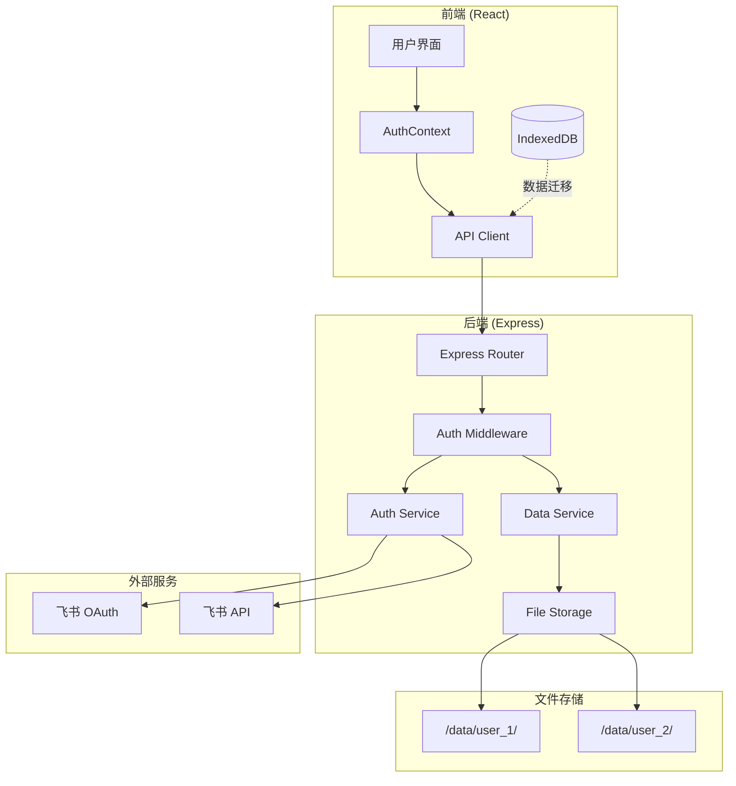
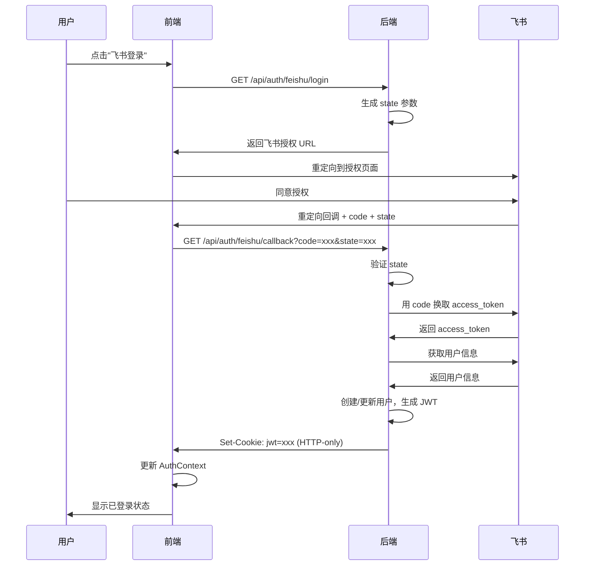

# Design Document: 飞书登录集成

## Overview

本设计文档描述视译练习平台（Sight Translation Trainer）的飞书登录集成功能。该功能将现有的纯前端 React 应用扩展为前后端分离架构，实现：

1. **飞书 OAuth 2.0 登录**：用户通过飞书账号登录，获取用户身份信息
2. **JWT 会话管理**：使用 JWT 令牌管理用户会话，支持自动刷新
3. **JSON 文件持久化**：使用轻量级 JSON 文件存储用户数据，每个用户独立目录
4. **本地数据迁移**：支持将浏览器 IndexedDB 数据上传到服务端

### 技术栈

- **后端**：Node.js + Express + TypeScript
- **数据存储**：JSON 文件（每用户独立目录）
- **前端**：现有 React 应用 + React Context
- **认证**：飞书 OAuth 2.0 + JWT

### 设计原则

- **轻量级**：不引入数据库，使用 JSON 文件存储
- **安全性**：JWT + HTTP-only Cookie，防止 XSS/CSRF
- **兼容性**：保持现有前端代码结构，最小化改动
- **可扩展**：模块化设计，便于后续扩展

## Architecture

### 系统架构图



### 认证流程



## Components and Interfaces

### 后端组件

#### 1. AuthService（认证服务）

```typescript
interface IAuthService {
  /**
   * 生成飞书 OAuth 授权 URL
   * @param redirectUri 回调地址
   * @returns 授权 URL 和 state 参数
   */
  getAuthorizationUrl(redirectUri: string): { url: string; state: string };

  /**
   * 处理 OAuth 回调，交换 token 并获取用户信息
   * @param code 授权码
   * @param state state 参数
   * @returns 用户信息和 JWT
   */
  handleCallback(code: string, state: string): Promise<AuthResult>;

  /**
   * 刷新 access_token
   * @param refreshToken 刷新令牌
   * @returns 新的 token 对
   */
  refreshToken(refreshToken: string): Promise<TokenPair>;

  /**
   * 验证 JWT 令牌
   * @param token JWT 令牌
   * @returns 解码后的用户信息
   */
  verifyToken(token: string): Promise<JWTPayload>;
}

interface AuthResult {
  user: User;
  jwt: string;
  expiresIn: number;
}

interface TokenPair {
  accessToken: string;
  refreshToken: string;
  expiresIn: number;
}

interface JWTPayload {
  userId: string;
  feishuUserId: string;
  name: string;
  iat: number;
  exp: number;
}
```

#### 2. DataService（数据服务）

```typescript
interface IDataService {
  // 用户管理
  getUser(userId: string): Promise<User | null>;
  createUser(feishuUser: FeishuUserInfo): Promise<User>;
  updateUser(userId: string, updates: Partial<User>): Promise<void>;

  // 项目管理
  getProjects(userId: string): Promise<Project[]>;
  getProject(userId: string, projectId: string): Promise<Project | null>;
  createProject(userId: string, project: ProjectInput): Promise<Project>;
  updateProject(userId: string, projectId: string, updates: Partial<Project>): Promise<void>;
  deleteProject(userId: string, projectId: string): Promise<void>;

  // 表达管理
  getExpressions(userId: string, keyword?: string): Promise<Expression[]>;
  createExpression(userId: string, expression: ExpressionInput): Promise<Expression>;
  updateExpression(userId: string, expressionId: string, updates: Partial<Expression>): Promise<void>;
  deleteExpression(userId: string, expressionId: string): Promise<void>;

  // 闪卡管理
  getFlashcards(userId: string): Promise<Flashcard[]>;
  getDueFlashcards(userId: string): Promise<Flashcard[]>;
  updateFlashcard(userId: string, flashcardId: string, updates: Partial<Flashcard>): Promise<void>;

  // 复习记录
  createReviewRecord(userId: string, record: ReviewRecordInput): Promise<ReviewRecord>;
  getReviewRecords(userId: string, flashcardId: string): Promise<ReviewRecord[]>;
}
```

#### 3. FileStorageService（文件存储服务）

```typescript
interface IFileStorageService {
  /**
   * 读取 JSON 文件
   * @param userId 用户 ID
   * @param filename 文件名（如 projects.json）
   * @returns 解析后的数据
   */
  readJson<T>(userId: string, filename: string): Promise<T>;

  /**
   * 写入 JSON 文件（带备份和锁）
   * @param userId 用户 ID
   * @param filename 文件名
   * @param data 要写入的数据
   */
  writeJson<T>(userId: string, filename: string, data: T): Promise<void>;

  /**
   * 确保用户目录存在
   * @param userId 用户 ID
   */
  ensureUserDir(userId: string): Promise<void>;

  /**
   * 获取用户数据目录路径
   * @param userId 用户 ID
   * @returns 目录路径
   */
  getUserDir(userId: string): string;
}
```

#### 4. MigrationService（数据迁移服务）

```typescript
interface IMigrationService {
  /**
   * 批量导入本地数据
   * @param userId 用户 ID
   * @param data 本地数据
   * @returns 导入结果
   */
  importLocalData(userId: string, data: LocalDataExport): Promise<MigrationResult>;
}

interface LocalDataExport {
  projects: Project[];
  expressions: Expression[];
  flashcards: Flashcard[];
  reviewRecords: ReviewRecord[];
}

interface MigrationResult {
  success: boolean;
  imported: {
    projects: number;
    expressions: number;
    flashcards: number;
    reviewRecords: number;
  };
  errors: string[];
}
```

### 前端组件

#### 1. AuthContext（认证上下文）

```typescript
interface AuthContextValue {
  user: User | null;
  isAuthenticated: boolean;
  isLoading: boolean;
  login: () => void;
  logout: () => Promise<void>;
  checkAuth: () => Promise<void>;
}
```

#### 2. ApiClient（API 客户端）

```typescript
interface IApiClient {
  // 认证
  getLoginUrl(): Promise<string>;
  handleCallback(code: string, state: string): Promise<User>;
  logout(): Promise<void>;
  getCurrentUser(): Promise<User | null>;

  // 项目
  getProjects(): Promise<Project[]>;
  getProject(id: string): Promise<Project>;
  createProject(input: ProjectInput): Promise<Project>;
  updateProject(id: string, updates: Partial<Project>): Promise<void>;
  deleteProject(id: string): Promise<void>;

  // 表达
  getExpressions(keyword?: string): Promise<Expression[]>;
  createExpression(input: ExpressionInput): Promise<Expression>;
  updateExpression(id: string, updates: Partial<Expression>): Promise<void>;
  deleteExpression(id: string): Promise<void>;

  // 闪卡
  getDueFlashcards(): Promise<Flashcard[]>;
  recordReview(flashcardId: string, remembered: boolean): Promise<void>;

  // 数据迁移
  migrateLocalData(data: LocalDataExport): Promise<MigrationResult>;
}
```

### API 端点设计

| 方法 | 路径 | 描述 | 认证 |
|------|------|------|------|
| GET | /api/auth/feishu/login | 获取飞书授权 URL | 否 |
| GET | /api/auth/feishu/callback | 处理 OAuth 回调 | 否 |
| GET | /api/auth/me | 获取当前用户信息 | 是 |
| POST | /api/auth/logout | 退出登录 | 是 |
| GET | /api/projects | 获取项目列表 | 是 |
| POST | /api/projects | 创建项目 | 是 |
| GET | /api/projects/:id | 获取项目详情 | 是 |
| PUT | /api/projects/:id | 更新项目 | 是 |
| DELETE | /api/projects/:id | 删除项目 | 是 |
| GET | /api/expressions | 获取表达列表 | 是 |
| POST | /api/expressions | 创建表达 | 是 |
| PUT | /api/expressions/:id | 更新表达 | 是 |
| DELETE | /api/expressions/:id | 删除表达 | 是 |
| GET | /api/flashcards/due | 获取待复习闪卡 | 是 |
| POST | /api/flashcards/:id/review | 记录复习结果 | 是 |
| POST | /api/migration/import | 导入本地数据 | 是 |

## Data Models

### 用户数据目录结构

```
data/
└── {feishu_user_id}/
    ├── user.json           # 用户信息
    ├── projects.json       # 项目列表
    ├── expressions.json    # 表达列表
    ├── flashcards.json     # 闪卡列表
    └── review-records.json # 复习记录
```

### JSON 文件格式

#### user.json

```typescript
interface UserFile {
  id: string;              // UUID
  feishuUserId: string;    // 飞书用户 ID
  name: string;            // 用户名
  avatar: string;          // 头像 URL
  createdAt: string;       // ISO 8601 时间戳
  updatedAt: string;       // ISO 8601 时间戳
}
```

#### projects.json

```typescript
interface ProjectsFile {
  version: number;         // 数据版本号
  projects: Project[];     // 项目数组
}

interface Project {
  id: string;
  name: string;
  createdAt: string;
  updatedAt: string;
  chineseText: string;
  englishText: string;
  chineseParagraphs: string[];
  englishParagraphs: string[];
  paragraphPairs: ParagraphPair[];
}
```

#### expressions.json

```typescript
interface ExpressionsFile {
  version: number;
  expressions: Expression[];
}

interface Expression {
  id: string;
  projectId: string;
  chinese: string;
  english: string;
  notes: string;
  createdAt: string;
  updatedAt: string;
}
```

#### flashcards.json

```typescript
interface FlashcardsFile {
  version: number;
  flashcards: Flashcard[];
}

interface Flashcard {
  id: string;
  expressionId: string;
  currentInterval: number;
  nextReviewDate: string;
  reviewCount: number;
  lastReviewDate: string | null;
  createdAt: string;
}
```

#### review-records.json

```typescript
interface ReviewRecordsFile {
  version: number;
  records: ReviewRecord[];
}

interface ReviewRecord {
  id: string;
  flashcardId: string;
  reviewedAt: string;
  remembered: boolean;
}
```

### 飞书 OAuth 相关类型

```typescript
interface FeishuOAuthConfig {
  appId: string;
  appSecret: string;
  redirectUri: string;
}

interface FeishuTokenResponse {
  access_token: string;
  refresh_token: string;
  token_type: string;
  expires_in: number;
  refresh_expires_in: number;
}

interface FeishuUserInfo {
  user_id: string;
  name: string;
  avatar_url: string;
  open_id: string;
  union_id: string;
}
```


## Correctness Properties

*A property is a characteristic or behavior that should hold true across all valid executions of a system—essentially, a formal statement about what the system should do. Properties serve as the bridge between human-readable specifications and machine-verifiable correctness guarantees.*

### Property 1: JWT 生成和验证往返

*For any* 有效的用户信息，生成 JWT 后再验证，应该能够还原出相同的用户 ID 和飞书用户 ID。

**Validates: Requirements 1.4, 2.1, 2.2, 2.3, 2.4, 2.8**

### Property 2: 用户数据隔离

*For any* 两个不同的用户 A 和 B，用户 A 创建的项目、表达、闪卡只能被用户 A 查询到，用户 B 无法访问用户 A 的任何数据。

**Validates: Requirements 3.2, 3.3, 3.4, 3.5, 3.6**

### Property 3: JSON 文件序列化往返

*For any* 有效的项目/表达/闪卡/复习记录对象，序列化为 JSON 写入文件后再读取反序列化，应该得到等价的对象（除时间戳精度外）。

**Validates: Requirements 5.2, 5.3, 5.4, 5.5, 5.6**

### Property 4: OAuth state 参数安全

*For any* OAuth 授权请求，生成的 state 参数应该是唯一的随机值，且回调时必须验证 state 匹配，不匹配时应拒绝请求。

**Validates: Requirements 1.7, 8.7**

### Property 5: 时间戳自动设置

*For any* 新创建的数据对象，created_at 和 updated_at 应该被自动设置为当前时间；*For any* 更新操作，updated_at 应该被更新为当前时间，而 created_at 保持不变。

**Validates: Requirements 5.7**

### Property 6: 文件路径安全验证

*For any* 包含 `..`、绝对路径或特殊字符的用户 ID 或文件名，FileStorageService 应该拒绝操作并抛出安全错误。

**Validates: Requirements 8.5**

### Property 7: 请求频率限制

*For any* 单个 IP 地址，在 1 分钟内发起超过 100 次请求时，后续请求应该返回 429 状态码。

**Validates: Requirements 8.4**

### Property 8: Cookie 安全标志

*For any* 登录成功后设置的 JWT Cookie，应该同时包含 HttpOnly 和 Secure 标志。

**Validates: Requirements 8.3**

### Property 9: 数据迁移完整性

*For any* 本地数据导出，导入到服务端后，所有项目、表达、闪卡、复习记录的数量和内容应该与原始数据一致。

**Validates: Requirements 6.4**

## Error Handling

### 认证错误

| 错误场景 | HTTP 状态码 | 错误码 | 处理方式 |
|---------|------------|--------|---------|
| 授权码无效 | 400 | AUTH_CODE_INVALID | 提示用户重新登录 |
| 授权码过期 | 400 | AUTH_CODE_EXPIRED | 提示用户重新登录 |
| state 参数不匹配 | 400 | STATE_MISMATCH | 提示可能的 CSRF 攻击 |
| 用户取消授权 | 400 | AUTH_CANCELLED | 显示取消提示 |
| 飞书 API 调用失败 | 502 | FEISHU_API_ERROR | 提示稍后重试 |
| JWT 无效 | 401 | TOKEN_INVALID | 清除 cookie，重定向登录 |
| JWT 过期 | 401 | TOKEN_EXPIRED | 尝试刷新，失败则重新登录 |
| 刷新令牌失败 | 401 | REFRESH_FAILED | 重定向登录 |

### 数据访问错误

| 错误场景 | HTTP 状态码 | 错误码 | 处理方式 |
|---------|------------|--------|---------|
| 资源不存在 | 404 | NOT_FOUND | 返回错误信息 |
| 无权访问 | 403 | FORBIDDEN | 返回错误信息 |
| 数据验证失败 | 400 | VALIDATION_ERROR | 返回具体字段错误 |
| 重复数据 | 409 | DUPLICATE | 返回冲突信息 |

### 文件存储错误

| 错误场景 | HTTP 状态码 | 错误码 | 处理方式 |
|---------|------------|--------|---------|
| 文件读取失败 | 500 | FILE_READ_ERROR | 记录日志，返回错误 |
| 文件写入失败 | 500 | FILE_WRITE_ERROR | 回滚到备份，返回错误 |
| 并发写入冲突 | 409 | CONCURRENT_WRITE | 提示稍后重试 |
| 路径安全检查失败 | 400 | PATH_SECURITY_ERROR | 拒绝操作 |

### 统一错误响应格式

```typescript
interface ErrorResponse {
  success: false;
  error: {
    code: string;
    message: string;
    details?: Record<string, string>;
  };
}
```

## Testing Strategy

### 测试方法

本项目采用双重测试策略：

1. **单元测试**：验证具体示例、边界情况和错误条件
2. **属性测试**：验证跨所有输入的通用属性

两种测试互补，共同提供全面覆盖。

### 属性测试配置

- **测试库**：使用 `fast-check` 进行属性测试
- **迭代次数**：每个属性测试至少运行 100 次
- **标签格式**：`Feature: feishu-login-integration, Property {number}: {property_text}`

### 测试分类

#### 后端单元测试

| 模块 | 测试内容 |
|------|---------|
| AuthService | OAuth URL 生成、token 交换、JWT 生成/验证 |
| DataService | CRUD 操作、数据隔离、级联删除 |
| FileStorageService | 读写操作、备份回滚、路径安全 |
| MigrationService | 数据导入、错误回滚 |
| AuthMiddleware | token 验证、401/403 响应 |
| RateLimiter | 频率限制、429 响应 |

#### 后端属性测试

| 属性 | 测试描述 |
|------|---------|
| Property 1 | 生成随机用户信息，验证 JWT 往返 |
| Property 2 | 生成随机用户对，验证数据隔离 |
| Property 3 | 生成随机数据对象，验证 JSON 往返 |
| Property 4 | 生成随机 state，验证匹配逻辑 |
| Property 5 | 生成随机操作序列，验证时间戳 |
| Property 6 | 生成恶意路径，验证安全检查 |

#### 前端测试

| 模块 | 测试内容 |
|------|---------|
| AuthContext | 状态管理、登录/登出流程 |
| ApiClient | API 调用、错误处理 |
| MigrationDialog | 数据导出、进度显示 |

### 测试数据生成器

```typescript
// fast-check 生成器示例
const userArbitrary = fc.record({
  id: fc.uuid(),
  feishuUserId: fc.string({ minLength: 10, maxLength: 20 }),
  name: fc.string({ minLength: 1, maxLength: 50 }),
  avatar: fc.webUrl(),
});

const projectArbitrary = fc.record({
  id: fc.uuid(),
  name: fc.string({ minLength: 1, maxLength: 100 }),
  chineseText: fc.string(),
  englishText: fc.string(),
  chineseParagraphs: fc.array(fc.string()),
  englishParagraphs: fc.array(fc.string()),
  paragraphPairs: fc.array(fc.record({
    index: fc.nat(),
    chinese: fc.string(),
    english: fc.string(),
  })),
});

const maliciousPathArbitrary = fc.oneof(
  fc.constant('../etc/passwd'),
  fc.constant('/etc/passwd'),
  fc.constant('..\\windows\\system32'),
  fc.stringOf(fc.constantFrom('/', '\\', '.', ':', '*', '?', '"', '<', '>', '|')),
);
```

### 集成测试

- 使用 `supertest` 测试 Express API 端点
- 使用临时目录进行文件存储测试
- Mock 飞书 API 响应

### 测试覆盖率目标

- 语句覆盖率：> 80%
- 分支覆盖率：> 75%
- 函数覆盖率：> 90%
