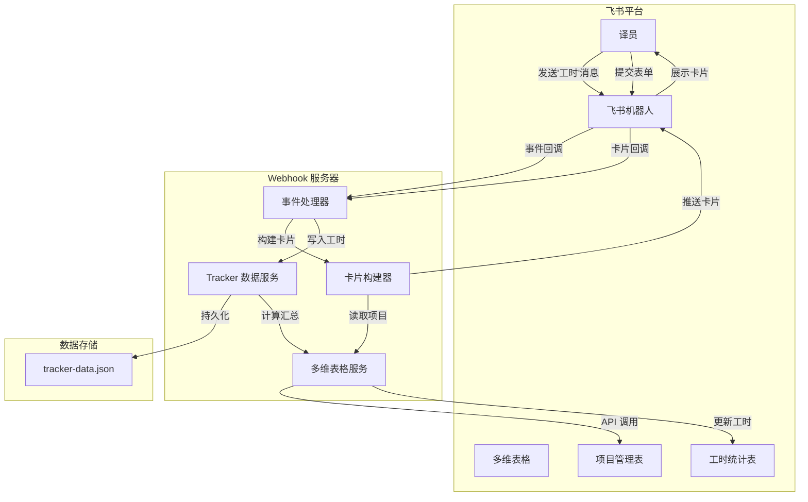
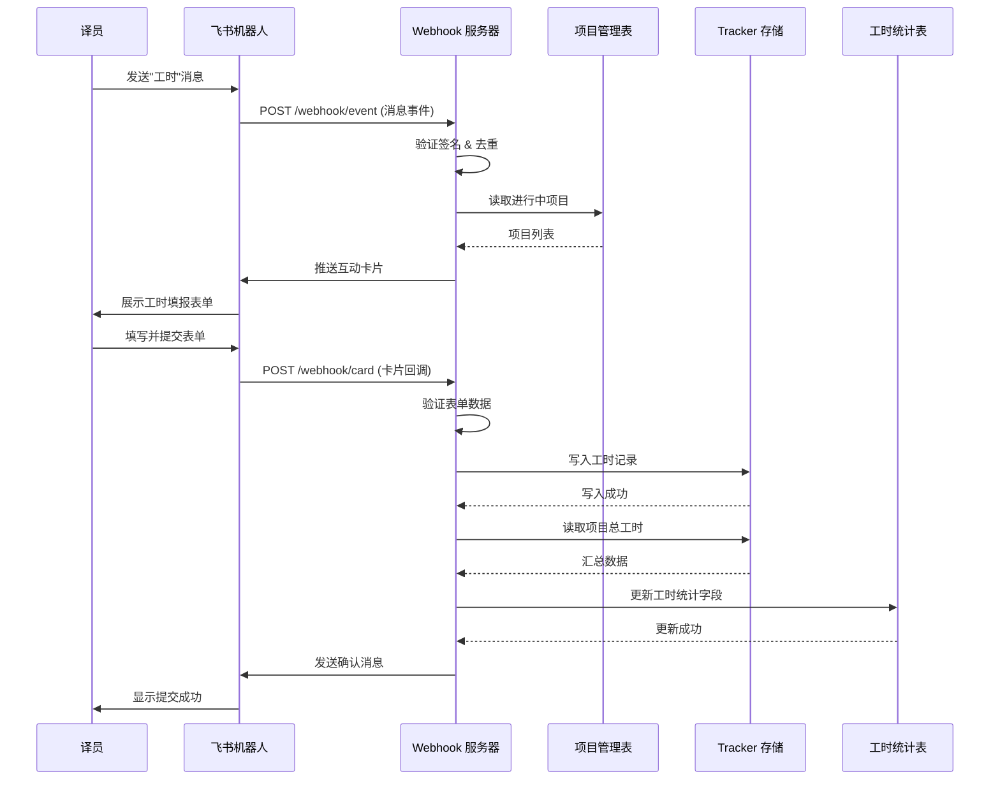

# 技术设计文档

## 概述

本设计文档描述飞书工时机器人（Feishu Workhour Bot）的技术实现方案。该系统作为现有 workhour-tracker 平台的飞书集成扩展，允许译员通过飞书机器人完成工时填报，实现与飞书多维表格的双向数据同步。

### 核心功能

1. **消息监听与问卷触发**：监听飞书单聊消息，识别"工时"关键词并推送互动卡片
2. **动态项目列表**：从飞书多维表格实时读取"进行中"项目
3. **工时填报表单**：通过飞书互动卡片收集口译/笔译工时数据
4. **数据双向同步**：将工时数据写入本地 Tracker 并回写飞书多维表格

### 技术栈选型

- **运行时**：Node.js 18+
- **Web 框架**：Express.js
- **飞书 SDK**：@larksuiteoapi/node-sdk
- **数据存储**：JSON 文件（与现有 localStorage 方案对齐）
- **开发工具**：ngrok（本地开发内网穿透）

---

## 架构

### 系统架构图



### 请求处理流程



---

## 组件与接口

### 1. Webhook 服务器 (WebhookServer)

主入口模块，负责 HTTP 服务和路由配置。

```typescript
interface WebhookServerConfig {
  port: number;
  feishuAppId: string;
  feishuAppSecret: string;
  verificationToken: string;
  encryptKey: string;
}

class WebhookServer {
  constructor(config: WebhookServerConfig);
  start(): Promise<void>;
  stop(): Promise<void>;
}
```

**路由定义**：
- `POST /webhook/event` - 飞书事件订阅回调
- `POST /webhook/card` - 飞书卡片交互回调
- `GET /health` - 健康检查

### 2. 事件处理器 (EventHandler)

处理飞书事件回调，包括消息事件和卡片交互事件。

```typescript
interface EventHandler {
  // 处理消息事件
  handleMessageEvent(event: MessageEvent): Promise<void>;
  
  // 处理卡片回调
  handleCardAction(action: CardAction): Promise<CardActionResponse>;
  
  // 处理 Challenge 验证
  handleChallenge(challenge: string): ChallengeResponse;
}

interface MessageEvent {
  event_id: string;
  event_type: string;
  sender: {
    open_id: string;
    user_id?: string;
  };
  message: {
    chat_id: string;
    content: string;
    message_type: string;
  };
}

interface CardAction {
  open_id: string;
  action: {
    tag: string;
    value: Record<string, any>;
  };
}
```

### 3. 多维表格服务 (BitableService)

封装飞书多维表格 API 操作。

```typescript
interface BitableService {
  // 获取进行中的项目列表
  getOngoingProjects(): Promise<Project[]>;
  
  // 更新工时统计字段
  updateWorkhourStats(projectId: string, totalMinutes: number): Promise<void>;
  
  // 查找或创建工时统计行
  findOrCreateWorkhourRecord(projectName: string): Promise<string>;
}

interface Project {
  recordId: string;
  name: string;
  status: string;
}

interface BitableConfig {
  appToken: string;           // 多维表格 app_token
  projectTableId: string;     // 项目管理表 table_id
  workhourTableId: string;    // 工时统计表 table_id
  statusFieldName: string;    // 状态字段名
  workhourFieldName: string;  // 工时统计字段名
}
```

### 4. Tracker 数据服务 (TrackerService)

管理本地工时数据存储，与现有 workhour-tracker 数据格式兼容。

```typescript
interface TrackerService {
  // 写入工时记录
  addTimeRecord(record: TimeRecord): Promise<void>;
  
  // 查找或创建译员
  findOrCreateTranslator(openId: string, name: string): Promise<Translator>;
  
  // 获取项目总工时
  getProjectTotalTime(projectId: string): Promise<number>;
  
  // 获取所有工时记录
  getAllTimeRecords(): Promise<TimeRecord[]>;
}

interface TimeRecord {
  id: number;
  translatorId: string;
  translatorName: string;
  projectId: string;
  projectName: string;
  type: 'interpretation' | 'translation';
  time: number;  // 分钟
  date: string;  // ISO 8601
}

interface Translator {
  id: string;
  name: string;
  feishuOpenId: string;
}
```

### 5. 卡片构建器 (CardBuilder)

构建飞书互动卡片 JSON。

```typescript
interface CardBuilder {
  // 构建工时填报卡片
  buildWorkhourCard(projects: Project[]): InteractiveCard;
  
  // 构建成功提示卡片
  buildSuccessCard(summary: SubmitSummary): InteractiveCard;
  
  // 构建错误提示卡片
  buildErrorCard(message: string): InteractiveCard;
}

interface InteractiveCard {
  config: { wide_screen_mode: boolean };
  header: { title: { tag: string; content: string }; template: string };
  elements: CardElement[];
}
```

### 6. 用户服务 (UserService)

处理飞书用户身份识别。

```typescript
interface UserService {
  // 获取用户信息
  getUserInfo(openId: string): Promise<FeishuUser>;
}

interface FeishuUser {
  open_id: string;
  user_id?: string;
  name: string;
  avatar_url?: string;
}
```

---

## 数据模型

### 1. 本地存储数据结构 (tracker-data.json)

与现有 workhour-tracker 的 localStorage 结构保持兼容：

```json
{
  "translators": [
    {
      "id": "translator_001",
      "name": "张三",
      "feishuOpenId": "ou_xxxxx"
    }
  ],
  "projects": {
    "interpretation": [
      { "id": "proj_001", "name": "项目A", "status": "ongoing" }
    ],
    "translation": [
      { "id": "proj_002", "name": "项目B", "status": "ongoing" }
    ]
  },
  "timeRecords": [
    {
      "id": 1234567890,
      "translatorId": "translator_001",
      "translatorName": "张三",
      "projectId": "proj_001",
      "projectName": "项目A",
      "type": "interpretation",
      "time": 120,
      "date": "2024-01-15T10:30:00.000Z"
    }
  ]
}
```

### 2. 飞书多维表格结构

**项目管理表 (Project_Table)**：

| 字段名 | 字段类型 | 说明 |
|--------|----------|------|
| 项目名称 | 文本 | 项目唯一标识名 |
| 项目状态 | 单选 | 进行中 / 已完成 / 暂停 |
| 创建时间 | 日期 | 项目创建时间 |

**工时统计表 (Workhour_Table)**：

| 字段名 | 字段类型 | 说明 |
|--------|----------|------|
| 项目名称 | 文本 | 关联项目名 |
| 工时统计/min | 数字 | 所有译员累计工时（分钟） |
| 最后更新 | 日期 | 最后一次工时更新时间 |

### 3. 飞书互动卡片数据结构

工时填报卡片 JSON Schema：

```json
{
  "config": { "wide_screen_mode": true },
  "header": {
    "title": { "tag": "plain_text", "content": "📝 工时填报" },
    "template": "blue"
  },
  "elements": [
    {
      "tag": "div",
      "text": { "tag": "plain_text", "content": "请填写本周工时：" }
    },
    {
      "tag": "div",
      "text": { "tag": "lark_md", "content": "**口译项目**" }
    },
    {
      "tag": "action",
      "actions": [
        {
          "tag": "select_static",
          "placeholder": { "tag": "plain_text", "content": "选择口译项目" },
          "options": [],
          "value": { "key": "interpretation_project" }
        }
      ]
    },
    {
      "tag": "action",
      "actions": [
        {
          "tag": "input",
          "name": "interpretation_time",
          "placeholder": { "tag": "plain_text", "content": "输入口译工时（分钟）" }
        }
      ]
    },
    {
      "tag": "div",
      "text": { "tag": "lark_md", "content": "**笔译项目**" }
    },
    {
      "tag": "action",
      "actions": [
        {
          "tag": "select_static",
          "placeholder": { "tag": "plain_text", "content": "选择笔译项目" },
          "options": [],
          "value": { "key": "translation_project" }
        }
      ]
    },
    {
      "tag": "action",
      "actions": [
        {
          "tag": "input",
          "name": "translation_time",
          "placeholder": { "tag": "plain_text", "content": "输入笔译工时（分钟）" }
        }
      ]
    },
    {
      "tag": "action",
      "actions": [
        {
          "tag": "button",
          "text": { "tag": "plain_text", "content": "提交" },
          "type": "primary",
          "value": { "action": "submit" }
        },
        {
          "tag": "button",
          "text": { "tag": "plain_text", "content": "取消" },
          "type": "default",
          "value": { "action": "cancel" }
        }
      ]
    }
  ]
}
```

### 4. 环境变量配置

```bash
# 飞书应用凭证
FEISHU_APP_ID=cli_xxxxxxxxxx
FEISHU_APP_SECRET=xxxxxxxxxx
FEISHU_VERIFICATION_TOKEN=xxxxxxxxxx
FEISHU_ENCRYPT_KEY=xxxxxxxxxx

# 多维表格配置
BITABLE_APP_TOKEN=appxxxxxxxxxx
PROJECT_TABLE_ID=tblxxxxxxxxxx
WORKHOUR_TABLE_ID=tblxxxxxxxxxx

# 服务器配置
PORT=3000
NODE_ENV=development
```


---

## 正确性属性

*正确性属性是指在系统所有有效执行中都应保持为真的特征或行为——本质上是关于系统应该做什么的形式化陈述。属性作为人类可读规范与机器可验证正确性保证之间的桥梁。*

### 属性反思

基于预分析，以下属性存在冗余或可合并：
- 4.3 和 6.3 都涉及"自动创建译员记录"，合并为一个属性
- 3.4 和 3.5 都是条件必填验证，可合并为"项目-工时配对验证"
- 5.1 和 5.5 都涉及工时汇总计算，合并为"工时汇总正确性"

### Property 1: 关键词触发卡片推送

*对于任意*包含"工时"关键词的消息内容，系统应触发工时填报卡片推送；*对于任意*不包含"工时"关键词的消息内容，系统应返回提示消息而非卡片。

**验证: 需求 1.1, 1.2**

### Property 2: 事件去重幂等性

*对于任意*事件 ID，当系统收到相同 event_id 的重复事件时，第二次及后续请求应被忽略，不产生重复的业务处理。

**验证: 需求 1.4**

### Property 3: 签名验证安全性

*对于任意*请求，当请求签名与预期不匹配时，系统应返回 HTTP 403 状态码并拒绝处理。

**验证: 需求 1.5**

### Property 4: 项目状态过滤

*对于任意*项目数据集，系统读取项目列表时应只返回状态为"进行中"的项目，过滤掉其他状态的项目。

**验证: 需求 2.1, 2.2**

### Property 5: 卡片结构完整性

*对于任意*有效的项目列表，生成的工时填报卡片应包含：口译项目单选（选项与项目列表一致）、口译工时输入框、笔译项目单选、笔译工时输入框、提交按钮、取消按钮。

**验证: 需求 3.1, 3.6**

### Property 6: 表单至少填写一项验证

*对于任意*表单提交，当口译和笔译都未填写时，系统应拒绝提交；当至少填写了其中一项（项目+工时配对完整）时，系统应接受提交。

**验证: 需求 3.2**

### Property 7: 工时正整数验证

*对于任意*工时输入值，当值不是正整数（包括负数、零、小数、非数字字符串）时，系统应拒绝提交并提示格式错误。

**验证: 需求 3.3**

### Property 8: 项目-工时配对验证

*对于任意*表单提交，当选择了项目但未填写对应工时时，或填写了工时但未选择对应项目时，系统应拒绝提交并提示配对不完整。

**验证: 需求 3.4, 3.5**

### Property 9: 工时记录数据格式

*对于任意*成功提交的工时数据，写入存储的记录应包含完整字段：translatorId、translatorName、projectId、projectName、type（interpretation/translation）、time（正整数分钟）、date（ISO 8601 格式）。

**验证: 需求 4.2**

### Property 10: 译员自动创建

*对于任意*飞书用户（以 open_id 标识），当该用户首次提交工时且 Tracker 中不存在对应记录时，系统应自动创建译员记录，使用飞书用户名或 open_id 作为姓名。

**验证: 需求 4.3, 6.3, 6.5**

### Property 11: 写入失败阻断回写

*对于任意*工时提交，当本地 Tracker 写入失败时，系统不应执行飞书多维表格的回写操作。

**验证: 需求 4.4**

### Property 12: 工时汇总计算正确性

*对于任意*项目，系统计算的项目总工时应等于该项目下所有译员的口译工时与笔译工时之和。每次新工时提交后，汇总值应重新计算并覆盖更新。

**验证: 需求 5.1, 5.2, 5.5**

### Property 13: 工时统计行自动创建

*对于任意*项目，当 Workhour_Table 中不存在该项目对应的行时，系统应自动创建新行并写入工时数据。

**验证: 需求 5.3**

### Property 14: 用户身份提取

*对于任意*飞书消息事件，系统应正确提取发送者的 open_id，并使用该 open_id 作为唯一标识符查找或创建译员记录。

**验证: 需求 6.1, 6.2**

### Property 15: Challenge 验证响应

*对于任意* Challenge 验证请求，系统应在响应体中返回相同的 challenge 值，完成 URL 验证。

**验证: 需求 7.3**

---

## 错误处理

### 错误类型与处理策略

| 错误类型 | 触发条件 | 处理策略 | 用户反馈 |
|----------|----------|----------|----------|
| 签名验证失败 | 请求签名不匹配 | 返回 HTTP 403，记录日志 | 无（请求被拒绝） |
| 重复事件 | event_id 已处理 | 返回 HTTP 200，忽略处理 | 无 |
| 项目列表为空 | 无进行中项目 | 发送提示消息 | "当前无可填报的进行中项目" |
| 多维表格读取失败 | API 调用异常 | 发送错误消息，记录日志 | "获取项目列表失败，请稍后重试" |
| 表单验证失败 | 输入不合法 | 返回卡片错误提示 | 具体验证错误信息 |
| Tracker 写入失败 | 文件 I/O 异常 | 发送失败消息，记录日志，阻断回写 | "工时记录保存失败，请重试" |
| 多维表格更新失败 | API 调用异常 | 发送部分成功消息，记录日志 | "本地记录已保存，但飞书表格同步失败" |
| 用户信息获取失败 | API 调用异常 | 使用 open_id 作为备用姓名 | 无（静默降级） |

### 错误日志格式

```json
{
  "timestamp": "2024-01-15T10:30:00.000Z",
  "level": "error",
  "event_id": "evt_xxxxx",
  "error_type": "BITABLE_API_ERROR",
  "message": "Failed to update workhour table",
  "details": {
    "project_id": "proj_001",
    "api_response": { "code": 1254002, "msg": "Fail" }
  }
}
```

---

## 测试策略

### 双重测试方法

本项目采用单元测试与属性测试相结合的测试策略：

- **单元测试**：验证具体示例、边界情况和错误条件
- **属性测试**：验证跨所有输入的通用属性

两者互补，共同提供全面的测试覆盖。

### 属性测试配置

- **测试库**：fast-check（JavaScript 属性测试库）
- **每个属性测试最少运行 100 次迭代**
- **每个测试必须用注释标注对应的设计属性**
- **标注格式**：`// Feature: feishu-workhour-bot, Property {number}: {property_text}`

### 测试文件结构

```
tests/
├── unit/
│   ├── eventHandler.test.ts      # 事件处理器单元测试
│   ├── cardBuilder.test.ts       # 卡片构建器单元测试
│   ├── trackerService.test.ts    # Tracker 服务单元测试
│   └── bitableService.test.ts    # 多维表格服务单元测试
├── property/
│   ├── keywordTrigger.prop.ts    # Property 1: 关键词触发
│   ├── eventDedup.prop.ts        # Property 2: 事件去重
│   ├── signatureVerify.prop.ts   # Property 3: 签名验证
│   ├── projectFilter.prop.ts     # Property 4: 项目过滤
│   ├── cardStructure.prop.ts     # Property 5: 卡片结构
│   ├── formValidation.prop.ts    # Property 6-8: 表单验证
│   ├── dataFormat.prop.ts        # Property 9: 数据格式
│   ├── translatorCreate.prop.ts  # Property 10: 译员创建
│   ├── writeFailBlock.prop.ts    # Property 11: 写入失败阻断
│   ├── workhourSum.prop.ts       # Property 12: 工时汇总
│   ├── rowAutoCreate.prop.ts     # Property 13: 行自动创建
│   ├── userIdentity.prop.ts      # Property 14: 用户身份
│   └── challenge.prop.ts         # Property 15: Challenge 验证
└── integration/
    └── e2e.test.ts               # 端到端集成测试
```

### 单元测试覆盖

| 模块 | 测试重点 |
|------|----------|
| EventHandler | Challenge 响应、消息解析、事件去重、签名验证 |
| CardBuilder | 卡片 JSON 结构、项目选项生成、按钮配置 |
| TrackerService | 数据读写、译员查找/创建、工时汇总计算 |
| BitableService | API 调用 mock、错误处理、数据转换 |
| FormValidator | 正整数验证、配对验证、至少填写一项验证 |

### 属性测试示例

```typescript
// Feature: feishu-workhour-bot, Property 1: 关键词触发卡片推送
import * as fc from 'fast-check';

describe('Property 1: Keyword Trigger', () => {
  it('should trigger card for messages containing "工时"', () => {
    fc.assert(
      fc.property(
        fc.string(), // 前缀
        fc.string(), // 后缀
        (prefix, suffix) => {
          const message = `${prefix}工时${suffix}`;
          const result = shouldTriggerCard(message);
          return result === true;
        }
      ),
      { numRuns: 100 }
    );
  });

  it('should not trigger card for messages without "工时"', () => {
    fc.assert(
      fc.property(
        fc.string().filter(s => !s.includes('工时')),
        (message) => {
          const result = shouldTriggerCard(message);
          return result === false;
        }
      ),
      { numRuns: 100 }
    );
  });
});
```

### 测试运行命令

```bash
# 运行所有测试
npm test

# 仅运行单元测试
npm run test:unit

# 仅运行属性测试
npm run test:property

# 运行测试并生成覆盖率报告
npm run test:coverage
```
