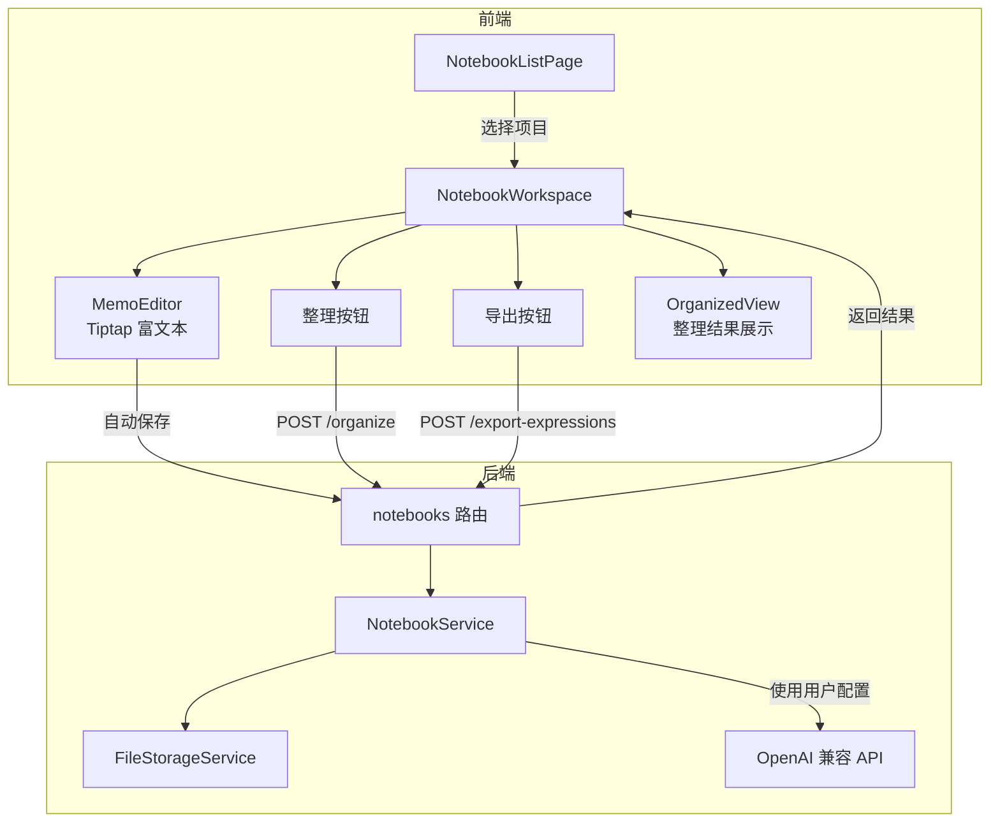
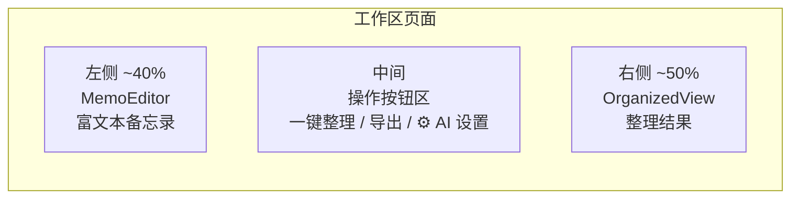
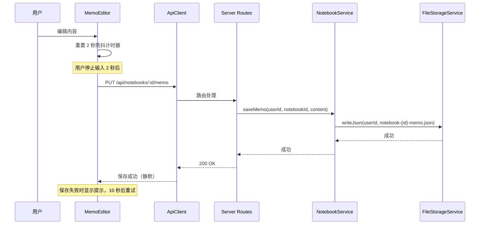
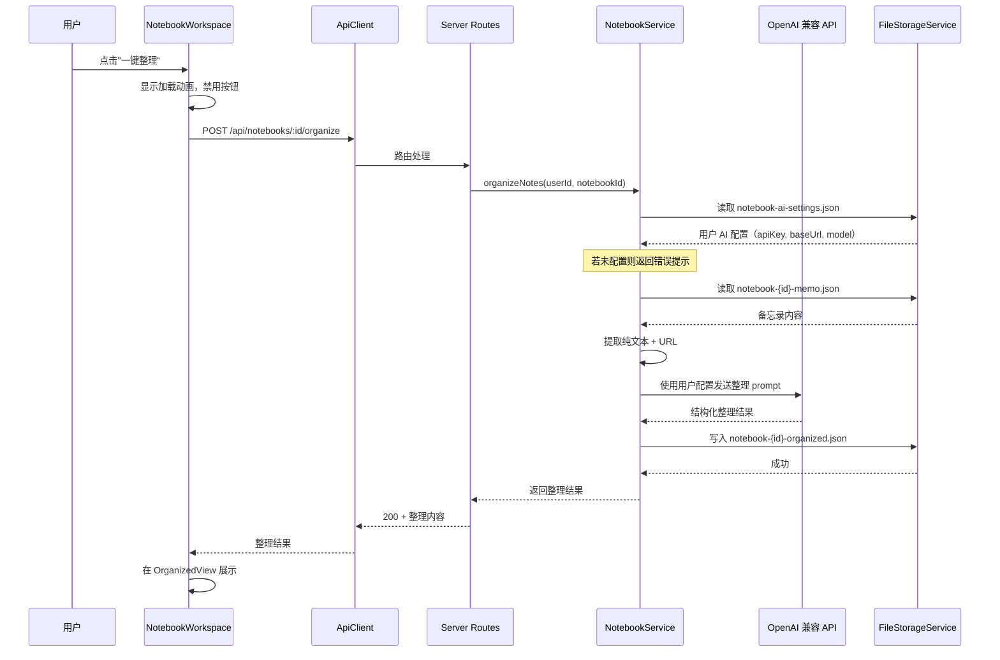

# 技术设计文档：Notebook（译前准备笔记本）

## 概述

Notebook 是视译练习平台的新功能模块，为译员提供译前准备的笔记管理工具。核心能力包括：

1. 笔记本项目的 CRUD 管理（标题、时间周期、领域）
2. 富文本备忘录编辑器（文字、URL、图片、格式化）
3. AI 一键整理：将零散笔记归纳为结构化内容
4. 中英双语表达识别与 Excel 导出

技术栈沿用现有架构：React + TypeScript 前端、Express + TypeScript 后端、FileStorageService JSON 文件存储。富文本编辑器采用 Tiptap（基于 ProseMirror），AI 整理和双语识别通过用户自行配置的 OpenAI 兼容 API 实现（支持 DeepSeek、通义千问、Moonshot 等任意兼容服务），Excel 导出使用 SheetJS（xlsx）库。

### 设计决策

- **富文本编辑器选型：Tiptap** — 基于 ProseMirror，React 集成良好，扩展性强，支持自定义节点（图片、链接），社区活跃。相比 Quill 更现代，相比直接用 ProseMirror 开发成本更低。
- **图片存储：Base64 内联** — 图片以 Base64 编码存储在富文本 JSON 中。对于译前准备场景，图片数量和大小有限，Base64 方案简单且避免了文件上传服务的复杂性。
- **AI 服务用户自定义** — 用户可在前端设置自己的 API Key、Base URL 和模型名称，配置存储在用户个人数据中（通过 FileStorageService）。后端调用 AI 时使用用户自己的配置，兼容任何 OpenAI 兼容的 API（如 DeepSeek、通义千问、Moonshot 等），不限制具体模型或服务商。
- **Excel 导出：前端生成** — 使用 xlsx 库在浏览器端生成 Excel 文件，避免后端处理二进制文件的复杂性。AI 识别双语表达在后端完成，前端拿到结构化数据后生成文件。

## 架构

### 整体数据流



### 项目工作区布局



### 备忘录自动保存流程



### AI 一键整理流程



## 组件与接口

### 1. 后端路由 — `server/src/routes/notebooks.ts`

所有路由需要 `authMiddleware` 认证。

| 方法 | 路径 | 说明 |
|------|------|------|
| GET | `/api/notebooks` | 获取用户笔记本项目列表 |
| POST | `/api/notebooks` | 创建笔记本项目 |
| PUT | `/api/notebooks/:id` | 更新项目基本信息 |
| DELETE | `/api/notebooks/:id` | 删除项目及关联数据 |
| GET | `/api/notebooks/:id/memo` | 获取备忘录内容 |
| PUT | `/api/notebooks/:id/memo` | 保存备忘录内容 |
| GET | `/api/notebooks/:id/organized` | 获取整理结果 |
| POST | `/api/notebooks/:id/organize` | 触发 AI 一键整理 |
| POST | `/api/notebooks/:id/export-expressions` | AI 识别双语表达 |
| GET | `/api/notebooks/settings/ai` | 获取用户 AI 配置 |
| PUT | `/api/notebooks/settings/ai` | 保存用户 AI 配置 |

### 2. 后端服务 — `server/src/services/NotebookService.ts`

```typescript
export class NotebookService {
  constructor(
    private storage: FileStorageService
  ) {}

  // 项目 CRUD
  async getNotebooks(userId: string): Promise<NotebookProject[]>
  async getNotebook(userId: string, id: string): Promise<NotebookProject | null>
  async createNotebook(userId: string, input: NotebookProjectInput): Promise<NotebookProject>
  async updateNotebook(userId: string, id: string, updates: Partial<NotebookProjectInput>): Promise<void>
  async deleteNotebook(userId: string, id: string): Promise<void>

  // 备忘录
  async getMemo(userId: string, notebookId: string): Promise<MemoContent>
  async saveMemo(userId: string, notebookId: string, content: MemoContent): Promise<void>

  // AI 整理
  async organizeNotes(userId: string, notebookId: string): Promise<OrganizedResult>

  // 双语表达识别
  async extractBilingualExpressions(userId: string, notebookId: string): Promise<BilingualExpression[]>

  // AI 设置
  async getAiSettings(userId: string): Promise<AiSettings>
  async saveAiSettings(userId: string, settings: AiSettings): Promise<void>
}
```

### 3. 前端页面组件

**NotebookListPage** — 笔记本项目列表页
- 展示所有笔记本项目（标题、领域、创建时间）
- 新建项目按钮 → 弹出创建表单
- 点击项目 → 导航到工作区

**NotebookWorkspace** — 项目工作区页面
- 三栏布局：左侧 MemoEditor、中间操作按钮、右侧 OrganizedView
- 管理备忘录自动保存、AI 整理、导出等操作
- 若用户未配置 AI 设置，点击"一键整理"或"导出双语表达"时提示用户先配置

**AiSettingsPanel** — AI 设置组件
- 提供 API Key、Base URL、模型名称三个输入字段
- Base URL 默认值为 `https://api.openai.com/v1`
- 兼容任何 OpenAI 兼容的 API（DeepSeek、通义千问、Moonshot 等）
- 保存时验证字段非空，API Key 以掩码形式显示
- 可从 NotebookWorkspace 的设置按钮打开

**MemoEditor** — 富文本编辑器组件
- 基于 Tiptap，支持：标题（H1/H2/H3）、加粗、斜体、下划线、文字颜色、链接、图片
- 工具栏渲染格式化按钮
- 内容变更时触发 2 秒防抖自动保存

**OrganizedView** — 整理结果展示组件
- 渲染 AI 整理后的结构化 Markdown 内容
- URL 链接可点击

### 4. 前端 API 客户端扩展 — `src/services/ApiClient.ts`

```typescript
// 新增方法
async getNotebooks(): Promise<NotebookProject[]>
async createNotebook(input: NotebookProjectInput): Promise<NotebookProject>
async updateNotebook(id: string, updates: Partial<NotebookProjectInput>): Promise<void>
async deleteNotebook(id: string): Promise<void>
async getMemo(notebookId: string): Promise<MemoContent>
async saveMemo(notebookId: string, content: MemoContent): Promise<void>
async organizeNotes(notebookId: string): Promise<OrganizedResult>
async exportExpressions(notebookId: string): Promise<BilingualExpression[]>
async getAiSettings(): Promise<AiSettings>
async saveAiSettings(settings: AiSettings): Promise<void>
```

### 5. 前端路由集成

在 `App.tsx` 的导航栏和视图切换中新增"笔记本"入口：

```typescript
// AppNav 新增导航按钮
<button onClick={goToNotebooks}>笔记本</button>

// AppContent renderView 新增
case 'notebooks':
  return <NotebookListPage />;
case 'notebook-workspace':
  return <NotebookWorkspace />;
```

## 数据模型

### NotebookProject — 笔记本项目

```typescript
export interface NotebookProject {
  id: string;              // UUID
  title: string;           // 项目标题
  domain: string;          // 领域（如"金融"、"法律"）
  startDate?: string;      // 时间周期开始日期 ISO
  endDate?: string;        // 时间周期结束日期 ISO
  createdAt: string;       // 创建时间 ISO
  updatedAt: string;       // 更新时间 ISO
}

export interface NotebookProjectInput {
  title: string;
  domain?: string;
  startDate?: string;
  endDate?: string;
}
```

### MemoContent — 备忘录内容

```typescript
export interface MemoContent {
  // Tiptap JSON 文档格式
  type: 'doc';
  content: TiptapNode[];
}

// Tiptap 节点的简化类型（实际由 Tiptap 库定义）
export interface TiptapNode {
  type: string;
  attrs?: Record<string, unknown>;
  content?: TiptapNode[];
  marks?: { type: string; attrs?: Record<string, unknown> }[];
  text?: string;
}
```

### OrganizedResult — 整理结果

```typescript
export interface OrganizedResult {
  markdown: string;        // 整理后的 Markdown 内容
  organizedAt: string;     // 整理时间 ISO
}
```

### BilingualExpression — 双语表达

```typescript
export interface BilingualExpression {
  chinese: string;
  english: string;
}
```

### AiSettings — 用户 AI 配置

```typescript
export interface AiSettings {
  apiKey: string;          // 用户的 API Key
  baseUrl: string;         // API Base URL，默认 https://api.openai.com/v1
  model: string;           // 模型名称，如 gpt-4o-mini、deepseek-chat 等
}
```

### 存储文件结构

每个用户目录下的笔记本相关文件：

```
data/{userId}/
  notebooks.json                    # 项目列表 { version: 1, notebooks: [...] }
  notebook-{id}-memo.json           # 备忘录内容（Tiptap JSON）
  notebook-{id}-organized.json      # 整理结果 { markdown, organizedAt }
  notebook-ai-settings.json         # 用户 AI 配置 { apiKey, baseUrl, model }
```

### NotebooksFile — 存储格式

```typescript
export interface NotebooksFile {
  version: number;
  notebooks: NotebookProject[];
}
```

`FileStorageService.getDefaultValue` 需要扩展，为 `notebooks.json` 返回默认值 `{ version: 1, notebooks: [] }`，为 `notebook-ai-settings.json` 返回默认值 `{ apiKey: '', baseUrl: 'https://api.openai.com/v1', model: '' }`。


## 正确性属性 (Correctness Properties)

*属性是在系统所有有效执行中都应成立的特征或行为——本质上是关于系统应该做什么的形式化陈述。属性是人类可读规格说明与机器可验证正确性保证之间的桥梁。*

### Property 1: 项目持久化往返

*For any* 有效的 NotebookProjectInput（标题非空），创建项目后通过 getNotebooks 查询应能找到该项目，且标题、领域、时间周期字段与输入一致。同理，对任意已存在的项目执行 updateNotebook 后，再次查询应返回更新后的字段值。

**Validates: Requirements 1.2, 1.7**

### Property 2: 空白标题拒绝

*For any* 仅由空白字符组成的字符串（包括空字符串、空格、制表符等），作为项目标题提交时，系统应拒绝创建并返回验证错误，笔记本列表长度不变。

**Validates: Requirements 1.3**

### Property 3: 项目列表完整展示

*For any* 笔记本项目列表，getNotebooks 返回的每个项目对象都应包含 title、domain 和 createdAt 字段，且这些字段均为非空值。

**Validates: Requirements 1.4**

### Property 4: 级联删除完整性

*For any* 笔记本项目，删除该项目后，其关联的备忘录文件（notebook-{id}-memo.json）和整理结果文件（notebook-{id}-organized.json）都应不再存在于存储中。

**Validates: Requirements 1.6**

### Property 5: URL 提取保留

*For any* 包含 URL 链接的 Tiptap JSON 文档，从中提取纯文本时，所有原始 URL 应完整保留在提取结果中。

**Validates: Requirements 3.6**

### Property 6: Excel 数据正确性

*For any* BilingualExpression 数组，生成的 Excel 工作表应包含与数组长度相等的数据行数，且每行的"中文"列和"英文"列分别对应数组中每个元素的 chinese 和 english 字段。

**Validates: Requirements 4.3**

### Property 7: 导出文件名格式

*For any* 项目标题字符串和日期，生成的文件名应符合 `{title}_双语表达_{YYYY-MM-DD}.xlsx` 格式，其中日期部分为有效的 ISO 日期格式。

**Validates: Requirements 4.4**

### Property 8: 未认证请求拒绝

*For any* 不携带有效 JWT 的请求访问 `/api/notebooks` 下的任意端点，系统应返回 401 状态码。

**Validates: Requirements 5.4**

### Property 9: 用户数据隔离

*For any* 两个不同的 userId，用户 A 创建的笔记本项目不应出现在用户 B 的 getNotebooks 结果中。

**Validates: Requirements 5.5**

### Property 10: AI 设置持久化往返

*For any* 有效的 AiSettings（apiKey、baseUrl、model 均非空），保存后通过 getAiSettings 查询应返回与输入一致的配置值。

**Validates: Requirements 3.2（AI 整理依赖用户配置）**

## 错误处理

| 场景 | 处理方式 |
|------|----------|
| 创建项目时标题为空 | 后端返回 400 `{ code: 'VALIDATION_ERROR', message: '标题不能为空' }`，前端在表单字段旁显示错误 |
| 项目不存在（404） | 后端返回 404 `{ code: 'NOT_FOUND', message: '笔记本项目不存在' }` |
| 备忘录自动保存失败 | 前端在编辑器顶部显示"保存失败，请检查网络连接"提示，10 秒后自动重试 |
| AI 整理请求失败（网络/API 错误） | 前端显示错误提示，恢复"一键整理"按钮为可点击状态 |
| AI 整理超时 | 设置 60 秒超时，超时后返回错误提示 |
| 用户未配置 AI 设置 | 后端返回 400 `{ code: 'AI_NOT_CONFIGURED', message: '请先在设置中配置 AI 服务的 API Key、Base URL 和模型' }`，前端弹出 AI 设置面板 |
| AI API Key 无效或余额不足 | 后端透传 AI 服务返回的错误信息，前端显示错误 Toast 并建议检查 AI 设置 |
| 双语表达识别结果为空 | 前端显示"未识别到中英双语表达，请确认备忘录中包含中英文内容" |
| 导出 Excel 失败 | 前端显示错误 Toast，允许重试 |
| 未认证访问 | authMiddleware 返回 401，前端跳转登录 |
| 备忘录内容过大（>5MB） | 后端返回 413，前端提示"内容过大，请精简备忘录" |

## 测试策略

### 双重测试方法

本功能采用单元测试 + 属性测试的双重策略：

- **单元测试**：验证具体场景、边界条件、错误处理、UI 渲染
- **属性测试**：验证跨所有输入的通用属性

### 属性测试配置

- **库**：使用 `fast-check` 作为属性测试库
- **迭代次数**：每个属性测试至少运行 100 次
- **标签格式**：每个测试用注释标注对应的设计属性

```typescript
// Feature: notebook, Property 1: 项目持久化往返
```

### 单元测试范围

1. **NotebookService CRUD**
   - 创建项目：有效输入 → 返回带 id 和时间戳的项目
   - 创建项目：空标题 → 抛出验证错误
   - 更新项目：有效更新 → 字段更新，id/createdAt 不变
   - 更新项目：不存在的 ID → 抛出 NOT_FOUND
   - 删除项目：级联删除备忘录和整理结果文件
   - 删除项目：不存在的 ID → 抛出 NOT_FOUND

2. **NotebookService 备忘录**
   - 保存备忘录：有效 Tiptap JSON → 写入成功
   - 读取备忘录：文件不存在 → 返回空文档
   - 保存备忘录：内容过大 → 抛出错误

3. **NotebookService AI 整理**
   - 整理成功：返回 Markdown 结构化内容
   - 备忘录为空：返回提示信息
   - AI API 失败：抛出错误
   - 用户未配置 AI 设置：抛出 AI_NOT_CONFIGURED 错误

4. **NotebookService AI 设置**
   - 保存 AI 设置：有效配置 → 写入成功
   - 读取 AI 设置：文件不存在 → 返回空配置
   - 保存 AI 设置：API Key 为空 → 抛出验证错误

5. **路由层**
   - 各端点的 200/400/401/404 响应
   - 认证中间件拦截

6. **前端组件**
   - NotebookListPage：项目列表渲染、新建按钮
   - MemoEditor：工具栏渲染、自动保存防抖
   - OrganizedView：Markdown 内容渲染
   - AiSettingsPanel：设置表单渲染、保存验证、API Key 掩码显示
   - 导出功能：文件名生成、空结果提示

### 属性测试范围

每个正确性属性对应一个属性测试：

| 属性 | 测试描述 | 生成器 |
|------|----------|--------|
| Property 1 | 创建/更新项目后可正确读取 | 生成随机 NotebookProjectInput（非空标题、随机领域和日期） |
| Property 2 | 空白标题被拒绝 | 生成仅含空白字符的随机字符串 |
| Property 3 | 项目列表字段完整 | 生成随机 NotebookProject 数组 |
| Property 4 | 删除项目后关联文件不存在 | 生成随机项目 ID，创建关联文件后删除 |
| Property 5 | Tiptap JSON 中的 URL 被保留 | 生成包含随机 URL 的 Tiptap JSON 文档 |
| Property 6 | Excel 数据行与输入数组一致 | 生成随机 BilingualExpression 数组 |
| Property 7 | 文件名格式正确 | 生成随机项目标题和日期 |
| Property 8 | 无 JWT 请求返回 401 | 生成随机 API 路径 |
| Property 9 | 不同用户数据隔离 | 生成两个随机 userId 和项目数据 |
| Property 10 | AI 设置保存后可正确读取 | 生成随机 AiSettings（非空 apiKey、baseUrl、model） |
