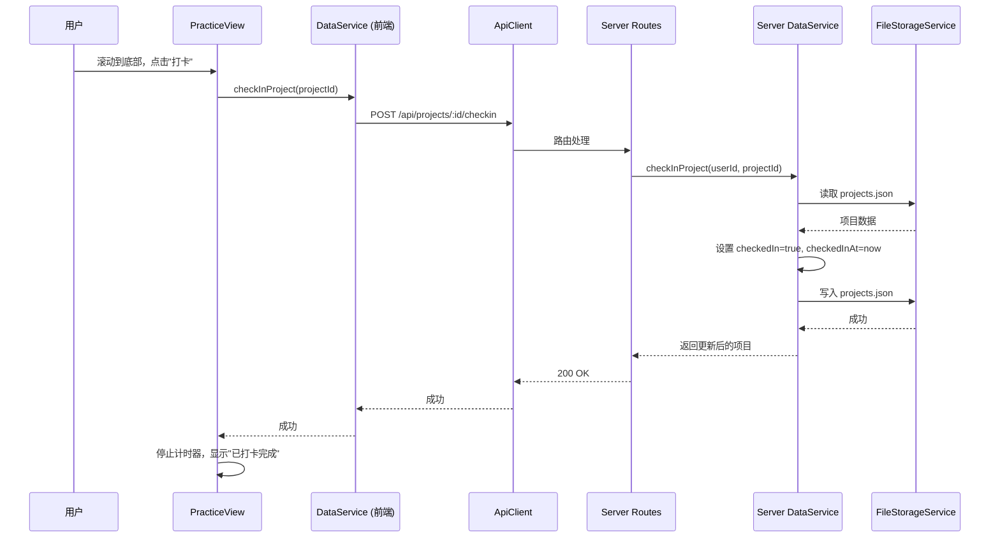
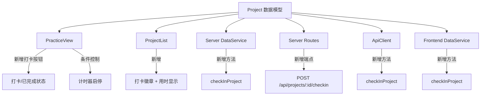

# 技术设计文档：练习打卡功能

## 概述

本功能为视译练习平台增加"打卡"机制，允许用户在完成练习后标记项目为已完成。核心变更包括：

1. 扩展 Project 数据模型，增加 `checkedIn` 和 `checkedInAt` 字段
2. 在 PracticeView 底部添加打卡按钮，打卡后停止计时器
3. 已打卡项目再次进入时不启动计时器
4. ProjectList 中展示打卡状态徽章和总用时
5. 后端新增打卡 API 端点（幂等）

技术栈沿用现有架构：React + TypeScript 前端、Express + TypeScript 后端、JSON 文件存储。

## 架构

### 数据流



### 组件影响范围



## 组件与接口

### 1. 数据模型扩展

**文件：** `server/src/types/index.ts` 和 `src/types/models.ts`

在 `Project` 接口中新增两个可选字段：

```typescript
export interface Project {
  // ... 现有字段 ...
  checkedIn?: boolean;       // 是否已打卡，默认 false
  checkedInAt?: string;      // 打卡时间 ISO 字符串（server 端为 string，前端 models.ts 为 Date）
}
```

前端 `src/types/models.ts` 中：
```typescript
export interface Project {
  // ... 现有字段 ...
  checkedIn?: boolean;
  checkedInAt?: Date;
}
```

前端 `src/services/ApiClient.ts` 中的 `Project` 接口同步添加：
```typescript
export interface Project {
  // ... 现有字段 ...
  checkedIn?: boolean;
  checkedInAt?: string;
}
```

使用可选字段（`?`）确保向后兼容，未设置时视为 `false`。

### 2. 后端打卡 API

**文件：** `server/src/routes/projects.ts`

新增端点：

```
POST /api/projects/:id/checkin
```

**请求：** 无请求体（项目 ID 从 URL 参数获取）

**响应：**
- 200：`{ success: true, data: { message: '打卡成功' } }`
- 404：`{ success: false, error: { code: 'NOT_FOUND', message: '项目不存在' } }`

**幂等性：** 如果项目已打卡，直接返回 200 成功，不修改数据。

### 3. Server DataService 扩展

**文件：** `server/src/services/DataService.ts`

新增方法：

```typescript
async checkInProject(userId: string, projectId: string): Promise<Project> {
  const data = await fileStorageService.readJson<ProjectsFile>(userId, 'projects.json');
  const index = data.projects.findIndex(p => p.id === projectId);
  if (index === -1) {
    throw new Error('NOT_FOUND: 项目不存在');
  }
  // 幂等：已打卡则直接返回
  if (data.projects[index].checkedIn) {
    return data.projects[index];
  }
  data.projects[index] = {
    ...data.projects[index],
    checkedIn: true,
    checkedInAt: new Date().toISOString(),
    updatedAt: new Date().toISOString(),
  };
  await fileStorageService.writeJson(userId, 'projects.json', data);
  return data.projects[index];
}
```

### 4. ApiClient 扩展

**文件：** `src/services/ApiClient.ts`

```typescript
async checkInProject(id: string): Promise<void> {
  await this.request(`/api/projects/${id}/checkin`, { method: 'POST' });
}
```

### 5. Frontend DataService 扩展

**文件：** `src/services/DataService.ts`

```typescript
export async function checkInProject(id: string): Promise<void> {
  if (_isAuthenticated) {
    await apiClient.checkInProject(id);
    return;
  }
  // 本地模式：直接更新 IndexedDB
  await db.projects.update(id, {
    checkedIn: true,
    checkedInAt: new Date(),
    updatedAt: new Date(),
  });
}
```

### 6. PracticeView 变更

**文件：** `src/components/PracticeView/PracticeView.tsx`

关键变更：

1. **计时器条件启动：** 在计时器 `useEffect` 中检查 `checkedIn` 状态，已打卡项目不启动 `setInterval`
2. **打卡按钮：** 在练习模式内容区域底部（双栏下方）添加打卡按钮
3. **打卡完成状态：** 打卡后显示"✅ 已打卡完成"替代按钮
4. **打卡流程：** 点击打卡 → 调用 `dataService.checkInProject` → 停止计时器 → 保存最终时间 → 显示成功提示

```typescript
// 新增状态
const [isCheckedIn, setIsCheckedIn] = useState(false);

// 初始化时读取打卡状态
useEffect(() => {
  if (currentProject) {
    dataService.getProject(currentProject.id).then(fresh => {
      setIsCheckedIn(fresh?.checkedIn ?? false);
    });
  }
}, [currentProject]);

// 计时器：仅在未打卡时运行
useEffect(() => {
  if (isCheckedIn) return; // 已打卡，不启动计时器
  const timer = setInterval(() => { /* 现有逻辑 */ }, 1000);
  return () => clearInterval(timer);
}, [currentProject, isCheckedIn]);
```

### 7. ProjectList 变更

**文件：** `src/components/ProjectManager/ProjectList/ProjectList.tsx`

在项目卡片中添加：
- 打卡完成徽章：`✅ 打卡完成`
- 总用时显示：格式 `HH:MM:SS`

```tsx
{project.checkedIn && (
  <div className="project-card__checkin-info">
    <span className="project-card__checkin-badge">✅ 打卡完成</span>
    <span className="project-card__checkin-time">
      用时 {formatTime(project.practiceProgress?.practiceTimeSeconds ?? 0)}
    </span>
  </div>
)}
```

## 数据模型

### Project 扩展字段

| 字段 | 类型 | 默认值 | 说明 |
|------|------|--------|------|
| `checkedIn` | `boolean?` | `undefined` (视为 `false`) | 是否已打卡完成 |
| `checkedInAt` | `string?` (ISO) / `Date?` | `undefined` | 打卡完成时间 |

### 存储格式

JSON 文件中的项目数据示例（打卡后）：

```json
{
  "id": "abc-123",
  "name": "第一课",
  "checkedIn": true,
  "checkedInAt": "2024-01-15T10:30:00.000Z",
  "practiceProgress": {
    "scrollPercentage": 1,
    "practiceTimeSeconds": 3600,
    "updatedAt": "2024-01-15T10:30:00.000Z"
  }
}
```

### 向后兼容

- 已有项目数据中不含 `checkedIn` 字段，代码中统一使用 `project.checkedIn ?? false` 处理
- 无需数据迁移脚本


## 正确性属性 (Correctness Properties)

*属性是在系统所有有效执行中都应成立的特征或行为——本质上是关于系统应该做什么的形式化陈述。属性是人类可读规格说明与机器可验证正确性保证之间的桥梁。*

### Property 1: 向后兼容 — 未设置 checkedIn 视为 false

*For any* Project 对象，若 `checkedIn` 字段为 `undefined` 或未设置，系统在所有判断逻辑中应将其等价于 `false`，即该项目视为未打卡。

**Validates: Requirements 1.3**

### Property 2: 打卡后计时器停止

*For any* 处于练习中的项目，当打卡操作成功完成后，计时器应立即停止递增，且最终的 `practiceTimeSeconds` 值应等于打卡瞬间的累计秒数。

**Validates: Requirements 2.4**

### Property 3: 已打卡项目不启动计时器且不自动保存

*For any* 已打卡完成的项目（`checkedIn === true`），进入练习视图后计时器不应启动（`practiceTimeSeconds` 保持不变），且不应触发每 30 秒的自动保存进度操作。

**Validates: Requirements 3.1, 3.2**

### Property 4: 时间格式化正确性

*For any* 非负整数秒数 `n`，`formatTime(n)` 的输出应满足 `HH:MM:SS` 格式，其中 `HH = floor(n/3600)`、`MM = floor((n%3600)/60)`、`SS = n%60`，且各部分用零补齐为两位数。

**Validates: Requirements 4.2**

### Property 5: 打卡接口正确设置字段

*For any* 未打卡的项目，调用 `checkInProject` 后，该项目的 `checkedIn` 应为 `true`，`checkedInAt` 应为有效的 ISO 时间字符串，且 `updatedAt` 应被更新。

**Validates: Requirements 5.2**

### Property 6: 打卡接口幂等性

*For any* 项目，连续调用 `checkInProject` N 次（N ≥ 1）的最终结果应与调用 1 次相同：`checkedIn` 为 `true`，`checkedInAt` 保持首次打卡的时间不变。

**Validates: Requirements 5.4**

## 错误处理

| 场景 | 处理方式 |
|------|----------|
| 打卡 API 请求失败（网络错误/服务器错误） | PracticeView 显示错误 Toast，保留打卡按钮供重试 |
| 项目 ID 不存在（404） | 后端返回 `{ success: false, error: { code: 'NOT_FOUND' } }`，前端显示错误提示 |
| 已打卡项目再次打卡 | 后端幂等处理，返回 200 成功，不修改数据 |
| 打卡时保存最终时间失败 | 打卡状态仍然设置成功（打卡优先），时间可能略有偏差但不影响核心功能 |
| 旧数据无 checkedIn 字段 | 代码中使用 `?? false` 兜底，无需迁移 |

## 测试策略

### 双重测试方法

本功能采用单元测试 + 属性测试的双重策略：

- **单元测试**：验证具体场景、边界条件、错误处理、UI 渲染
- **属性测试**：验证跨所有输入的通用属性

### 属性测试配置

- **库**：使用 `fast-check` 作为属性测试库
- **迭代次数**：每个属性测试至少运行 100 次
- **标签格式**：每个测试用注释标注对应的设计属性

```typescript
// Feature: practice-checkin, Property 4: 时间格式化正确性
```

### 单元测试范围

1. **Server DataService `checkInProject`**
   - 正常打卡：未打卡项目 → 打卡成功
   - 幂等性：已打卡项目 → 返回成功，数据不变
   - 404：不存在的项目 ID → 抛出 NOT_FOUND 错误

2. **Server Route `POST /api/projects/:id/checkin`**
   - 200 成功响应
   - 404 错误响应
   - 未认证请求 → 401

3. **PracticeView 组件**
   - 未打卡项目：显示打卡按钮
   - 已打卡项目：显示"已打卡完成"标识，不显示按钮
   - 打卡成功：按钮消失，显示成功提示
   - 打卡失败：按钮保留，显示错误提示

4. **ProjectList 组件**
   - 已打卡项目：显示徽章和用时
   - 未打卡项目：不显示徽章和用时

### 属性测试范围

每个正确性属性对应一个属性测试：

| 属性 | 测试描述 | 生成器 |
|------|----------|--------|
| Property 1 | 未设置 checkedIn 的项目视为未打卡 | 生成随机 Project，checkedIn 为 undefined/null/false |
| Property 2 | 打卡后计时器值冻结 | 生成随机秒数，模拟打卡后验证值不变 |
| Property 3 | 已打卡项目计时器不启动 | 生成 checkedIn=true 的项目，验证计时器不运行 |
| Property 4 | formatTime 输出格式正确 | 生成 0 到 360000 的随机整数 |
| Property 5 | checkInProject 设置正确字段 | 生成随机未打卡项目，调用 checkIn 后验证字段 |
| Property 6 | 多次打卡结果等于一次 | 生成随机项目，调用 checkIn 1~10 次，比较结果 |
