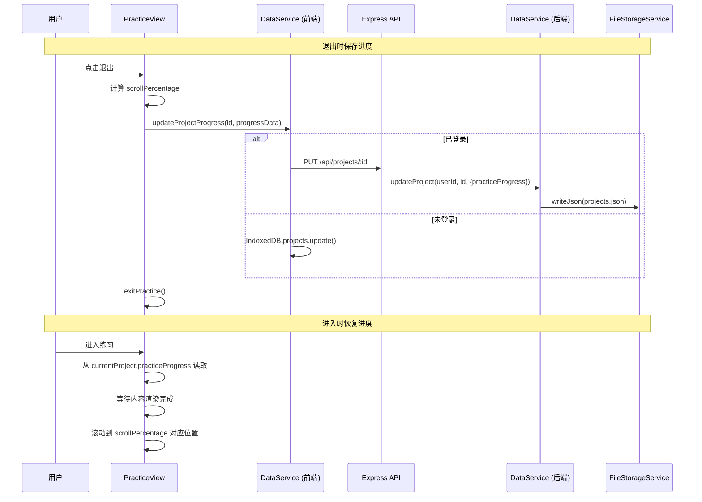

# 技术设计文档：练习进度记忆

## 概述

本功能为视译练习平台的 PracticeView 组件增加滚动进度的自动保存与恢复能力。核心思路是：

1. 用户退出练习时，将当前内容区的滚动百分比（`scrollPercentage`）保存到 Project 数据中
2. 用户再次进入练习时，根据保存的百分比自动恢复滚动位置
3. 进度数据通过现有的 DataService 层持久化，已登录用户同步到云端，未登录用户保存到 IndexedDB

使用百分比而非像素值的设计决策是为了适应不同屏幕尺寸和内容变化的场景。

## 架构

### 数据流



### 变更范围

本功能的变更集中在以下层面：

- **数据模型层**：在 Project 接口中新增 `practiceProgress` 可选字段
- **前端组件层**：修改 PracticeView 的退出和初始化逻辑
- **前端服务层**：在 DataService 中新增 `updateProjectProgress` 方法
- **后端**：无需修改，现有的 `PUT /api/projects/:id` 已支持 `Partial<Project>` 更新

## 组件与接口

### 1. PracticeView 组件变更

**保存进度（退出时）：**

在 `handleExit` 函数中，退出前计算当前内容区的 `scrollPercentage` 并调用 DataService 保存：

```typescript
// 计算滚动百分比
function calculateScrollPercentage(element: HTMLElement): number {
  const { scrollTop, scrollHeight, clientHeight } = element;
  const maxScroll = scrollHeight - clientHeight;
  if (maxScroll <= 0) return 0;
  return scrollTop / maxScroll;
}
```

**恢复进度（进入时）：**

在组件初始化 useEffect 中，内容渲染完成后恢复滚动位置：

```typescript
// 恢复滚动位置
function restoreScrollPosition(element: HTMLElement, percentage: number): void {
  const maxScroll = element.scrollHeight - element.clientHeight;
  const targetScroll = Math.min(percentage * maxScroll, maxScroll);
  element.scrollTop = targetScroll;
}
```

**左右栏同步：**

恢复时同时设置左栏（中文）和右栏（英文）的滚动位置，使用同一个 `scrollPercentage` 值。

### 2. 前端 DataService 新增方法

```typescript
interface ProgressData {
  scrollPercentage: number;  // 0 到 1 之间
  updatedAt: string;         // ISO 时间戳
}

async function updateProjectProgress(id: string, progress: ProgressData): Promise<void>
```

该方法通过现有的项目更新通道（已登录走 API，未登录走 IndexedDB）持久化进度数据。

### 3. 后端无需新增接口

现有的 `PUT /api/projects/:id` 路由接受 `Partial<Project>` 更新，`DataService.updateProject` 使用展开运算符合并字段。新增的 `practiceProgress` 字段会自动被持久化到 `projects.json` 中，无需任何后端代码变更。


## 数据模型

### ProgressData 接口

```typescript
interface ProgressData {
  /** 滚动百分比，0 到 1 之间的小数 */
  scrollPercentage: number;
  /** 最后更新时间，ISO 8601 格式 */
  updatedAt: string;
}
```

### Project 接口扩展

在前端 `src/types/models.ts` 和后端 `server/src/types/index.ts` 的 Project 接口中新增可选字段：

```typescript
export interface Project {
  // ... 现有字段
  /** 练习进度数据（可选） */
  practiceProgress?: ProgressData;
}
```

同时在 `src/services/ApiClient.ts` 的 Project 接口中同步新增该字段。

### 数据存储示例

`projects.json` 中的项目数据将包含新字段：

```json
{
  "version": 1,
  "projects": [
    {
      "id": "abc-123",
      "name": "练习项目1",
      "practiceProgress": {
        "scrollPercentage": 0.45,
        "updatedAt": "2024-01-15T10:30:00.000Z"
      }
    }
  ]
}
```

### 关键设计决策

| 决策 | 选择 | 理由 |
|------|------|------|
| 使用百分比而非像素值 | `scrollPercentage` | 不同屏幕尺寸、字体大小变化后仍能准确定位 |
| 进度数据嵌入 Project | `practiceProgress` 字段 | 复用现有更新通道，无需新建存储文件或 API |
| 保存时机 | 仅在退出时保存 | 避免频繁写入，简化实现 |
| 恢复时机 | 内容渲染完成后 | 确保 scrollHeight 已计算正确 |
| 左右栏同步 | 使用同一百分比 | 中英文内容高度可能不同，但百分比能保持相对位置一致 |


## 正确性属性

*属性（Property）是指在系统所有合法执行中都应成立的特征或行为——本质上是对系统行为的形式化陈述。属性是人类可读的规格说明与机器可验证的正确性保证之间的桥梁。*

### 属性 1：滚动百分比计算的有界性

*对于任意* scrollHeight、clientHeight 和 scrollTop 的合法组合（scrollTop ∈ [0, scrollHeight - clientHeight]），`calculateScrollPercentage` 返回的值应始终在 [0, 1] 范围内。

**验证需求：1.1, 1.3**

### 属性 2：滚动位置保存-恢复往返一致性

*对于任意*可滚动元素和任意合法滚动位置，先调用 `calculateScrollPercentage` 计算百分比，再调用 `restoreScrollPosition` 恢复位置，最终的 scrollTop 应与原始 scrollTop 相等（在整数取整误差范围内）。

**验证需求：1.1, 1.3, 2.1**

### 属性 3：进度数据持久化往返一致性

*对于任意*合法的 ProgressData（scrollPercentage ∈ [0, 1]，updatedAt 为合法 ISO 时间戳），保存到存储后再读取回来，应得到与原始数据等价的 ProgressData 对象，且包含 scrollPercentage 和 updatedAt 两个字段。

**验证需求：3.1, 3.4**

### 属性 4：左右栏滚动同步

*对于任意* scrollPercentage 值，恢复滚动位置时，左栏和右栏应各自根据自身的 scrollHeight 和 clientHeight 计算目标位置，且两栏使用的 scrollPercentage 输入值相同。

**验证需求：2.3**

## 错误处理

| 场景 | 处理方式 | 对应需求 |
|------|----------|----------|
| 保存进度失败（网络错误、存储满等） | 静默捕获异常，不阻断退出流程 | 1.4 |
| 恢复位置超出内容范围 | `Math.min(targetScroll, maxScroll)` 钳位到末尾 | 2.4 |
| Project 无 practiceProgress 字段 | 默认从顶部开始（scrollTop = 0） | 2.2 |
| scrollHeight ≤ clientHeight（内容不足以滚动） | `calculateScrollPercentage` 返回 0 | 边界情况 |

## 测试策略

### 属性测试（Property-Based Testing）

使用 `fast-check` 库进行属性测试，每个属性至少运行 100 次迭代。

每个属性测试必须用注释标注对应的设计属性：
- 格式：`Feature: practice-progress-resume, Property {N}: {属性描述}`

属性测试覆盖：

| 属性 | 测试内容 | 生成器 |
|------|----------|--------|
| 属性 1 | 生成随机 scrollHeight/clientHeight/scrollTop，验证百分比在 [0,1] | `fc.integer` 生成合法的 DOM 尺寸值 |
| 属性 2 | 生成随机滚动状态，验证 calculate → restore 往返一致 | `fc.integer` 组合生成 scroll 参数 |
| 属性 3 | 生成随机 ProgressData，验证 save → load 往返一致 | `fc.float` + `fc.date` 生成合法进度数据 |
| 属性 4 | 生成随机百分比和不同的左右栏尺寸，验证两栏使用相同百分比 | `fc.float` + `fc.integer` |

### 单元测试

单元测试聚焦于具体示例和边界情况：

- `calculateScrollPercentage`：内容不可滚动时返回 0
- `restoreScrollPosition`：百分比超出范围时钳位到末尾
- 无 `practiceProgress` 时从顶部开始
- 编辑模式切换到练习模式后退出，保存的是练习模式的位置
- 保存失败时退出流程不受影响

### 测试配置

- 属性测试库：`fast-check`
- 每个属性测试最少 100 次迭代
- 每个属性测试必须引用设计文档中的属性编号
- 标注格式：`Feature: practice-progress-resume, Property {number}: {property_text}`
- 每个正确性属性由单个属性测试实现
