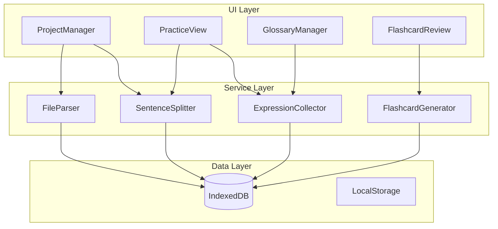

# Design Document

## Overview

视译练习软件（Sight Translation Trainer）是一款纯前端Web应用，帮助译员练习视译技能。系统采用React + TypeScript技术栈，使用IndexedDB进行本地数据持久化，支持PDF和Word文件的文本提取。

### 核心功能模块

1. **项目管理模块** - 创建、浏览、删除双语项目，支持TXT/PDF/Word文件上传
2. **句子切分模块** - 智能识别中英文标点，将文本切分为独立句子
3. **视译练习模块** - 中译英/英译中双向练习，逐句显示/隐藏翻译
4. **表达收藏模块** - 划线选择文本，保存表达及上下文
5. **术语库模块** - 浏览、搜索、编辑收藏的表达
6. **Flashcard模块** - 基于艾宾浩斯记忆曲线的间隔复习系统

### 技术选型

- **框架**: React 18 + TypeScript
- **状态管理**: React Context + useReducer
- **存储**: IndexedDB (via Dexie.js)
- **文件解析**: pdf.js (PDF), mammoth.js (Word)
- **UI组件**: 自定义组件 + CSS Modules
- **构建工具**: Vite

## Architecture



### 数据流

1. **文件上传流程**: 用户上传文件 → FileParser提取文本 → SentenceSplitter切分句子 → 存储到IndexedDB
2. **练习流程**: 加载项目 → 显示源语言句子 → 用户点击显示翻译 → 可选收藏表达
3. **复习流程**: FlashcardGenerator计算今日待复习 → 显示卡片 → 用户反馈 → 更新复习计划

## Components and Interfaces

### FileParser

负责从不同格式文件中提取纯文本内容。

```typescript
interface FileParser {
  /**
   * 解析文件并提取文本内容
   * @param file 上传的文件对象
   * @returns 提取的纯文本内容
   * @throws FileParseError 当文件格式不支持或解析失败时
   */
  parseFile(file: File): Promise<string>;
  
  /**
   * 检查文件格式是否支持
   * @param file 文件对象
   * @returns 是否支持该格式
   */
  isSupportedFormat(file: File): boolean;
}

// 支持的文件类型
type SupportedFileType = 'text/plain' | 'application/pdf' | 
  'application/msword' | 'application/vnd.openxmlformats-officedocument.wordprocessingml.document';
```

### SentenceSplitter

将文本切分为独立句子，支持中英文标点。

```typescript
interface SentenceSplitter {
  /**
   * 将文本切分为句子数组
   * @param text 原始文本
   * @param language 文本语言
   * @returns 句子数组，保持原始顺序
   */
  split(text: string, language: 'zh' | 'en'): string[];
}

// 句子切分配置
interface SplitConfig {
  // 中文句末标点
  zhTerminators: string[];  // ['。', '！', '？', '；']
  // 英文句末标点
  enTerminators: string[];  // ['.', '!', '?']
  // 是否保留标点
  preservePunctuation: boolean;
}
```

### ExpressionCollector

管理用户收藏的表达。

```typescript
interface ExpressionCollector {
  /**
   * 保存表达
   * @param expression 要保存的表达
   * @returns 保存后的表达（含ID）
   * @throws DuplicateExpressionError 当表达已存在时
   */
  saveExpression(expression: ExpressionInput): Promise<Expression>;
  
  /**
   * 获取所有表达
   * @param filter 可选过滤条件
   * @returns 表达列表
   */
  getExpressions(filter?: ExpressionFilter): Promise<Expression[]>;
  
  /**
   * 更新表达备注
   * @param id 表达ID
   * @param notes 新备注内容
   */
  updateNotes(id: string, notes: string): Promise<void>;
  
  /**
   * 删除表达
   * @param id 表达ID
   */
  deleteExpression(id: string): Promise<void>;
  
  /**
   * 检查表达是否已存在
   * @param text 表达文本
   * @returns 是否存在
   */
  isDuplicate(text: string): Promise<boolean>;
}

interface ExpressionFilter {
  sourceLanguage?: 'zh' | 'en';
  keyword?: string;
}
```

### FlashcardGenerator

基于艾宾浩斯记忆曲线生成和管理复习卡片。

```typescript
interface FlashcardGenerator {
  /**
   * 获取今日待复习的卡片
   * @returns 待复习卡片列表
   */
  getDueCards(): Promise<Flashcard[]>;
  
  /**
   * 获取今日待复习卡片数量
   * @returns 卡片数量
   */
  getDueCount(): Promise<number>;
  
  /**
   * 记录复习结果
   * @param cardId 卡片ID
   * @param remembered 是否记住
   */
  recordReview(cardId: string, remembered: boolean): Promise<void>;
  
  /**
   * 为新表达创建复习计划
   * @param expressionId 表达ID
   */
  scheduleExpression(expressionId: string): Promise<void>;
  
  /**
   * 移除表达的复习计划
   * @param expressionId 表达ID
   */
  removeSchedule(expressionId: string): Promise<void>;
}

// 艾宾浩斯复习间隔（天数）
const REVIEW_INTERVALS = [1, 2, 4, 7, 15, 30];
```

### ProjectManager

管理项目的创建、读取和删除。

```typescript
interface ProjectManager {
  /**
   * 创建新项目
   * @param input 项目输入数据
   * @returns 创建的项目
   * @throws DuplicateProjectError 当项目名已存在时
   */
  createProject(input: ProjectInput): Promise<Project>;
  
  /**
   * 获取所有项目
   * @returns 项目列表
   */
  getProjects(): Promise<Project[]>;
  
  /**
   * 获取单个项目
   * @param id 项目ID
   * @returns 项目详情
   */
  getProject(id: string): Promise<Project | null>;
  
  /**
   * 删除项目
   * @param id 项目ID
   */
  deleteProject(id: string): Promise<void>;
}

interface ProjectInput {
  name: string;
  chineseFile: File;
  englishFile: File;
}
```


## Data Models

### Project

```typescript
interface Project {
  id: string;                    // UUID
  name: string;                  // 项目名称（唯一）
  createdAt: Date;               // 创建时间
  updatedAt: Date;               // 更新时间
  chineseText: string;           // 中文原文
  englishText: string;           // 英文原文
  chineseSentences: string[];    // 切分后的中文句子
  englishSentences: string[];    // 切分后的英文句子
}
```

### Expression

```typescript
interface Expression {
  id: string;                    // UUID
  projectId: string;             // 所属项目ID
  text: string;                  // 表达文本
  contextSentence: string;       // 上下文句子
  sourceLanguage: 'zh' | 'en';   // 源语言
  targetLanguage: 'zh' | 'en';   // 目标语言
  notes: string;                 // 用户备注
  createdAt: Date;               // 创建时间
  updatedAt: Date;               // 更新时间
}

interface ExpressionInput {
  projectId: string;
  text: string;
  contextSentence: string;
  sourceLanguage: 'zh' | 'en';
  targetLanguage: 'zh' | 'en';
  notes?: string;
}
```

### Flashcard

```typescript
interface Flashcard {
  id: string;                    // UUID
  expressionId: string;          // 关联的表达ID
  currentInterval: number;       // 当前复习间隔索引 (0-5)
  nextReviewDate: Date;          // 下次复习日期
  reviewCount: number;           // 总复习次数
  lastReviewDate: Date | null;   // 上次复习日期
  createdAt: Date;               // 创建时间
}

// 复习记录（用于统计）
interface ReviewRecord {
  id: string;
  flashcardId: string;
  reviewedAt: Date;
  remembered: boolean;
}
```

### IndexedDB Schema

```typescript
// 使用 Dexie.js 定义数据库结构
class SightTranslationDB extends Dexie {
  projects: Table<Project>;
  expressions: Table<Expression>;
  flashcards: Table<Flashcard>;
  reviewRecords: Table<ReviewRecord>;

  constructor() {
    super('SightTranslationDB');
    this.version(1).stores({
      projects: 'id, name, createdAt',
      expressions: 'id, projectId, sourceLanguage, text, createdAt',
      flashcards: 'id, expressionId, nextReviewDate',
      reviewRecords: 'id, flashcardId, reviewedAt'
    });
  }
}
```

### UI State

```typescript
// 应用全局状态
interface AppState {
  // 当前视图
  currentView: 'projects' | 'practice' | 'glossary' | 'flashcards';
  // 当前项目
  currentProject: Project | null;
  // 练习模式
  practiceMode: 'zh-to-en' | 'en-to-zh';
  // 显示翻译的句子索引集合
  visibleTranslations: Set<number>;
  // 加载状态
  isLoading: boolean;
  // 错误信息
  error: string | null;
}

// 练习视图状态
interface PracticeState {
  sentences: SentencePair[];
  currentIndex: number;
  showTranslation: boolean;
  selectedText: string | null;
}

interface SentencePair {
  index: number;
  source: string;
  target: string;
}
```


## Correctness Properties

*A property is a characteristic or behavior that should hold true across all valid executions of a system—essentially, a formal statement about what the system should do. Properties serve as the bridge between human-readable specifications and machine-verifiable correctness guarantees.*

### Property 1: Project Name Uniqueness

*For any* two projects in the system, if they have the same name, then they must be the same project (same ID). Equivalently, creating a project with an existing name should fail.

**Validates: Requirements 1.1**

### Property 2: Project Requires Both Files

*For any* project creation attempt, if either the Chinese file or English file is missing or null, the creation should fail with a validation error.

**Validates: Requirements 1.2**

### Property 3: Supported File Format Acceptance

*For any* file with extension in {.txt, .pdf, .doc, .docx}, the FileParser should accept it. *For any* file with extension not in this set, the FileParser should reject it.

**Validates: Requirements 1.3**

### Property 4: File Parsing Preserves Content

*For any* text content, if we create a TXT file with that content and parse it, the extracted text should equal the original content (modulo whitespace normalization).

**Validates: Requirements 1.4**

### Property 5: Empty File Rejection

*For any* file that contains no text content (empty or whitespace-only), the validation should fail and prevent project creation.

**Validates: Requirements 1.5**

### Property 6: Project List Integrity

*For any* sequence of project create and delete operations, the project list should contain exactly the projects that were created and not subsequently deleted.

**Validates: Requirements 1.7, 1.8**

### Property 7: Project Deletion Cascades to Expressions

*For any* project with associated expressions, when the project is deleted, all expressions with that projectId should also be deleted from the system.

**Validates: Requirements 1.9**

### Property 8: Sentence Splitting Round-Trip

*For any* text containing sentence terminators, splitting the text into sentences and then joining them back (with original terminators) should produce a string equivalent to the original text.

**Validates: Requirements 2.1, 2.3**

### Property 9: Punctuation-Based Splitting

*For any* text containing Chinese terminators (。！？) or English terminators (. ! ?), each terminator should result in a sentence boundary, producing the expected number of sentences.

**Validates: Requirements 2.4**

### Property 10: Sentence Pair Alignment

*For any* project with N Chinese sentences and N English sentences, the sentence at index i in the Chinese array should correspond to the sentence at index i in the English array throughout all practice operations.

**Validates: Requirements 3.6**

### Property 11: Expression Data Completeness

*For any* saved expression, it must contain: non-empty text, non-empty contextSentence, valid sourceLanguage ('zh' or 'en'), and valid targetLanguage ('zh' or 'en').

**Validates: Requirements 4.3, 4.4**

### Property 12: Expression Duplicate Prevention

*For any* expression text that already exists in the system, attempting to save it again should fail or return the existing entry, and the total count of expressions should not increase.

**Validates: Requirements 4.5**

### Property 13: Notes Update Persistence

*For any* expression, after updating its notes field and retrieving it again, the notes should equal the updated value.

**Validates: Requirements 4.6, 5.4**

### Property 14: Language Filter Correctness

*For any* filter by sourceLanguage, all returned expressions should have their sourceLanguage field equal to the filter value.

**Validates: Requirements 5.2**

### Property 15: Keyword Search Correctness

*For any* keyword search, all returned expressions should contain the keyword in either their text or contextSentence field (case-insensitive).

**Validates: Requirements 5.3**

### Property 16: Expression Deletion Cascades to Flashcard

*For any* expression with an associated flashcard, when the expression is deleted, the flashcard with that expressionId should also be deleted.

**Validates: Requirements 5.5, 5.6**

### Property 17: Flashcard Generation on Expression Save

*For any* newly saved expression, a corresponding flashcard should be created with currentInterval=0 and nextReviewDate set to tomorrow.

**Validates: Requirements 6.1**

### Property 18: Review Interval Calculation

*For any* flashcard at interval index i (where i < 5), the nextReviewDate should be calculated as today + REVIEW_INTERVALS[i] days, where REVIEW_INTERVALS = [1, 2, 4, 7, 15, 30].

**Validates: Requirements 6.2**

### Property 19: Remembered Advances Interval

*For any* flashcard with currentInterval < 5, marking it as "remembered" should increment currentInterval by 1 and update nextReviewDate accordingly.

**Validates: Requirements 6.6**

### Property 20: Forgot Resets Interval

*For any* flashcard with currentInterval > 0, marking it as "forgot" should reset currentInterval to 0 and set nextReviewDate to tomorrow.

**Validates: Requirements 6.7**

### Property 21: Due Count Accuracy

*For any* point in time, getDueCount() should return the exact count of flashcards where nextReviewDate <= today.

**Validates: Requirements 6.8**

### Property 22: Project Persistence Round-Trip

*For any* project saved to IndexedDB, after simulating an application restart (clearing in-memory state and reloading from DB), the retrieved project should be equivalent to the original.

**Validates: Requirements 7.1, 7.4**

### Property 23: Expression Persistence Round-Trip

*For any* expression saved to IndexedDB, after reloading from DB, the retrieved expression should be equivalent to the original.

**Validates: Requirements 7.2**

### Property 24: Flashcard Persistence Round-Trip

*For any* flashcard state (including review progress), after saving and reloading from IndexedDB, the retrieved flashcard should be equivalent to the original.

**Validates: Requirements 7.3**


## Error Handling

### 文件解析错误

```typescript
class FileParseError extends Error {
  constructor(
    public readonly fileName: string,
    public readonly reason: 'unsupported_format' | 'empty_content' | 'parse_failed',
    message: string
  ) {
    super(message);
    this.name = 'FileParseError';
  }
}

// 错误处理策略
const handleFileError = (error: FileParseError): string => {
  switch (error.reason) {
    case 'unsupported_format':
      return `不支持的文件格式: ${error.fileName}。请上传 TXT、PDF 或 Word 文件。`;
    case 'empty_content':
      return `文件内容为空: ${error.fileName}。请上传包含文本内容的文件。`;
    case 'parse_failed':
      return `文件解析失败: ${error.fileName}。请检查文件是否损坏。`;
  }
};
```

### 数据验证错误

```typescript
class ValidationError extends Error {
  constructor(
    public readonly field: string,
    public readonly constraint: string
  ) {
    super(`Validation failed: ${field} - ${constraint}`);
    this.name = 'ValidationError';
  }
}

class DuplicateError extends Error {
  constructor(
    public readonly entityType: 'project' | 'expression',
    public readonly identifier: string
  ) {
    super(`${entityType} already exists: ${identifier}`);
    this.name = 'DuplicateError';
  }
}
```

### 数据库错误

```typescript
class DatabaseError extends Error {
  constructor(
    public readonly operation: 'read' | 'write' | 'delete',
    public readonly entity: string,
    cause?: Error
  ) {
    super(`Database ${operation} failed for ${entity}`);
    this.name = 'DatabaseError';
    this.cause = cause;
  }
}

// 数据库操作包装器
const withErrorHandling = async <T>(
  operation: () => Promise<T>,
  context: { operation: string; entity: string }
): Promise<T> => {
  try {
    return await operation();
  } catch (error) {
    if (error instanceof Dexie.DexieError) {
      throw new DatabaseError(
        context.operation as 'read' | 'write' | 'delete',
        context.entity,
        error
      );
    }
    throw error;
  }
};
```

### 用户反馈

- 所有错误都应通过统一的Toast组件显示给用户
- 错误消息使用中文，便于用户理解
- 提供明确的恢复建议（如"请重试"或"请检查文件格式"）
- 数据加载失败时提供"使用空数据开始"选项

## Testing Strategy

### 单元测试

使用 Vitest 进行单元测试，重点覆盖：

1. **FileParser** - 各格式文件的解析逻辑
2. **SentenceSplitter** - 中英文句子切分边界情况
3. **ExpressionCollector** - 重复检测、CRUD操作
4. **FlashcardGenerator** - 间隔计算、状态转换

```typescript
// 示例：SentenceSplitter 单元测试
describe('SentenceSplitter', () => {
  it('should split Chinese text by sentence terminators', () => {
    const text = '你好。世界！测试？';
    const result = splitter.split(text, 'zh');
    expect(result).toEqual(['你好。', '世界！', '测试？']);
  });

  it('should handle text without terminators', () => {
    const text = '没有标点的文本';
    const result = splitter.split(text, 'zh');
    expect(result).toEqual(['没有标点的文本']);
  });
});
```

### 属性测试

使用 fast-check 进行属性测试，每个属性测试至少运行100次迭代。

```typescript
import fc from 'fast-check';

// Feature: sight-translation-trainer, Property 8: Sentence Splitting Round-Trip
describe('Property: Sentence Splitting Round-Trip', () => {
  it('splitting then joining should preserve original text', () => {
    fc.assert(
      fc.property(
        fc.array(fc.string({ minLength: 1 }), { minLength: 1 }),
        (sentences) => {
          const terminators = ['。', '！', '？'];
          const text = sentences
            .map((s, i) => s + terminators[i % 3])
            .join('');
          const split = splitter.split(text, 'zh');
          const joined = split.join('');
          return joined === text;
        }
      ),
      { numRuns: 100 }
    );
  });
});

// Feature: sight-translation-trainer, Property 12: Expression Duplicate Prevention
describe('Property: Expression Duplicate Prevention', () => {
  it('saving same expression twice should not increase count', () => {
    fc.assert(
      fc.property(
        fc.record({
          text: fc.string({ minLength: 1 }),
          contextSentence: fc.string({ minLength: 1 }),
          sourceLanguage: fc.constantFrom('zh', 'en'),
          targetLanguage: fc.constantFrom('zh', 'en'),
        }),
        async (expressionInput) => {
          const countBefore = await collector.getExpressions().then(e => e.length);
          await collector.saveExpression(expressionInput);
          try {
            await collector.saveExpression(expressionInput);
          } catch (e) {
            // Expected: duplicate error
          }
          const countAfter = await collector.getExpressions().then(e => e.length);
          return countAfter === countBefore + 1;
        }
      ),
      { numRuns: 100 }
    );
  });
});

// Feature: sight-translation-trainer, Property 19: Remembered Advances Interval
describe('Property: Remembered Advances Interval', () => {
  it('marking remembered should increment interval', () => {
    fc.assert(
      fc.property(
        fc.integer({ min: 0, max: 4 }),
        async (initialInterval) => {
          const flashcard = await createFlashcardWithInterval(initialInterval);
          await generator.recordReview(flashcard.id, true);
          const updated = await getFlashcard(flashcard.id);
          return updated.currentInterval === initialInterval + 1;
        }
      ),
      { numRuns: 100 }
    );
  });
});
```

### 集成测试

测试组件间的交互：

1. **项目创建流程** - 文件上传 → 解析 → 切分 → 存储
2. **表达收藏流程** - 选择文本 → 保存 → 创建Flashcard
3. **级联删除** - 删除项目 → 删除表达 → 删除Flashcard

### 测试配置

```typescript
// vitest.config.ts
export default defineConfig({
  test: {
    environment: 'jsdom',
    setupFiles: ['./src/test/setup.ts'],
    coverage: {
      provider: 'v8',
      reporter: ['text', 'html'],
      exclude: ['node_modules/', 'src/test/']
    }
  }
});
```

### 测试数据生成器

```typescript
// 用于属性测试的数据生成器
const projectArbitrary = fc.record({
  name: fc.string({ minLength: 1, maxLength: 50 }),
  chineseText: fc.string({ minLength: 10 }),
  englishText: fc.string({ minLength: 10 }),
});

const expressionArbitrary = fc.record({
  text: fc.string({ minLength: 1, maxLength: 200 }),
  contextSentence: fc.string({ minLength: 1, maxLength: 500 }),
  sourceLanguage: fc.constantFrom('zh' as const, 'en' as const),
  targetLanguage: fc.constantFrom('zh' as const, 'en' as const),
  notes: fc.string({ maxLength: 1000 }),
});

const flashcardArbitrary = fc.record({
  currentInterval: fc.integer({ min: 0, max: 5 }),
  reviewCount: fc.integer({ min: 0, max: 100 }),
});
```

