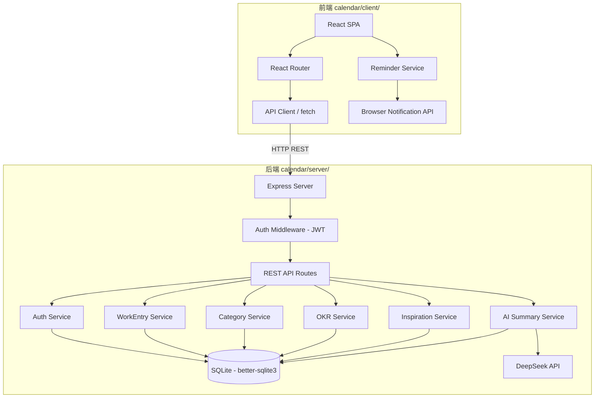
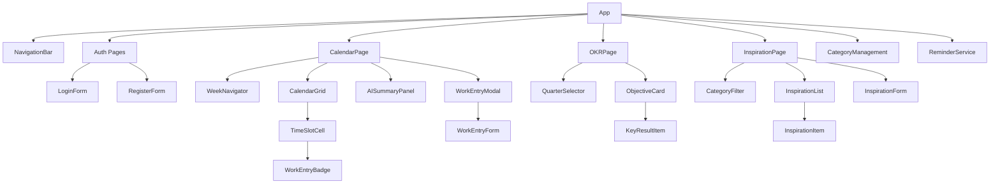
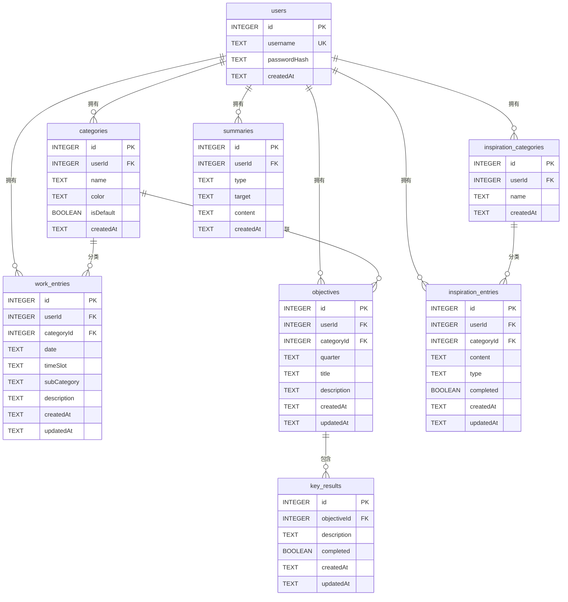

# 技术设计文档：工作时间追踪日历应用

## 概述

本设计文档描述工作时间追踪日历应用（Calendar_App）的技术架构和实现方案。应用包含三个核心页面：日历（工时记录）、OKR（目标管理）、灵感（灵感与待办），通过 AI（DeepSeek API）生成工作总结并结合 OKR 进行推进分析。

技术栈：
- 前端：React + TypeScript + Vite，位于 `calendar/client/`
- 后端：Node.js + Express + TypeScript，位于 `calendar/server/`
- 数据库：SQLite（better-sqlite3）
- 测试：Vitest + fast-check（属性测试）
- 认证：JWT + bcrypt

## 架构

### 整体架构



### 前端路由结构

```
/login          - 登录页
/register       - 注册页
/calendar       - 日历页面（默认主页）
/okr            - OKR 管理页面
/inspiration    - 灵感与待办页面
/categories     - 分类管理页面
```

### 后端 API 路由

```
POST   /api/auth/register          - 用户注册
POST   /api/auth/login             - 用户登录
POST   /api/auth/logout            - 退出登录

GET    /api/categories              - 获取分类列表
POST   /api/categories              - 新增分类
PUT    /api/categories/:id          - 编辑分类
DELETE /api/categories/:id          - 删除分类

GET    /api/work-entries?date=&week= - 获取工作条目
POST   /api/work-entries             - 保存工作条目（批量）
DELETE /api/work-entries/:id         - 删除工作条目

GET    /api/okr?quarter=             - 获取 OKR 数据
POST   /api/okr/objectives           - 新增 Objective
PUT    /api/okr/objectives/:id       - 编辑 Objective
DELETE /api/okr/objectives/:id       - 删除 Objective
POST   /api/okr/key-results          - 新增 Key Result
PUT    /api/okr/key-results/:id      - 编辑 Key Result
DELETE /api/okr/key-results/:id      - 删除 Key Result

GET    /api/inspirations             - 获取灵感列表
POST   /api/inspirations             - 新增灵感条目
PUT    /api/inspirations/:id         - 编辑灵感条目
DELETE /api/inspirations/:id         - 删除灵感条目
GET    /api/inspiration-categories   - 获取灵感分类
POST   /api/inspiration-categories   - 新增灵感分类
PUT    /api/inspiration-categories/:id - 编辑灵感分类
DELETE /api/inspiration-categories/:id - 删除灵感分类

POST   /api/summaries/generate       - 生成 AI 总结
GET    /api/summaries                 - 获取历史总结列表
GET    /api/summaries/:id            - 获取总结详情
```

## 组件与接口

### 前端组件层次



### 核心前端接口

```typescript
// API Client
interface ApiClient {
  auth: {
    register(username: string, password: string): Promise<AuthResponse>;
    login(username: string, password: string): Promise<AuthResponse>;
    logout(): Promise<void>;
  };
  workEntries: {
    getByWeek(weekStart: string): Promise<WorkEntry[]>;
    save(entries: CreateWorkEntryDTO[]): Promise<WorkEntry[]>;
    delete(id: number): Promise<void>;
  };
  categories: {
    list(): Promise<Category[]>;
    create(name: string): Promise<Category>;
    update(id: number, name: string): Promise<Category>;
    delete(id: number, migrateToId?: number): Promise<void>;
  };
  okr: {
    getByQuarter(quarter: string): Promise<OKRData>;
    createObjective(obj: CreateObjectiveDTO): Promise<Objective>;
    updateObjective(id: number, obj: UpdateObjectiveDTO): Promise<Objective>;
    deleteObjective(id: number): Promise<void>;
    createKeyResult(kr: CreateKeyResultDTO): Promise<KeyResult>;
    updateKeyResult(id: number, kr: UpdateKeyResultDTO): Promise<KeyResult>;
    deleteKeyResult(id: number): Promise<void>;
  };
  inspirations: {
    list(categoryId?: number): Promise<InspirationEntry[]>;
    create(entry: CreateInspirationDTO): Promise<InspirationEntry>;
    update(id: number, entry: UpdateInspirationDTO): Promise<InspirationEntry>;
    delete(id: number): Promise<void>;
  };
  inspirationCategories: {
    list(): Promise<InspirationCategory[]>;
    create(name: string): Promise<InspirationCategory>;
    update(id: number, name: string): Promise<InspirationCategory>;
    delete(id: number): Promise<void>;
  };
  summaries: {
    generate(type: SummaryType, target: string): Promise<Summary>;
    list(): Promise<Summary[]>;
    getById(id: number): Promise<Summary>;
  };
}
```

### 后端服务接口

```typescript
// Auth Service
interface IAuthService {
  register(username: string, password: string): Promise<{ user: User; token: string }>;
  login(username: string, password: string): Promise<{ user: User; token: string }>;
  verifyToken(token: string): { userId: number; username: string };
}

// WorkEntry Service
interface IWorkEntryService {
  getByWeek(userId: number, weekStart: string): WorkEntry[];
  getByDateRange(userId: number, startDate: string, endDate: string): WorkEntry[];
  save(userId: number, entries: CreateWorkEntryDTO[]): WorkEntry[];
  delete(userId: number, entryId: number): void;
}

// Category Service
interface ICategoryService {
  list(userId: number): CategoryWithCount[];
  create(userId: number, name: string): Category;
  update(userId: number, id: number, name: string): Category;
  delete(userId: number, id: number, migrateToId?: number): void;
  ensureDefaults(userId: number): void;
}

// OKR Service
interface IOKRService {
  getByQuarter(userId: number, quarter: string): OKRData;
  createObjective(userId: number, obj: CreateObjectiveDTO): Objective;
  updateObjective(userId: number, id: number, obj: UpdateObjectiveDTO): Objective;
  deleteObjective(userId: number, id: number): void;
  createKeyResult(userId: number, kr: CreateKeyResultDTO): KeyResult;
  updateKeyResult(userId: number, id: number, kr: UpdateKeyResultDTO): KeyResult;
  deleteKeyResult(userId: number, id: number): void;
}

// Inspiration Service
interface IInspirationService {
  list(userId: number, categoryId?: number): InspirationEntry[];
  create(userId: number, entry: CreateInspirationDTO): InspirationEntry;
  update(userId: number, id: number, entry: UpdateInspirationDTO): InspirationEntry;
  delete(userId: number, id: number): void;
}

// AI Summary Service
interface IAISummaryService {
  generate(userId: number, type: SummaryType, target: string): Promise<Summary>;
  list(userId: number): Summary[];
  getById(userId: number, id: number): Summary;
}
```


### 提醒服务（前端）

```typescript
interface IReminderService {
  start(): void;                    // 启动定时检查
  stop(): void;                     // 停止定时检查
  requestPermission(): Promise<boolean>; // 请求通知权限
  snooze(timeSlot: string): void;   // 延迟 15 分钟提醒
  skip(timeSlot: string): void;     // 跳过该时间段提醒
  isSlotFilled(timeSlot: string, date: string): boolean; // 检查时间段是否已填写
}
```

### 设计决策

1. **JWT 存储方式**：使用 HTTP-only Cookie 存储 JWT，防止 XSS 攻击窃取令牌。前端通过 `credentials: 'include'` 自动携带 Cookie。

2. **分类体系共享**：OKR 的 Objective 和日历的 Work_Entry 共用同一套 Category 表。通过 `categoryId` 外键关联，确保分类变更自动同步。

3. **"其他"分类特殊处理**：内置"其他"分类标记为 `isDefault: true`，不可删除。OKR 创建 Objective 时前端过滤掉"其他"分类选项。AI 总结时将"其他"分类的工作条目单独归类为"非 OKR 相关工作"。

4. **SQLite 选择理由**：个人应用场景，单用户并发低，SQLite 足够满足需求且部署简单。使用 better-sqlite3 同步 API 简化代码。

5. **提醒机制**：前端使用 `setInterval` 每分钟检查是否到达整点，结合浏览器 Notification API 发送通知。提醒状态（已跳过、已延迟）存储在内存中，页面刷新后重置。

6. **灵感分类独立**：灵感页面使用独立的 `Inspiration_Category` 分类体系，与工作分类（Category）分开管理，避免两套分类互相干扰。

## 数据模型

### 数据库 ER 图



### TypeScript 类型定义

```typescript
// 用户
interface User {
  id: number;
  username: string;
  createdAt: string;
}

// 分类
interface Category {
  id: number;
  userId: number;
  name: string;
  color: string;
  isDefault: boolean;
  createdAt: string;
}

interface CategoryWithCount extends Category {
  workEntryCount: number;
  objectiveCount: number;
}

// 工作条目
interface WorkEntry {
  id: number;
  userId: number;
  categoryId: number;
  date: string;          // ISO 8601: "2025-01-06"
  timeSlot: string;      // "09:00-10:00"
  subCategory: string;
  description: string;
  createdAt: string;
  updatedAt: string;
}

interface CreateWorkEntryDTO {
  date: string;
  timeSlot: string;
  categoryId: number;
  subCategory: string;
  description: string;
}

// OKR
interface Objective {
  id: number;
  userId: number;
  categoryId: number;
  quarter: string;       // "2025-Q1"
  title: string;
  description: string;
  keyResults: KeyResult[];
  createdAt: string;
  updatedAt: string;
}

interface KeyResult {
  id: number;
  objectiveId: number;
  description: string;
  completed: boolean;
  createdAt: string;
  updatedAt: string;
}

interface CreateObjectiveDTO {
  categoryId: number;
  quarter: string;
  title: string;
  description: string;
}

interface UpdateObjectiveDTO {
  categoryId?: number;
  title?: string;
  description?: string;
}

interface CreateKeyResultDTO {
  objectiveId: number;
  description: string;
}

interface UpdateKeyResultDTO {
  description?: string;
  completed?: boolean;
}

interface OKRData {
  quarter: string;
  objectives: Objective[];
}

// 灵感
interface InspirationEntry {
  id: number;
  userId: number;
  categoryId: number;
  content: string;
  type: 'inspiration' | 'todo';
  completed: boolean;
  createdAt: string;
  updatedAt: string;
}

interface InspirationCategory {
  id: number;
  userId: number;
  name: string;
  createdAt: string;
}

interface CreateInspirationDTO {
  content: string;
  type: 'inspiration' | 'todo';
  categoryId: number;
}

interface UpdateInspirationDTO {
  content?: string;
  type?: 'inspiration' | 'todo';
  categoryId?: number;
  completed?: boolean;
}

// AI 总结
type SummaryType = 'daily' | 'weekly' | 'monthly' | 'quarterly';

interface Summary {
  id: number;
  userId: number;
  type: SummaryType;
  target: string;        // "2025-01-06" | "2025-W02" | "2025-01" | "2025-Q1"
  content: string;
  createdAt: string;
}

// 认证
interface AuthResponse {
  user: User;
  token: string;
}

// 提醒
interface ReminderState {
  skipped: Set<string>;   // "2025-01-06_09:00-10:00"
  snoozed: Map<string, number>; // timeSlot -> snooze until timestamp
}
```

### 数据库建表 SQL

```sql
CREATE TABLE IF NOT EXISTS users (
  id INTEGER PRIMARY KEY AUTOINCREMENT,
  username TEXT NOT NULL UNIQUE,
  passwordHash TEXT NOT NULL,
  createdAt TEXT NOT NULL DEFAULT (datetime('now'))
);

CREATE TABLE IF NOT EXISTS categories (
  id INTEGER PRIMARY KEY AUTOINCREMENT,
  userId INTEGER NOT NULL,
  name TEXT NOT NULL,
  color TEXT NOT NULL,
  isDefault INTEGER NOT NULL DEFAULT 0,
  createdAt TEXT NOT NULL DEFAULT (datetime('now')),
  FOREIGN KEY (userId) REFERENCES users(id),
  UNIQUE(userId, name)
);

CREATE TABLE IF NOT EXISTS work_entries (
  id INTEGER PRIMARY KEY AUTOINCREMENT,
  userId INTEGER NOT NULL,
  categoryId INTEGER NOT NULL,
  date TEXT NOT NULL,
  timeSlot TEXT NOT NULL,
  subCategory TEXT NOT NULL DEFAULT '',
  description TEXT NOT NULL DEFAULT '',
  createdAt TEXT NOT NULL DEFAULT (datetime('now')),
  updatedAt TEXT NOT NULL DEFAULT (datetime('now')),
  FOREIGN KEY (userId) REFERENCES users(id),
  FOREIGN KEY (categoryId) REFERENCES categories(id)
);

CREATE INDEX IF NOT EXISTS idx_work_entries_user_date_slot
  ON work_entries(userId, date, timeSlot);

CREATE TABLE IF NOT EXISTS objectives (
  id INTEGER PRIMARY KEY AUTOINCREMENT,
  userId INTEGER NOT NULL,
  categoryId INTEGER NOT NULL,
  quarter TEXT NOT NULL,
  title TEXT NOT NULL,
  description TEXT NOT NULL DEFAULT '',
  createdAt TEXT NOT NULL DEFAULT (datetime('now')),
  updatedAt TEXT NOT NULL DEFAULT (datetime('now')),
  FOREIGN KEY (userId) REFERENCES users(id),
  FOREIGN KEY (categoryId) REFERENCES categories(id)
);

CREATE TABLE IF NOT EXISTS key_results (
  id INTEGER PRIMARY KEY AUTOINCREMENT,
  objectiveId INTEGER NOT NULL,
  description TEXT NOT NULL,
  completed INTEGER NOT NULL DEFAULT 0,
  createdAt TEXT NOT NULL DEFAULT (datetime('now')),
  updatedAt TEXT NOT NULL DEFAULT (datetime('now')),
  FOREIGN KEY (objectiveId) REFERENCES objectives(id) ON DELETE CASCADE
);

CREATE TABLE IF NOT EXISTS inspiration_categories (
  id INTEGER PRIMARY KEY AUTOINCREMENT,
  userId INTEGER NOT NULL,
  name TEXT NOT NULL,
  createdAt TEXT NOT NULL DEFAULT (datetime('now')),
  FOREIGN KEY (userId) REFERENCES users(id),
  UNIQUE(userId, name)
);

CREATE TABLE IF NOT EXISTS inspiration_entries (
  id INTEGER PRIMARY KEY AUTOINCREMENT,
  userId INTEGER NOT NULL,
  categoryId INTEGER NOT NULL,
  content TEXT NOT NULL,
  type TEXT NOT NULL CHECK(type IN ('inspiration', 'todo')),
  completed INTEGER NOT NULL DEFAULT 0,
  createdAt TEXT NOT NULL DEFAULT (datetime('now')),
  updatedAt TEXT NOT NULL DEFAULT (datetime('now')),
  FOREIGN KEY (userId) REFERENCES users(id),
  FOREIGN KEY (categoryId) REFERENCES inspiration_categories(id)
);

CREATE TABLE IF NOT EXISTS summaries (
  id INTEGER PRIMARY KEY AUTOINCREMENT,
  userId INTEGER NOT NULL,
  type TEXT NOT NULL CHECK(type IN ('daily', 'weekly', 'monthly', 'quarterly')),
  target TEXT NOT NULL,
  content TEXT NOT NULL,
  createdAt TEXT NOT NULL DEFAULT (datetime('now')),
  FOREIGN KEY (userId) REFERENCES users(id)
);
```


## 正确性属性

*属性（Property）是指在系统所有有效执行中都应成立的特征或行为——本质上是对系统应做什么的形式化陈述。属性是人类可读规格说明与机器可验证正确性保证之间的桥梁。*

### 属性 1：用户名和密码长度验证

*对于任意*字符串作为用户名和密码，Auth_Service 的注册验证应当：当用户名长度在 3-20 之间且密码长度在 6-30 之间时接受，否则拒绝。

**验证需求：1.2**

### 属性 2：用户名唯一性约束

*对于任意*已注册的用户名，再次使用相同用户名注册应当失败并返回错误。

**验证需求：1.3**

### 属性 3：密码哈希安全性（往返属性）

*对于任意*密码字符串，经 bcrypt 哈希后的值不应等于原始密码，且使用 bcrypt.compare 验证原始密码与哈希值应返回 true。

**验证需求：1.5**

### 属性 4：JWT 令牌往返验证

*对于任意*有效用户，登录生成的 JWT 令牌经 verifyToken 解析后应返回相同的 userId 和 username。

**验证需求：1.7**

### 属性 5：无效令牌拒绝

*对于任意*无效或过期的 JWT 令牌，Auth Middleware 应返回 401 状态码，拒绝访问受保护的接口。

**验证需求：1.10**

### 属性 6：登录错误信息不泄露

*对于任意*不存在的用户名或错误的密码，Auth_Service 返回的错误信息应完全相同（"用户名或密码错误"），不区分具体原因。

**验证需求：1.8**

### 属性 7：周日期范围计算

*对于任意*日期，计算其所在周的日期范围应返回该周的周一至周五，且周一 ≤ 该日期 ≤ 周五（或该日期为周末时返回最近的工作周）。

**验证需求：2.2**

### 属性 8：周导航往返

*对于任意*周起始日期，执行"下一周"再执行"上一周"应返回原始周起始日期。

**验证需求：2.3**

### 属性 9：工作条目持久化往返

*对于任意*有效的工作条目数据（包含 date、timeSlot、categoryId、subCategory、description），保存后通过相同的 date 和 timeSlot 查询应返回包含相同字段值的条目。

**验证需求：3.6**

### 属性 10：分类创建往返

*对于任意*有效的分类名称，创建分类后查询分类列表应包含该分类名称。

**验证需求：3.4, 5.2**

### 属性 11：提醒触发时间判定

*对于任意*日期时间，提醒判定函数应当：仅在工作日（周一至周五）的 10:00、11:00、12:00、13:00、14:00、15:00、16:00、17:00、18:00、18:30 触发提醒，其他时间不触发。

**验证需求：4.1**

### 属性 12：提醒对应时间段计算

*对于任意*提醒触发时间点，计算出的对应 Time_Slot 应为前一个小时的时间段（如 10:00 触发对应 "09:00-10:00"，18:30 触发对应 "18:00-18:30"）。

**验证需求：4.2**

### 属性 13：延迟提醒状态机

*对于任意*时间段，执行"稍后提醒"后，在 15 分钟内不应再次触发该时间段的提醒，15 分钟后应恢复触发。

**验证需求：4.4**

### 属性 14：跳过提醒永久性

*对于任意*时间段，执行"跳过"后，该时间段不应再触发任何提醒。

**验证需求：4.5**

### 属性 15：已填写时间段跳过提醒

*对于任意*已有 Work_Entry 的时间段，提醒服务应跳过该时间段不触发提醒。

**验证需求：4.6**

### 属性 16：分类使用次数准确性

*对于任意*分类和关联的工作条目及 Objective 集合，分类管理页面显示的使用次数应等于该分类关联的 Work_Entry 数量加上 Objective 数量。

**验证需求：5.1**

### 属性 17：分类编辑后引用完整性

*对于任意*分类，编辑其名称后，所有通过 categoryId 关联的 Work_Entry 和 Objective 查询时应返回更新后的分类名称。

**验证需求：5.3**

### 属性 18：分类删除迁移

*对于任意*有关联记录的分类，删除时指定迁移目标分类后，原分类的所有关联记录应迁移到目标分类，原分类不再存在。

**验证需求：5.4**

### 属性 19："其他"分类不可删除

*对于任意*用户，尝试删除 isDefault 为 true 的"其他"分类应当失败。

**验证需求：5.8**

### 属性 20：分类颜色唯一性

*对于任意*用户的分类集合，每个分类的颜色标签应互不相同。

**验证需求：5.5**

### 属性 21：数据用户隔离

*对于任意*两个不同用户，用户 A 的查询操作不应返回用户 B 的数据，包括工作条目、分类、OKR、灵感条目和总结记录。

**验证需求：5.6, 7.2, 11.6, 12.7**

### 属性 22：跨用户写入拒绝

*对于任意*写入操作，当目标数据的 userId 与当前会话用户不一致时，API_Server 应返回 403 状态码。

**验证需求：7.3**

### 属性 23：AI 总结日期范围计算

*对于任意*总结类型（日/周/月/季度）和目标标识，计算出的日期范围应正确覆盖对应时间段：日总结为单日，周总结为周一至周五，月总结为该月所有工作日，季度总结为该季度所有工作日。

**验证需求：6.2, 6.3, 6.4, 6.5**

### 属性 24：AI 数据准备分组与"其他"分离

*对于任意*工作条目集合，AI 总结的数据准备函数应按 Category 正确分组，且将"其他"分类的条目单独归类为"非 OKR 相关工作"，不纳入 OKR 推进分析数据。

**验证需求：6.6, 6.7**

### 属性 25：OKR 与工作条目的 Category 匹配

*对于任意* Objective 和工作条目集合，通过 categoryId 匹配的结果应正确关联：每个 Objective 下匹配到的 Work_Entry 的 categoryId 应与该 Objective 的 categoryId 相同。

**验证需求：6.8**

### 属性 26：总结记录持久化往返

*对于任意*生成的总结，保存后通过 ID 查询应返回相同的总结内容。

**验证需求：6.12**

### 属性 27：环境变量配置读取

*对于任意*环境变量配置组合（JWT_SECRET、DEEPSEEK_API_KEY、PORT、DATABASE_PATH），配置模块应正确读取对应值，未设置的可选变量应使用默认值。

**验证需求：9.5**

### 属性 28：季度计算

*对于任意*日期，计算其所属季度应返回正确的季度字符串（如 "2025-Q1"），且 1-3 月为 Q1，4-6 月为 Q2，7-9 月为 Q3，10-12 月为 Q4。

**验证需求：11.1**

### 属性 29：OKR 数据 CRUD 往返

*对于任意*有效的 Objective 和 Key_Result 数据，创建后查询应返回相同数据，编辑后查询应返回更新后的数据，删除后查询应不包含该数据。

**验证需求：11.2, 11.3, 11.4, 11.5**

### 属性 30：Objective 不可关联"其他"分类

*对于任意*创建 Objective 的请求，当 categoryId 指向"其他"分类时，系统应拒绝创建。

**验证需求：11.8**

### 属性 31：灵感条目按分类筛选

*对于任意*灵感分类 ID 作为筛选条件，返回的所有灵感条目的 categoryId 应等于该筛选 ID。

**验证需求：12.1**

### 属性 32：灵感条目 CRUD 往返

*对于任意*有效的灵感条目数据，创建后查询应返回相同数据，包括 content、type、categoryId 字段。

**验证需求：12.2, 12.6**

### 属性 33：待办完成状态切换

*对于任意*类型为"待办"的灵感条目，标记为已完成后查询应返回 completed 为 true。

**验证需求：12.5**

### 属性 34：灵感条目按时间倒序

*对于任意*灵感条目列表查询结果，列表应按 createdAt 降序排列，即每条记录的 createdAt 应大于等于其后一条记录的 createdAt。

**验证需求：12.8**

## 错误处理

### 前端错误处理

| 场景 | 处理方式 |
|------|---------|
| 网络请求失败 | 显示 toast 提示"网络连接失败，请检查网络"，保留用户已填写内容 |
| 401 未授权 | 自动跳转到登录页面，清除本地认证状态 |
| 403 禁止访问 | 显示 toast 提示"无权限执行此操作" |
| 表单验证失败 | 在对应输入框下方显示红色错误提示文字 |
| 工作条目保存失败 | 显示错误提示，保留弹窗中已填写的内容不关闭 |
| AI 总结生成失败 | 显示"AI 总结生成失败，请稍后重试"，允许用户重试 |
| 浏览器不支持 Notification API | 降级为页面内弹窗提醒，不使用系统通知 |
| 通知权限被拒绝 | 降级为页面内弹窗提醒，提示用户可在浏览器设置中开启 |

### 后端错误处理

| 场景 | HTTP 状态码 | 响应格式 |
|------|------------|---------|
| 请求参数验证失败 | 400 | `{ error: "具体验证错误信息" }` |
| JWT 令牌无效/过期 | 401 | `{ error: "未授权，请重新登录" }` |
| 用户名已存在 | 409 | `{ error: "用户名已存在" }` |
| 访问其他用户数据 | 403 | `{ error: "无权限访问该资源" }` |
| 资源不存在 | 404 | `{ error: "资源不存在" }` |
| 删除有关联记录的分类（未指定迁移） | 400 | `{ error: "该分类有关联记录，请指定迁移目标" }` |
| 删除默认"其他"分类 | 400 | `{ error: "默认分类不可删除" }` |
| Objective 关联"其他"分类 | 400 | `{ error: "Objective 不可关联'其他'分类" }` |
| DeepSeek API 调用失败 | 502 | `{ error: "AI 总结生成失败，请稍后重试" }` |
| 必需环境变量缺失 | 启动终止 | 控制台输出缺失变量名称 |
| 数据库操作失败 | 500 | `{ error: "服务器内部错误" }` |

### 全局错误中间件

```typescript
// Express 全局错误处理中间件
function errorHandler(err: Error, req: Request, res: Response, next: NextFunction) {
  if (err instanceof ValidationError) {
    return res.status(400).json({ error: err.message });
  }
  if (err instanceof AuthError) {
    return res.status(401).json({ error: err.message });
  }
  if (err instanceof ForbiddenError) {
    return res.status(403).json({ error: err.message });
  }
  if (err instanceof NotFoundError) {
    return res.status(404).json({ error: err.message });
  }
  console.error('Unhandled error:', err);
  return res.status(500).json({ error: '服务器内部错误' });
}
```

## 测试策略

### 测试框架

- **单元测试 & 属性测试**：Vitest + fast-check
- **前端组件测试**：@testing-library/react
- **测试运行**：`vitest --run`（单次执行）

### 双重测试方法

本项目采用单元测试与属性测试互补的策略：

- **单元测试**：验证具体示例、边界情况和错误条件
- **属性测试**：验证跨所有输入的通用属性，每个属性测试至少运行 100 次迭代

两者互补：单元测试捕获具体 bug，属性测试验证通用正确性。

### 属性测试配置

- 使用 **fast-check** 库（项目已有依赖）
- 每个属性测试配置 `numRuns: 100` 最少迭代次数
- 每个属性测试必须以注释标注对应的设计属性
- 标注格式：**Feature: workhour-calendar, Property {编号}: {属性描述}**
- 每个正确性属性由**单个**属性测试实现

### 测试分层

| 层级 | 测试类型 | 覆盖范围 |
|------|---------|---------|
| 后端服务层 | 属性测试 | 属性 1-6（认证）、9-10（工作条目/分类持久化）、16-22（分类管理/数据隔离）、23-26（AI 数据准备）、27-30（配置/OKR）、31-34（灵感） |
| 后端服务层 | 单元测试 | 默认分类初始化、默认灵感分类初始化、数据库建表、环境变量缺失处理 |
| 前端工具函数 | 属性测试 | 属性 7-8（周日期计算）、11-15（提醒逻辑）、28（季度计算） |
| 前端工具函数 | 单元测试 | 时间段列表生成（10 行）、具体日期的周范围示例 |
| 前端组件 | 单元测试 | 导航栏渲染、表单验证提示、弹窗交互 |
| API 集成 | 单元测试 | 路由响应状态码、错误处理中间件 |

### 测试目录结构

```
calendar/
├── client/
│   └── src/
│       ├── utils/__tests__/          # 前端工具函数测试
│       │   ├── dateUtils.test.ts     # 属性测试：周计算、季度计算
│       │   └── reminderUtils.test.ts # 属性测试：提醒逻辑
│       └── components/__tests__/     # 组件单元测试
└── server/
    └── src/
        └── services/__tests__/       # 后端服务测试
            ├── authService.test.ts   # 属性测试：认证相关属性
            ├── workEntryService.test.ts
            ├── categoryService.test.ts
            ├── okrService.test.ts
            ├── inspirationService.test.ts
            └── aiSummaryService.test.ts
```
