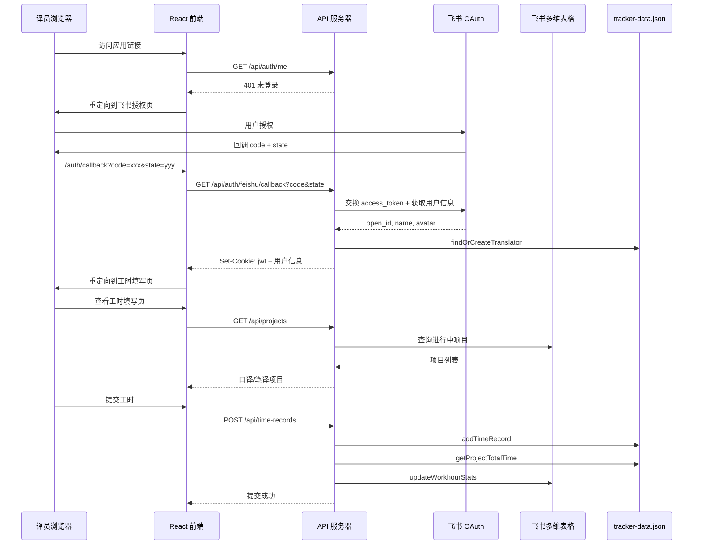

# 技术设计文档：工时管理 Web 应用

## 概述

本设计实现一个工时管理 Web 应用（workhour-web-app），替代现有飞书机器人方案。系统采用前后端分离架构：前端使用 React + TypeScript（Vite 构建），后端使用 Express + TypeScript。

核心流程：管理员分享链接 → 译员点击访问 → 飞书 OAuth 登录 → 查看进行中项目 → 填写工时 → 系统汇总回写飞书多维表格。

后端复用现有 `feishu-workhour-bot/` 中的 `BitableService`（飞书多维表格读写）、`TrackerService`（本地 JSON 数据存储）和 `FormValidator`（表单验证）。

### 关键设计决策

1. **复用现有服务代码**：直接将 `BitableService`、`TrackerService`、`FormValidator` 及类型定义复制到新项目中，避免跨项目引用的复杂性。
2. **飞书 OAuth 复用现有模式**：参考 `server/src/routes/auth.ts` 中已有的飞书 OAuth 实现模式（JWT Cookie + state 防 CSRF）。
3. **JSON 文件存储**：沿用 `TrackerService` 的 JSON 文件存储方案，MVP 阶段无需引入数据库。
4. **图表库选择**：使用 Recharts 实现数据分析页面的图表，与 React 生态契合度高。

## 架构

### 系统架构图

```mermaid
graph TB
    subgraph 前端 [React 前端 - Vite]
        LoginPage[登录页面]
        TimesheetPage[工时填写页面]
        AdminPage[管理页面]
        AnalyticsPage[数据分析页面]
    end

    subgraph 后端 [Express API 服务器]
        AuthRoutes[/api/auth/*]
        ProjectRoutes[/api/projects]
        TimeRecordRoutes[/api/time-records]
        StatsRoutes[/api/stats]
        AuthMiddleware[JWT 认证中间件]
    end

    subgraph 服务层 [服务层 - 复用]
        AuthService[AuthService]
        BitableService[BitableService ★复用]
        TrackerService[TrackerService ★复用]
        FormValidator[FormValidator ★复用]
    end

    subgraph 外部 [外部服务]
        FeishuOAuth[飞书 OAuth API]
        FeishuBitable[飞书多维表格 API]
        JSONFile[tracker-data.json]
    end

    LoginPage -->|OAuth 登录| AuthRoutes
    TimesheetPage -->|提交工时| TimeRecordRoutes
    TimesheetPage -->|获取项目| ProjectRoutes
    AdminPage -->|查询记录| TimeRecordRoutes
    AnalyticsPage -->|获取统计| StatsRoutes

    AuthRoutes --> AuthService
    ProjectRoutes --> BitableService
    TimeRecordRoutes --> TrackerService
    TimeRecordRoutes --> BitableService
    TimeRecordRoutes --> FormValidator
    StatsRoutes --> TrackerService

    AuthService --> FeishuOAuth
    BitableService --> FeishuBitable
    TrackerService --> JSONFile
```

### 请求流程



## 组件与接口

### 项目目录结构

```
workhour-web-app/
├── client/                    # React 前端
│   ├── src/
│   │   ├── components/        # UI 组件
│   │   │   ├── LoginPage.tsx
│   │   │   ├── TimesheetPage.tsx
│   │   │   ├── AdminPage.tsx
│   │   │   └── AnalyticsPage.tsx
│   │   ├── context/
│   │   │   └── AuthContext.tsx # 认证上下文
│   │   ├── services/
│   │   │   └── api.ts         # API 客户端
│   │   ├── App.tsx
│   │   └── main.tsx
│   ├── index.html
│   ├── package.json
│   ├── tsconfig.json
│   └── vite.config.ts
├── server/                    # Express 后端
│   ├── src/
│   │   ├── config/
│   │   │   └── index.ts       # 环境变量配置
│   │   ├── middleware/
│   │   │   └── authMiddleware.ts
│   │   ├── routes/
│   │   │   ├── auth.ts
│   │   │   ├── projects.ts
│   │   │   ├── timeRecords.ts
│   │   │   └── stats.ts
│   │   ├── services/
│   │   │   ├── AuthService.ts
│   │   │   ├── BitableService.ts   # 复用
│   │   │   └── TrackerService.ts   # 复用
│   │   ├── validators/
│   │   │   └── FormValidator.ts    # 复用
│   │   ├── types/
│   │   │   └── index.ts            # 复用 + 扩展
│   │   └── index.ts
│   ├── package.json
│   └── tsconfig.json
├── .env
└── README.md
```

### 后端 API 接口

#### 1. 认证接口

```typescript
// GET /api/auth/feishu
// 发起飞书 OAuth 授权，返回授权 URL
// Response: { success: true, data: { url: string, state: string } }

// GET /api/auth/feishu/callback?code=xxx&state=yyy
// 处理 OAuth 回调，交换 token，设置 JWT Cookie
// Response: { success: true, data: { user: UserInfo } }
// Set-Cookie: jwt=<token>; HttpOnly; SameSite=Lax; Max-Age=604800

// GET /api/auth/me
// 获取当前登录用户信息（需认证）
// Response: { success: true, data: { userId, name, avatar } }

// POST /api/auth/logout
// 退出登录，清除 Cookie
// Response: { success: true, data: { message: string } }
```

#### 2. 项目接口

```typescript
// GET /api/projects?type=interpretation|translation
// 获取进行中的项目列表（需认证）
// Response: { success: true, data: { interpretation: Project[], translation: Project[] } }
```

#### 3. 工时记录接口

```typescript
// POST /api/time-records
// 提交工时记录（需认证）
// Request Body: {
//   entries: Array<{
//     projectId: string,
//     projectName: string,
//     type: 'interpretation' | 'translation',
//     time: number
//   }>
// }
// Response: { success: true, data: { records: TimeRecord[], syncStatus: string } }

// GET /api/time-records?translatorId=&projectId=&startDate=&endDate=
// 查询工时记录（需认证）
// Response: { success: true, data: TimeRecord[] }
```

#### 4. 统计接口

```typescript
// GET /api/stats?startDate=&endDate=
// 获取工时统计数据（需认证）
// Response: {
//   success: true,
//   data: {
//     totalTime: number,
//     interpretationTime: number,
//     translationTime: number,
//     translatorCount: number,
//     byTranslator: Array<{ name, totalTime, interpretationTime, translationTime }>,
//     byProject: Array<{ name, type, totalTime }>
//   }
// }
```

### 后端服务层

#### AuthService

```typescript
class AuthService {
  // 生成飞书 OAuth 授权 URL（含 state 防 CSRF）
  getAuthorizationUrl(redirectUri: string): { url: string; state: string }
  
  // 处理 OAuth 回调：交换 token → 获取用户信息 → 创建 JWT
  handleCallback(code: string, state: string): Promise<{ jwt: string; user: UserInfo }>
  
  // 验证 JWT 令牌
  verifyToken(token: string): JwtPayload
}
```

#### BitableService（复用）

从 `feishu-workhour-bot/src/services/BitableService.ts` 复制，提供：
- `getOngoingProjects()`: 获取口译和笔译进行中项目
- `getOngoingProjectsByType(type)`: 按类型获取进行中项目
- `updateWorkhourStats(projectName, type, totalMinutes, recordId?)`: 更新工时统计字段

#### TrackerService（复用）

从 `feishu-workhour-bot/src/services/TrackerService.ts` 复制，提供：
- `addTimeRecord(record)`: 写入工时记录
- `findOrCreateTranslator(openId, name)`: 查找或创建译员
- `getProjectTotalTime(projectId)`: 获取项目总工时
- `getAllTimeRecords()`: 获取所有工时记录
- `getTimeRecordsByProject(projectId)`: 按项目查询
- `getTimeRecordsByTranslator(translatorId)`: 按译员查询

#### FormValidator（复用）

从 `feishu-workhour-bot/src/validators/FormValidator.ts` 复制，提供：
- `isPositiveInteger(value)`: 验证正整数
- `validateProjectTimePair(project, time, type)`: 验证项目-工时配对
- `hasAtLeastOneEntry(formData)`: 验证至少填写一项
- `validateWorkhourForm(formData)`: 完整表单验证

### 前端组件

#### AuthContext

```typescript
// 认证上下文，管理登录状态
interface AuthContextType {
  user: UserInfo | null;
  loading: boolean;
  login: () => void;    // 发起飞书 OAuth
  logout: () => void;   // 退出登录
}
```

#### TimesheetPage（工时填写页面）

- 显示当前用户信息（姓名、头像）
- 口译区域：项目下拉选择 + 工时输入
- 笔译区域：项目下拉选择 + 工时输入
- 表单验证（复用 FormValidator 逻辑）
- 提交按钮 + 成功/失败提示

#### AdminPage（管理页面）

- 筛选栏：译员姓名、项目名称、项目类型、日期范围
- 工时记录表格：译员姓名、项目名称、项目类型、工时、提交日期
- 项目工时汇总展示

#### AnalyticsPage（数据分析页面）

- 统计概览卡片：总工时、口译总工时、笔译总工时、译员人数
- 按译员分组柱状图（Recharts BarChart）
- 按项目分组柱状图（Recharts BarChart）
- 口译/笔译占比饼图（Recharts PieChart）
- 时间范围筛选器


## 数据模型

### 核心类型（复用自 feishu-workhour-bot）

```typescript
// 工时记录
interface TimeRecord {
  id: number;
  translatorId: string;
  translatorName: string;
  projectId: string;       // 多维表格 record_id
  projectName: string;
  type: 'interpretation' | 'translation';
  time: number;            // 分钟
  date: string;            // ISO 8601
}

// 译员信息
interface Translator {
  id: string;              // translator_{timestamp}
  name: string;
  feishuOpenId: string;
}

// 项目信息（来自飞书多维表格）
interface Project {
  recordId: string;        // 多维表格 record_id
  name: string;
  status: string;
  projectType: 'interpretation' | 'translation';
}
```

### 扩展类型（Web 应用新增）

```typescript
// JWT Payload
interface JwtPayload {
  userId: string;          // translator_id
  feishuOpenId: string;
  name: string;
  avatar?: string;
  iat: number;
  exp: number;
}

// 前端用户信息
interface UserInfo {
  userId: string;
  feishuOpenId: string;
  name: string;
  avatar?: string;
}

// 工时提交请求
interface TimeRecordSubmitRequest {
  entries: Array<{
    projectId: string;
    projectName: string;
    type: 'interpretation' | 'translation';
    time: number;
  }>;
}

// 统计数据响应
interface StatsResponse {
  totalTime: number;
  interpretationTime: number;
  translationTime: number;
  translatorCount: number;
  byTranslator: Array<{
    name: string;
    totalTime: number;
    interpretationTime: number;
    translationTime: number;
  }>;
  byProject: Array<{
    name: string;
    type: 'interpretation' | 'translation';
    totalTime: number;
  }>;
}

// 统一 API 响应格式
interface ApiResponse<T = any> {
  success: boolean;
  data?: T;
  error?: string;
}
```

### 本地存储结构（tracker-data.json）

```json
{
  "translators": [
    { "id": "translator_1234", "name": "张三", "feishuOpenId": "ou_xxx" }
  ],
  "projects": {
    "interpretation": [],
    "translation": []
  },
  "timeRecords": [
    {
      "id": 1234567890,
      "translatorId": "translator_1234",
      "translatorName": "张三",
      "projectId": "recXXX",
      "projectName": "项目A",
      "type": "interpretation",
      "time": 60,
      "date": "2024-01-15T10:30:00.000Z"
    }
  ]
}
```

### 环境变量配置

```
# 飞书应用凭证
FEISHU_APP_ID=
FEISHU_APP_SECRET=

# 多维表格配置
BITABLE_APP_TOKEN=LZxwwV9vGiHesHk5nEVcsw1Pnud
INTERPRETATION_TABLE_ID=tblxCsMVGfag1mmZ
TRANSLATION_TABLE_ID=tbliA5bK8PsJ213l

# JWT 配置
JWT_SECRET=

# 服务配置
PORT=3002
CORS_ORIGIN=http://localhost:5174

# 飞书 OAuth 回调
FEISHU_REDIRECT_URI=http://localhost:5174/auth/callback
```


## 正确性属性

*属性（Property）是在系统所有有效执行中都应成立的特征或行为——本质上是对系统应做什么的形式化陈述。属性是人类可读规范与机器可验证正确性保证之间的桥梁。*

### Property 1: JWT 令牌 Round-Trip

*For any* 有效的用户信息（userId、feishuOpenId、name、avatar），创建 JWT 令牌后再验证解码，应得到与原始信息等价的 payload。

**Validates: Requirements 1.3**

### Property 2: OAuth 授权 URL 包含 State 参数

*For any* 生成的飞书 OAuth 授权 URL，URL 中都应包含非空的 state 查询参数，且每次生成的 state 值应互不相同。

**Validates: Requirements 1.5**

### Property 3: 项目过滤与分组

*For any* 项目列表（包含不同状态和类型的项目），过滤"进行中"项目后：(a) 返回的每个项目状态都为"进行中"，(b) 口译分组只包含口译项目，笔译分组只包含笔译项目，(c) 原始列表中所有"进行中"项目都出现在结果中。

**Validates: Requirements 2.1, 2.2**

### Property 4: 表单至少填写一项验证

*For any* 表单数据，当口译和笔译的项目与工时都为空时，验证应拒绝提交；当至少有一项（项目+工时）完整填写时，验证应接受提交。

**Validates: Requirements 3.3**

### Property 5: 工时正整数验证

*For any* 输入值，当值不是正整数（包括负数、零、小数、空字符串、纯空白字符串、非数字字符串）时，`isPositiveInteger` 应返回 false；当值为正整数时应返回 true。

**Validates: Requirements 3.4**

### Property 6: 项目-工时配对验证

*For any* 表单中的单项（口译或笔译），当选择了项目但未填写工时时应报错提示工时必填，当填写了工时但未选择项目时应报错提示需选择项目，当两者都填写且工时为正整数时应通过验证。

**Validates: Requirements 3.5, 3.6**

### Property 7: 工时记录持久化 Round-Trip

*For any* 有效的工时记录（包含 translatorId、translatorName、projectId、projectName、type、time、date），写入 TrackerService 后再读取，应能找到包含所有原始字段值的记录。

**Validates: Requirements 3.7**

### Property 8: 项目总工时聚合

*For any* 项目和一组该项目下的工时记录，`getProjectTotalTime` 返回的值应等于该项目下所有记录的 time 字段之和。

**Validates: Requirements 4.1, 4.4, 6.5**

### Property 9: 译员查找或创建幂等性

*For any* open_id 和 name，首次调用 `findOrCreateTranslator` 应创建新记录并返回；再次以相同 open_id 调用应返回同一条记录（id 不变），不会创建重复记录。

**Validates: Requirements 5.1, 5.2**

### Property 10: 译员数据隔离

*For any* 两个不同的译员，译员 A 查询工时记录时不应看到译员 B 的记录，反之亦然。

**Validates: Requirements 5.4**

### Property 11: 工时记录筛选正确性

*For any* 工时记录集合和筛选条件（translatorId、projectId、startDate、endDate），筛选结果中的每条记录都应满足所有指定的筛选条件，且原始集合中满足条件的记录都应出现在结果中。

**Validates: Requirements 6.2, 6.3, 7.4**

### Property 12: 统计数据聚合正确性

*For any* 工时记录集合，统计结果应满足：(a) totalTime 等于所有记录 time 之和，(b) interpretationTime 等于所有口译记录 time 之和，(c) translationTime 等于所有笔译记录 time 之和，(d) totalTime = interpretationTime + translationTime，(e) translatorCount 等于去重后的译员数。

**Validates: Requirements 7.1**

### Property 13: 认证中间件拒绝未认证请求

*For any* 受保护的 API 端点，当请求不携带有效 JWT Cookie 时，应返回 401 状态码。

**Validates: Requirements 8.9**

### Property 14: 统一 API 响应格式

*For any* API 响应，JSON 体都应包含 boolean 类型的 success 字段；当 success 为 true 时应包含 data 字段；当 success 为 false 时应包含 error 字段。

**Validates: Requirements 8.10**

### Property 15: 环境变量验证

*For any* 必需环境变量的子集缺失，`validateConfig` 应抛出错误，且错误信息中应包含所有缺失变量的名称。

**Validates: Requirements 9.2**


## 错误处理

### 错误分类与处理策略

| 错误类型 | 场景 | 处理方式 |
|---------|------|---------|
| 认证错误 | JWT 过期/无效、OAuth 失败 | 返回 401，前端重定向到登录页 |
| 验证错误 | 表单数据不合法 | 返回 400 + 具体错误字段和消息 |
| 飞书 API 错误 | 多维表格读写失败 | 返回 502，前端显示错误提示 + 重试按钮 |
| 部分失败 | 本地写入成功但飞书同步失败 | 返回 200 + syncStatus: 'partial'，提示用户 |
| 服务器错误 | 未预期的异常 | 返回 500，记录错误日志 |
| 配置错误 | 缺少必需环境变量 | 启动时终止进程，输出缺失变量名 |

### 前端错误处理

- API 请求统一通过 `api.ts` 封装，自动处理 401 重定向
- 网络错误显示通用错误提示
- 表单验证错误在对应输入框旁显示
- 工时提交失败时保留表单数据，成功时清空

### 后端错误处理

```typescript
// 统一错误响应格式
app.use((err: Error, req: Request, res: Response, next: NextFunction) => {
  console.error(`[${new Date().toISOString()}] ${err.message}`);
  res.status(500).json({
    success: false,
    error: '服务器内部错误'
  });
});
```

## 测试策略

### 测试框架

- 测试框架：Vitest
- 属性测试库：fast-check
- 每个属性测试至少运行 100 次迭代

### 属性测试（Property-Based Tests）

每个正确性属性对应一个属性测试，使用 fast-check 生成随机输入：

| 属性 | 测试文件 | 生成器 |
|-----|---------|--------|
| Property 1: JWT Round-Trip | `auth.property.test.ts` | 随机 userId、name、avatar |
| Property 2: OAuth State | `auth.property.test.ts` | 多次调用生成 URL |
| Property 3: 项目过滤分组 | `projects.property.test.ts` | 随机项目列表（不同状态和类型） |
| Property 4: 至少一项验证 | `formValidator.property.test.ts` | 随机表单数据 |
| Property 5: 正整数验证 | `formValidator.property.test.ts` | 随机数字和字符串 |
| Property 6: 配对验证 | `formValidator.property.test.ts` | 随机项目/工时组合 |
| Property 7: 记录持久化 | `trackerService.property.test.ts` | 随机 TimeRecord |
| Property 8: 总工时聚合 | `trackerService.property.test.ts` | 随机工时记录集合 |
| Property 9: 译员幂等性 | `trackerService.property.test.ts` | 随机 open_id 和 name |
| Property 10: 数据隔离 | `trackerService.property.test.ts` | 两组随机译员和记录 |
| Property 11: 筛选正确性 | `timeRecords.property.test.ts` | 随机记录集合和筛选条件 |
| Property 12: 统计聚合 | `stats.property.test.ts` | 随机工时记录集合 |
| Property 13: 认证中间件 | `auth.property.test.ts` | 随机无效/缺失 token |
| Property 14: 响应格式 | `api.property.test.ts` | 随机 API 端点和参数 |
| Property 15: 环境变量 | `config.property.test.ts` | 随机环境变量子集 |

每个属性测试必须包含注释标签：
```typescript
// Feature: workhour-web-app, Property 1: JWT 令牌 Round-Trip
```

### 单元测试

单元测试聚焦于具体示例和边界情况：

- 认证流程：OAuth 回调成功/失败、JWT 过期处理
- 表单验证：空表单、单项填写、完整填写、各种非法输入
- API 端点：各端点的请求/响应格式、参数校验
- 错误处理：飞书 API 失败、网络超时、数据文件损坏

### 测试配置

```typescript
// vitest.config.ts
export default defineConfig({
  test: {
    globals: true,
    environment: 'node',
  },
});
```

属性测试配置：
```typescript
fc.assert(
  fc.property(/* arbitraries */, (/* values */) => {
    // 属性断言
  }),
  { numRuns: 100 }
);
```
